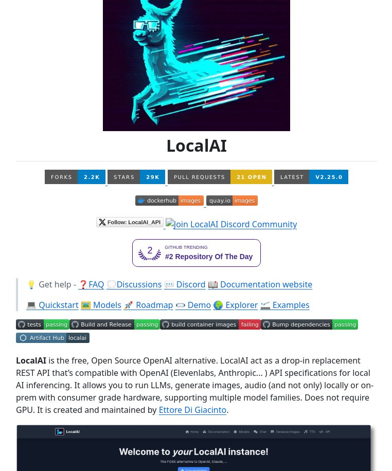

**Source:** [https://twitter.com/i/web/status/1880878405341577660](https://twitter.com/i/web/status/1880878405341577660)
**Original Post Date:** 2025-05-28 08:47:06

# LocalAI: An Open-Source Local Deployment Alternative to the OpenAI API

## Introduction
LocalAI is an open-source project that provides a drop-in replacement for OpenAI's REST API infrastructure. It enables developers to run Large Language Models (LLMs) locally without requiring specialized hardware or cloud services, offering significant benefits in terms of cost savings, privacy, and control over model deployment.

## Overview and Architecture

LocalAI serves as a middleware layer that abstracts the complexities of running local AI models while maintaining API compatibility with OpenAI's service. This architectural approach allows developers to seamlessly transition existing applications from cloud-based services to local deployments.

The project implements the same RESTful API endpoints as OpenAI, ensuring minimal code changes when migrating workflows. It supports multiple model families and provides comprehensive logging for monitoring performance and usage.

```bash
# Docker deployment example
 docker run -d \
  -p 8080:8080 \
  --name localai \
  ghcr.io/go-skynet/localai:v2.25.0
```

- REST API compatibility with OpenAI endpoints
- GPU-optional architecture for consumer hardware
- Multimodal support (text, image, audio)
- Modular deployment options via Docker/Quay

> **Note/Tip:** Ensure adequate RAM allocation when deploying on CPU-only systems.

> **Note/Tip:** Cache model outputs to optimize performance for frequent requests.

## Technical Requirements and Setup

LocalAI is designed to run efficiently on standard hardware, making it accessible to a wide range of developers. The system requires at least 8GB RAM for basic operation, though performance improves with more memory available.

Setup involves three primary steps: model selection and download, configuration file adjustment, and service deployment via Docker or native installation.

```yaml
# Sample config.yaml
model:
  name: 'llama-2-7b'
  path: './models/'
api:
  host: '0.0.0.0'
  port: 8080
```

1. Download base model files from official sources
1. Configure deployment parameters in config.yaml
1. Initialize Docker container with proper resource allocation
1. Verify API endpoints via curl/Postman tests

> **Note/Tip:** Use model quantization techniques to reduce memory footprint.

> **Note/Tip:** Implement rate limiting for production deployments.

## Integration and Community Support

LocalAI integrates seamlessly with existing workflows through its OpenAI-compatible API. The project maintains active community engagement through Discord, GitHub discussions, and comprehensive documentation.

Regular updates ensure compatibility with the latest model versions and security patches.

- Active GitHub community (29K stars)
- Comprehensive API reference documentation
- Discord support channel for troubleshooting
- Regular version updates and bug fixes

## Key Takeaways

- LocalAI provides a cost-effective alternative to cloud-based AI services by enabling local model deployment.
- The project maintains full API compatibility with OpenAI, minimizing migration efforts.
- Multimodal support allows for diverse use cases beyond text generation.

## Conclusion
LocalAI represents a significant advancement in making enterprise-grade AI models accessible through local deployment. Its combination of OpenAI API compatibility and hardware-friendly requirements makes it an attractive solution for organizations seeking to reduce cloud dependencies while maintaining model performance.

## External References

- [GitHub Repository](https://github.com/go-skynet/LocalAI)
- [Documentation Site](https://localai.io/docs/)


## Media

**Image Description:** ### Description of the Image

The image appears to be a screenshot of a GitHub repository page for a project called **LocalAI**. Below is a detailed breakdown of the image, focusing on the main subject and relevant technical details:

---

#### **1. Header Section**
- **Logo and Visual Design**:
  - At the top of the image, there is a stylized graphic of a humanoid figure in a futuristic, cyberpunk theme. The figure is depicted in a dynamic pose, with one arm extended forward, as if interacting with or controlling something. The design includes:
    - **Color Scheme**: Dominantly teal, blue, and purple hues, with streaks of light and motion effects in various colors (e.g., orange, pink, and white) to convey speed and technology.
    - **Abstract Elements**: The background features abstract, angular shapes and lines, reinforcing the futuristic and tech-oriented theme.
  - The overall aesthetic suggests themes of AI, speed, and advanced technology.

- **Title**:
  - Below the graphic, the title **"LocalAI"** is prominently displayed in large, bold text. The font is clean and modern, emphasizing the project's focus on technology and innovation.

---

#### **2. GitHub Repository Metrics**
- Directly below the title, there are standard GitHub repository metrics displayed in a horizontal row:
  - **Forks**: 2.2K (indicating the number of forks of the repository).
  - **Stars**: 29K (indicating the number of stars, a measure of popularity).
  - **Pull Requests**: 334 (indicating the number of open pull requests).
  - **Open Issues**: 21 (indicating the number of open issues).
  - **Latest Release**: v2.25.0 (indicating the latest version of the project).

---

#### **3. Badges and Links**
- Below the metrics, there are several badges and links, providing additional information about the project:
  - **Docker Images**: Badges for Docker Hub and Quay.io, indicating that the project provides Docker images for easy deployment.
  - **GitHub Trending**: A badge showing that the repository is trending on GitHub, specifically ranked as the **#2 Repository of the Day**.
  - **Follow LocalAI API**: A link to follow the LocalAI API on GitHub.
  - **Join Discord Community**: A link to join the LocalAI Discord community for discussions and support.

---

#### **4. Navigation and Documentation**
- Below the badges, there is a section with links to various resources:
  - **Get Help**:
    - **FAQ**: Link to frequently asked questions.
    - **Discussions**: Link to community discussions.
    - **Discord**: Link to the Discord server.
    - **Documentation**: Link to the project's documentation website.
  - **Quickstart**: A link to a quickstart guide for getting started with the project.
  - **Models**: A link to information about the models supported by LocalAI.
  - **Roadmap**: A link to the project's roadmap.
  - **Demo**: A link to a demo of the project.
  - **Explorer**: A link to an interactive explorer for the project.
  - **Examples**: A link to example use cases and code snippets.

---

#### **5. Status Badges**
- A row of status badges is displayed, indicating the health and status of the project:
  - **Tests**: Passing (indicated by a green badge).
  - **Build and Release**: Passing (indicated by a green badge).
  - **Build Container Images**: Failing (indicated by a red badge, suggesting an issue with container image builds).
  - **Bump Dependencies**: Passing (indicated by a green badge).
  - **Artifact Hub**: A link to the project's presence on Artifact Hub.

---

#### **6. Project Description**
- Below the status badges, there is a detailed description of the **LocalAI** project:
  - **Overview**:
    - LocalAI is a free, open-source alternative to OpenAI (Elevenlabs, Anthropic, etc.).
    - It acts as a drop-in replacement for the OpenAI REST API, providing compatibility with existing tools and workflows.
  - **Key Features**:
    - **Local Inference**: Allows running Large Language Models (LLMs) locally without requiring a GPU.
    - **Hardware Requirements**: Supports consumer-grade hardware, making it accessible for a wide range of users.
    - **Multimodal Support**: Supports generating images, audio, and other media locally or on-premises.
    - **Model Families**: Supports multiple model families, providing flexibility and compatibility.
  - **Maintenance**:
    - The project is created and maintained by **Ettore Di Giacinto**, as noted in the description.

---

#### **7. Footer**
- At the bottom of the image, there is a footer section:
  - **Navigation Links**:
    - Home
    - Documentation
    - Models
    - Chat
    - Generate Images
    - TTS (Text-to-Speech)
    - API
  - **Welcome Message**:
    - A welcoming message: **"Welcome to your LocalAI instance!"**, indicating that the project is designed for users to set up and run their own instances.
  - **Copyright and Attribution**:
    - A note indicating that LocalAI is an alternative to OpenAI, Elevenlabs, and other similar services.

---

### **Summary**
The image is a GitHub repository page for **LocalAI**, an open-source project designed as a drop-in replacement for OpenAI's REST API. The project focuses on enabling local inference of LLMs and other models without requiring a GPU, making it accessible for users with consumer-grade hardware. The page includes detailed metrics, badges, links to resources, and a comprehensive description of the project's features and maintenance. The visual design emphasizes a futuristic, tech-oriented theme, aligning with the project's focus on advanced AI and local computing.
