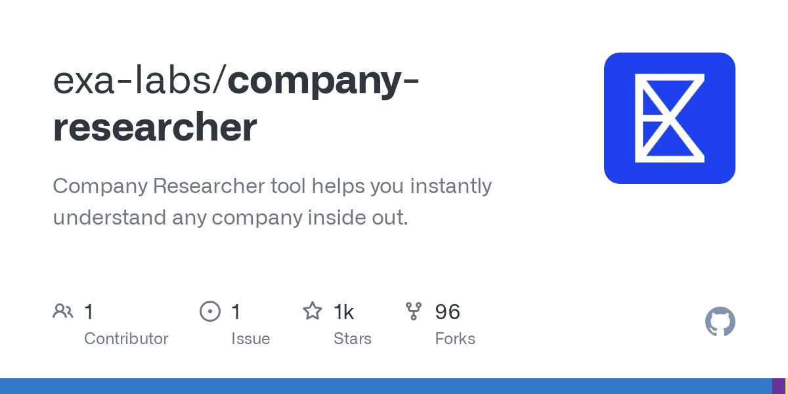

# Company Insider Ai

## Description
recently made an AI agent/app which can tell you everything about any company inside-out

opensource for the win!...

## Content
recently made an AI agent/app which can tell you everything about any company inside-out

opensource for the win!

## Category Information

- Main Category: artificial_intelligence
- Sub Category: machine_learning
- Item Name: company_insider_ai

## Source

- Original Tweet: [https://twitter.com/i/web/status/1878889570550559004](https://twitter.com/i/web/status/1878889570550559004)
- Date: 2025-02-20 15:36:34

## Media

### Media 1

**Description:** The image shows a screenshot of a GitHub page for the "exa-labs/company-researcher" repository.

* The title at the top reads "exa-labs/company-researcher" in large black text.
	+ Below this, there is smaller gray text that says "Company Researcher tool helps you understand any company inside out".
* In the center of the image, there is a blue square with a white envelope icon inside it.
	+ This suggests that the repository is related to email or communication tools.
* At the bottom left corner of the image, there are three icons: a person, a star, and a fork.
	+ These icons represent the number of contributors (1), stars (1000), and forks (96) for the repository.

Overall, the image appears to be a screenshot of a GitHub page for a company researcher tool that helps users understand any company inside out. The blue square with a white envelope icon suggests that the tool may involve email or communication features.

*Last updated: 2025-02-20 15:36:34*