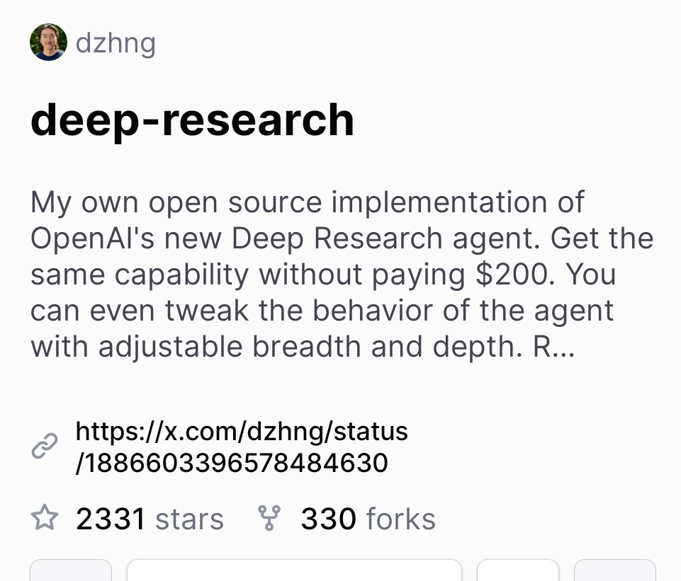

The Deep Research repository on GitHub has gained significant attention, accumulating 2.3k stars in just three days. This repository, created by user dzhng, features an implementation of OpenAI's new Deep Research agent, allowing users to leverage its capabilities without the associated costs.

## Technical Content
The Deep Research agent is designed to facilitate in-depth research and analysis. The implementation provided in the repository enables users to adjust the breadth and depth of their research, making it a highly customizable tool. By utilizing this open-source solution, researchers can bypass the $200 fee associated with OpenAI's official offering.

### Key Features
- **Adjustable Breadth and Depth**: Users can tweak the agent's behavior to suit their specific research needs.
- **Cost-Effective**: This implementation provides access to Deep Research capabilities without incurring significant costs.
- **Community Engagement**: The high level of engagement, as evidenced by the stars and forks on GitHub, indicates a strong community interest in collaborative development and improvement.

### Examples
For instance, a researcher looking to explore a broad topic with a shallow depth might adjust the parameters to prioritize breadth over depth. Conversely, for topics requiring more in-depth analysis, the depth parameter can be adjusted accordingly.

## Key Takeaways and Best Practices
- **Leverage Open-Source Solutions**: When possible, utilize open-source implementations to reduce costs and encourage community-driven development.
- **Customization**: Take advantage of adjustable parameters to tailor the tool to specific research requirements.
- **Community Participation**: Engage with the developer community to contribute to, learn from, and improve open-source projects.

## References
- **OpenAI's Deep Research Agent**: The original technology that the repository's implementation is based on.
- **GitHub Repository**: https://github.com/dzhng/deep-research - A valuable resource for those looking to implement or contribute to the Deep Research agent.
- **Tweet Announcement**: https://x.com/dzhng/status/188603396578484630 - The social media post that announced the repository's rapid growth in popularity.

By following the example set by the Deep Research repository, developers and researchers can collaborate on innovative projects, driving progress in artificial intelligence and machine learning while fostering a spirit of community and open-source development.
## Source

- Original Tweet: [https://twitter.com/i/web/status/1888299647845961909](https://twitter.com/i/web/status/1888299647845961909)
- Date: 2025-02-20 17:28:38

## Media

### Media 1

**Description:** The image displays a social media post from X.com, featuring a screenshot of a user's profile page with their name "dzhng" at the top left corner. The background is white.

*   **Username**
    *   Located at the top left corner
    *   Displayed as "dzhng"
*   **Post Title**
    *   Centered below the username
    *   Reads "deep-research"
*   **Post Content**
    *   Below the title, there is a block of text describing an implementation of OpenAI's new Deep Research agent.
    *   It mentions that the user has implemented it themselves without paying $200 and can even tweak the behavior with adjustable breadth and depth.
    *   A link to the post is provided: https://x.com/dzhng/status/188603396578484630
*   **Statistics**
    *   At the bottom of the image, there are statistics for the post:
        *   2331 stars
        *   330 forks

The post appears to be about a user's implementation of OpenAI's new Deep Research agent and their experience with it.

*Last updated: 2025-02-20 17:28:38*