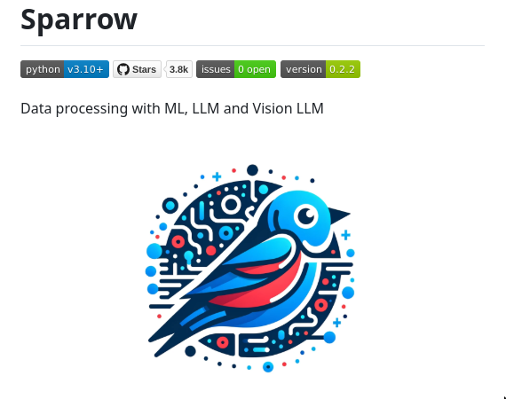

Sparrow is an open-source solution designed for extracting and processing data from documents and images using machine learning (ML). It specializes in handling forms, invoices, receipts, and other structured data through modules for Optical Character Recognition (OCR), ML models, and data labeling. This Python library integrates seamlessly with ML, Large Language Models (LLM), and Vision LLM to provide a comprehensive data processing toolkit.

#### Technical Content
Sparrow's architecture is built around several key components:
- **Optical Character Recognition (OCR)**: This module enables the extraction of text from images and scanned documents, converting them into editable digital formats. Sparrow's OCR capabilities are crucial for handling invoices, receipts, and forms where data needs to be extracted accurately.
- **Machine Learning Models**: Sparrow utilizes ML models to analyze and process the extracted data. These models can be trained on specific datasets to recognize patterns, classify documents, or predict outcomes based on historical data. For instance, an ML model in Sparrow could be trained to differentiate between invoices from different vendors based on their layouts and content.
- **Data Labeling**: To improve the accuracy of its ML models, Sparrow incorporates a data labeling module. This allows users to annotate and label the extracted data, which can then be used to fine-tune the ML models for better performance in real-world applications.

#### Examples
A common scenario where Sparrow could be invaluable is in automating the processing of receipts for expense reporting. Here’s how it works:
1. **Data Extraction**: Sparrow uses its OCR module to extract relevant information from receipt images, such as date, amount, and items purchased.
2. **Data Processing**: The extracted data is then processed through ML models that categorize the expenses (e.g., food, travel, etc.) and calculate totals.
3. **Data Labeling**: Users can review and label the categorized expenses to correct any inaccuracies or add more specific categories, which helps in training the ML model for future use.

#### Key Takeaways and Best Practices
- **Accuracy Over Speed**: When using Sparrow or similar tools, prioritize the accuracy of extracted and processed data. This may involve manually reviewing a subset of the data to ensure that ML models are performing as expected.
- **Continuous Training**: Regularly update and train ML models with new data to maintain their effectiveness and adaptability to changing document formats or content.
- **Data Privacy**: Ensure that all data processing complies with relevant privacy laws and regulations, especially when dealing with sensitive information such as financial documents.

#### References
- [Sparrow Official Website](link-to-sparrow-website) - For detailed documentation, tutorials, and community forums related to Sparrow.
- [Python Library for Machine Learning](link-to-python-library) - Resources for integrating Sparrow with other Python ML libraries.
- [Large Language Models (LLM) and Vision LLM](link-to-llm-vision-llm-resources) - Further reading on how these technologies can be leveraged in data processing tasks.

By leveraging Sparrow's capabilities, developers and data analysts can significantly streamline their workflows related to document and image data extraction and processing, opening up new possibilities for automation and insight generation.
## Source

- Original Tweet: [https://twitter.com/i/web/status/1866925123493642719](https://twitter.com/i/web/status/1866925123493642719)
- Date: 2025-02-24 12:10:48

## Media

### Media 1

**Description:** The image displays a screenshot of the Sparrow website, which is a Python library for data processing with ML, LLM, and Vision LLM.

* The title "Sparrow" is displayed at the top left corner of the page.
	+ It is written in large black text.
	+ Below it are several lines of smaller text that provide information about the project.
* A blue bird icon is prominently displayed on the page.
	+ The bird is surrounded by various shapes and symbols, including red dots, blue circles, and geometric patterns.
	+ The bird's body is composed of different colors, including blue, red, and white.
* The background of the image is a light gray color.
	+ There are no other visual elements or images present in the background.

Overall, the image suggests that Sparrow is a project focused on machine learning and artificial intelligence, with a focus on data processing and visualization. The use of a blue bird icon may symbolize freedom, creativity, and innovation, which could be relevant to the field of AI development.

*Last updated: 2025-02-24 12:10:48*