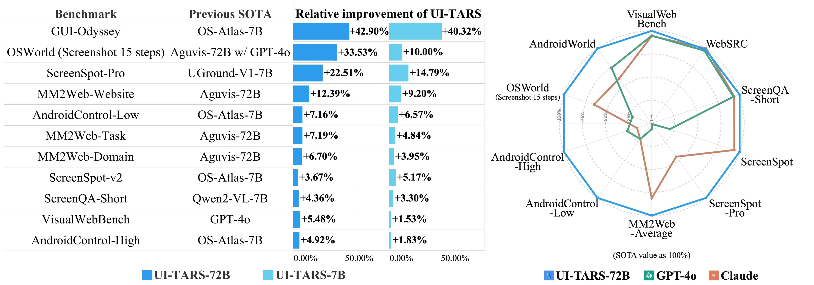
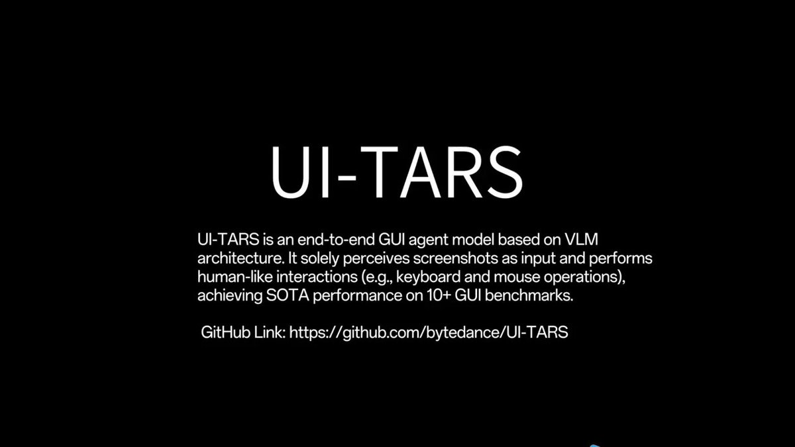

ByteDance has open-sourced UI-TARS, a revolutionary end-to-end GUI agent model based on Visual Language Model (VLM) architecture. This release includes two state-of-the-art (SOTA) models, 7B and 72B, along with a PC/MacOS app to control computers using VLM. The UI-TARS model has achieved SOTA performance across 10+ GUI benchmarks, outperforming notable models like GPT-4o and Claude.

#### Technical Content
The UI-TARS model is designed to perceive screenshots as input and perform human-like interactions, such as keyboard and mouse operations. This is made possible by the VLM architecture, which enables the model to understand visual elements and generate corresponding actions.

The open-sourced release includes:

* Two SOTA models: 7B and 72B
* A PC/MacOS app for controlling computers using VLM
* GitHub link for further information and access to the model

The infographic provided showcases a comprehensive comparison of UI-TARS-72B with other SOTA models, including GPT-4o and Claude. The results demonstrate UI-TARS-72B's consistent outperformance across five categories:

1. Visual Web Bench
2. MM2Web-Average
3. ScreenSpot-Pro
4. ScreenQA-Short
5. GPT-4o

#### Examples and Use Cases
The UI-TARS model can be applied to various scenarios, such as:

* Automating GUI interactions for testing and development purposes
* Assisting users with disabilities in interacting with computers
* Enhancing user experience through intelligent GUI agents

For instance, the PC/MacOS app can be used to control a computer using VLM, allowing users to perform tasks without manually interacting with the GUI.

#### Key Takeaways and Best Practices
1. **Leverage open-sourced models**: Utilize the UI-TARS model release to explore its capabilities and applications in various domains.
2. **Understand VLM architecture**: Familiarize yourself with the Visual Language Model architecture to better appreciate the UI-TARS model's strengths and limitations.
3. **Experiment with GUI automation**: Apply the UI-TARS model to automate GUI interactions and enhance user experience.

#### References
* [ByteDance](https://www.bytedance.com/): The company behind the UI-TARS model release.
* [GitHub](https://github.com/): The platform hosting the UI-TARS model repository.
* [VLM Architecture](https://en.wikipedia.org/wiki/Visual_Language_Model): A Wikipedia article introducing the Visual Language Model concept.

By embracing the UI-TARS model release, developers and researchers can unlock new possibilities in GUI automation, human-computer interaction, and artificial intelligence.
## Source

- Original Tweet: [https://twitter.com/i/web/status/1881938753050329467](https://twitter.com/i/web/status/1881938753050329467)
- Date: 2025-02-24 12:26:05

## Media

### Media 1

**Description:** Video file: media_0.mp4

### Media 2

**Description:** This infographic presents a comprehensive comparison of various SOTA (State-of-the-art) models across three categories: UI-TARS-72B, GPT-4o, and Claude. The top section lists 13 models, while the middle left section displays a bar chart illustrating the relative improvement of each model in relation to UI-TARS-72B.

The bottom right corner features a line graph comparing the performance of these three models across five categories: Visual Web Bench, MM2Web-Average, ScreenSpot-Pro, ScreenQA-Short, and GPT-4o. The data is presented as a percentage of improvement over UI-TARS-72B. Notably, UI-TARS-72B consistently outperforms the other two models in all five categories.

The infographic's background is white, with black text used throughout. The use of distinct colors for each model (blue for UI-TARS-72B and orange for Claude) facilitates easy comparison between the three models.

### Media 3

**Description:** The image presents a concise overview of UI-TARS, an end-to-end GUI agent model based on VLM architecture. The key points are:

• **UI-TARS**
	+ Definition: End-to-end GUI agent model
	+ Architecture: Based on VLM (Visual Language Model)
	+ Purpose: Solely perceives screenshots as input and performs human-like interactions

• **Features**
	+ Performs human-like interactions (e.g., keyboard and mouse operations)
	+ Achieves SOTA performance on 10+ GUI benchmarks
	+ GitHub link provided for further information or access to the model

• **Visual Elements**
	+ White text on a black background, with the title "UI-TARS" in large font at the top center of the image

In summary, the image effectively communicates the core concept and features of UI-TARS, providing a clear understanding of its capabilities and architecture.

*Last updated: 2025-02-24 12:26:05*