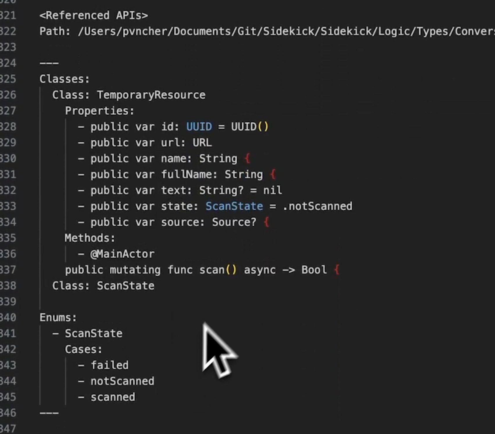

Code pattern matching is a crucial aspect of artificial intelligence (AI) and natural language processing (NLP) that involves identifying essential patterns and relationships within codebases to facilitate efficient processing by large language models (LLMs). This entry delves into the importance of stripping code to its essential elements, the role of CodeMaps, and best practices for optimizing code for AI analysis.

#### Technical Content
Large Language Models (LLMs) are designed to process and understand vast amounts of data, including source code. However, feeding entire codebases into LLMs can be inefficient due to the noise and redundancy present in the code. LLMs operate by matching patterns rather than reading code line by line like a human developer would. Therefore, presenting the right signals—i.e., the essential patterns and relationships within the code—is key to effective AI processing.

A **CodeMap** is a tool or technique used to strip code down to its most critical elements, highlighting the structure, variables, functions, and data types that define the code's functionality. By doing so, CodeMaps help in reducing the noise that can flood the context window of LLMs, thereby improving the accuracy and efficiency of AI-driven analysis and processing tasks.

**Example:**

Consider a simple Python function for calculating the area of a rectangle:
```python
def calculate_area(length, width):
    area = length * width
    return area
```
A CodeMap for this function might focus on the parameters (`length` and `width`), the operation (`*`), and the return value (`area`), presenting these essential elements in a condensed form that is easily digestible by LLMs.

#### Key Takeaways and Best Practices
- **Optimize Code for AI:** Before feeding code into LLMs, optimize it by removing redundant comments, dead code, and other elements that do not contribute to the code's functionality.
- **Use CodeMaps:** Utilize CodeMaps or similar techniques to highlight the essential patterns and relationships within your codebase.
- **Minimize Noise:** Ensure that the context provided to LLMs is as clean and relevant as possible to improve processing efficiency and accuracy.
- **Understand LLM Limitations:** Recognize that LLMs match patterns rather than truly "read" code, and plan your AI integration strategies accordingly.

#### References
- **Large Language Models (LLMs):** Advanced AI models capable of processing and generating human-like language, including source code.
- **CodeMaps:** Tools or techniques for simplifying and highlighting the essential elements of source code to improve AI processing efficiency.
- **Natural Language Processing (NLP):** A subfield of artificial intelligence focused on enabling computers to understand, interpret, and generate natural human language.

By following best practices in code pattern matching and utilizing tools like CodeMaps, developers can significantly enhance the efficiency and effectiveness of AI-driven analysis and processing tasks. This not only improves the performance of LLMs but also contributes to better integration of AI technologies within software development workflows.
## Source

- Original Tweet: [https://twitter.com/i/web/status/1890774044758147223](https://twitter.com/i/web/status/1890774044758147223)
- Date: 2025-02-20 16:01:05


## Media

### Media 1

**Description:** The image shows a code snippet in a programming language, with a gray background and white text. The purpose of the image is to display a piece of code that appears to be related to computer science or software development.

Here are the key features of the image:

* **Code Snippet:**
	+ The code is written in a programming language
	+ It includes variables, functions, and data types
	+ The syntax and structure suggest it is written in a specific programming language
* **Gray Background:**
	+ The background color is a medium gray tone
	+ The gray tone provides contrast to the white text of the code
* **White Text:**
	+ The text is displayed in a clean, sans-serif font
	+ The text is easy to read and understand

Overall, the image presents a clear and organized piece of code with a neutral background, making it suitable for display or analysis. There are no significant changes or comparisons to note in this image.

*Last updated: 2025-02-20 16:01:05*