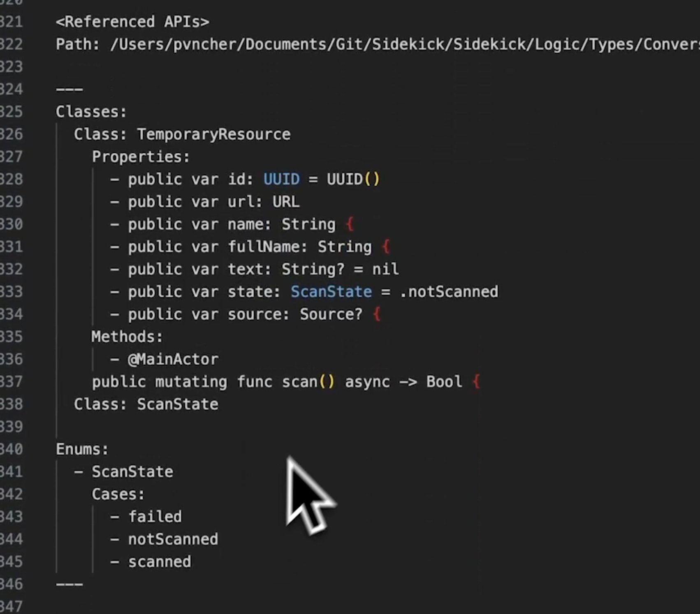

# Code Pattern Matching

## Description
Don't feed AI your entire codebase. LLMs don't read code - they match patterns. A CodeMap strips your code to its essential patterns and relationships. Show less code but show the right signals. Stop ...

## Content
Don't feed AI your entire codebase. LLMs don't read code - they match patterns. A CodeMap strips your code to its essential patterns and relationships. Show less code but show the right signals. Stop flooding the context window with noise.

## Category Information

- Main Category: artificial_intelligence
- Sub Category: nlp
- Item Name: code_pattern_matching

## Source

- Original Tweet: [https://twitter.com/i/web/status/1890774044758147223](https://twitter.com/i/web/status/1890774044758147223)
- Date: 2025-02-20 15:36:34

## Media

### Media 1

**Description:** The image shows a code snippet in a programming language, with a gray background and white text. The purpose of the image is to display a piece of code that appears to be related to computer science or software development.

Here are the key features of the image:

* **Code Snippet:**
	+ The code is written in a programming language
	+ It includes variables, functions, and data types
	+ The syntax and structure suggest it is written in a specific programming language
* **Gray Background:**
	+ The background color is a medium gray tone
	+ The gray tone provides contrast to the white text of the code
* **White Text:**
	+ The text is displayed in a clean, sans-serif font
	+ The text is easy to read and understand

Overall, the image presents a clear and organized piece of code with a neutral background, making it suitable for display or analysis. There are no significant changes or comparisons to note in this image.

*Last updated: 2025-02-20 15:36:34*