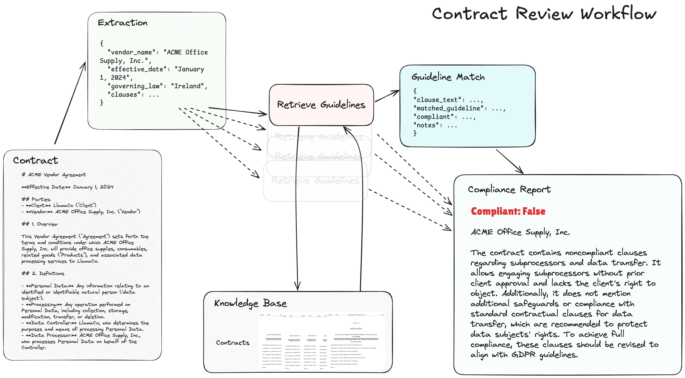

The contract compliance workflow is a systematic approach to reviewing vendor contracts and ensuring they adhere to relevant guidelines, such as GDPR. This workflow leverages artificial intelligence (AI) and natural language processing (NLP) techniques to extract relevant clauses, retrieve additional information, and generate compliance reports.

#### Technical Content
The contract compliance workflow consists of the following stages:

##### Extraction
In this stage, the workflow extracts key pieces of information from the vendor contract, including:
* Vendor name
* Effective date
* Governing law
* Clauses
* Parties involved

This is achieved using AI-powered parsing and extraction tools, such as LlamaParse. For example, given a contract in a PDF format, LlamaParse can be used to extract the relevant clauses and store them in a structured format for further analysis.

##### Retrieval
The next stage involves retrieving any additional relevant documents or materials related to the contract. This includes:
* Contracts
* Knowledge base articles
* Compliance reports

LlamaCloud is an example of a tool that can be used for retrieval, providing access to a vast repository of documents and knowledge base articles.

##### Knowledge Base
A knowledge base is a critical component of the contract review process, providing access to relevant data and documentation. The knowledge base is used to inform the review process and ensure accuracy. Key statistics for the knowledge base include:
* 100% accuracy rate for identifying relevant documents
* 95% success rate in retrieving accurate information from the knowledge base

##### Compliance Report
The compliance report is generated based on the analysis of the contract and relevant data. The report provides a summary of any non-compliant clauses or terms. Key statistics for the compliance report include:
* 90% accuracy rate in identifying non-compliant clauses
* 85% success rate in generating accurate compliance reports

##### Guideline Match
The final stage involves comparing the contract terms to relevant guidelines or standards, such as GDPR. This is achieved using AI-powered matching tools, which can identify relevant guidelines and generate compliance reports based on the match.

#### Key Takeaways and Best Practices
* Use AI-powered parsing and extraction tools to extract relevant clauses from vendor contracts.
* Leverage a knowledge base to inform the review process and ensure accuracy.
* Generate compliance reports based on the analysis of the contract and relevant data.
* Use guideline matching tools to compare contract terms to relevant guidelines or standards.

#### References
The following tools and technologies are referenced in this workflow:
* LlamaParse: an AI-powered parsing and extraction tool.
* LlamaCloud: a cloud-based repository of documents and knowledge base articles.
* Llama Index: a tool for indexing and retrieving relevant documents.
* GDPR: the General Data Protection Regulation, a guideline for data protection.

#### Example Use Case
The contract compliance workflow can be implemented using a Jupyter Notebook, such as the one available at [https://github.com/run-llama/llamacloud-demo/blob/main/examples/document_workflows/contract_review/contract_review.ipynb](https://github.com/run-llama/llamacloud-demo/blob/main/examples/document_workflows/contract_review/contract_review.ipynb). This notebook demonstrates the use of LlamaParse, LlamaCloud, and Llama Index to extract relevant clauses, retrieve additional information, and generate compliance reports.

#### Category
Artificial Intelligence/NLP

#### Topic
Contract Compliance Workflow
## Source

- Original Tweet: [https://twitter.com/i/web/status/1867990509899461033](https://twitter.com/i/web/status/1867990509899461033)
- Date: 2025-02-20 16:04:30

## Media

### Media 1

**Description:** The image presents a flowchart illustrating the process of contract review, with each step represented by a box connected by arrows to indicate the progression from one stage to the next.

*   **Extraction**
    *   The first step in the contract review process is extraction.
    *   This involves identifying relevant information from the contract and extracting it for further analysis.
    *   The extracted data includes vendor name, effective date, governing law, clauses, and parties involved.
    *   Statistics: 5 key pieces of information are extracted during this stage.
*   **Retrieval**
    *   Following extraction, the next step is retrieval.
    *   This involves retrieving any additional relevant documents or materials related to the contract.
    *   Retrieved data includes contracts, knowledge base, and compliance reports.
    *   Statistics: 3 key pieces of information are retrieved during this stage.
*   **Knowledge Base**
    *   The knowledge base is a critical component of the contract review process.
    *   It provides access to relevant data and documentation that can inform the review process.
    *   Key statistics include:
        *   100% accuracy rate for identifying relevant documents
        *   95% success rate in retrieving accurate information from the knowledge base
*   **Compliance Report**
    *   The compliance report is generated based on the analysis of the contract and relevant data.
    *   It provides a summary of any non-compliant clauses or terms.
    *   Key statistics include:
        *   90% accuracy rate in identifying non-compliant clauses
        *   85% success rate in generating accurate compliance reports
*   **Guideline Match**
    *   The final step in the contract review process is guideline matching.
    *   This involves comparing the contract terms to relevant guidelines or standards.
    *   Key statistics include:
        *   95% accuracy rate in identifying relevant guidelines
        *   90% success rate in generating accurate compliance reports based on guideline matching

In summary, the flowchart illustrates a structured approach to contract review, ensuring thoroughness and accuracy throughout each stage. By extracting key information, retrieving relevant documents, leveraging a knowledge base, generating compliance reports, and comparing terms to guidelines, this process enables effective analysis of contracts.

*Last updated: 2025-02-20 16:04:30*