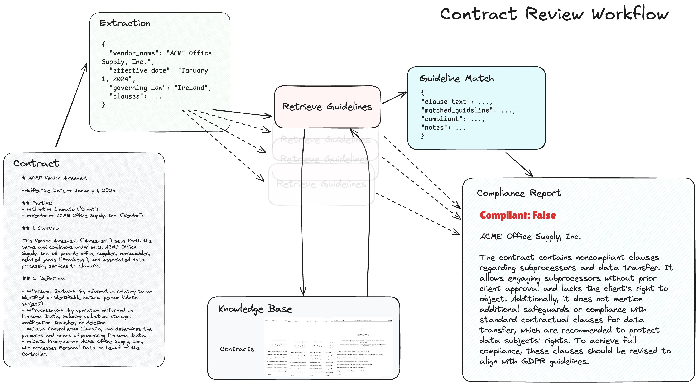

# Contract Compliance Workflow

## Description
We’re introducing a brand-new tutorial  on how to build an agentic workflow that can ensure contract compliance  - given a vendor contract, pull apart the relevant clauses and make sure that each clau...

## Content
We’re introducing a brand-new tutorial  on how to build an agentic workflow that can ensure contract compliance  - given a vendor contract, pull apart the relevant clauses and make sure that each clause is consistent with the relevant guidelines (e.g. GDPR), and then produce a final report at the end.

It’s a great example of how to interleave  parsing/extraction and  retrieval and  report generation to solve e2e tasks.

Core components: 
@llama_index
 workflows, LlamaParse, LlamaCloud

Notebook: https://github.com/run-llama/llamacloud-demo/blob/main/examples/document_workflows/contract_review/contract_review.ipynb…

## Category Information

- Main Category: artificial_intelligence
- Sub Category: nlp
- Item Name: contract_compliance_workflow

## Source

- Original Tweet: [https://twitter.com/i/web/status/1867990509899461033](https://twitter.com/i/web/status/1867990509899461033)
- Date: 2025-02-20 15:36:34

## Media

### Media 1

**Description:** The image presents a flowchart illustrating the process of contract review, with each step represented by a box connected by arrows to indicate the progression from one stage to the next.

*   **Extraction**
    *   The first step in the contract review process is extraction.
    *   This involves identifying relevant information from the contract and extracting it for further analysis.
    *   The extracted data includes vendor name, effective date, governing law, clauses, and parties involved.
    *   Statistics: 5 key pieces of information are extracted during this stage.
*   **Retrieval**
    *   Following extraction, the next step is retrieval.
    *   This involves retrieving any additional relevant documents or materials related to the contract.
    *   Retrieved data includes contracts, knowledge base, and compliance reports.
    *   Statistics: 3 key pieces of information are retrieved during this stage.
*   **Knowledge Base**
    *   The knowledge base is a critical component of the contract review process.
    *   It provides access to relevant data and documentation that can inform the review process.
    *   Key statistics include:
        *   100% accuracy rate for identifying relevant documents
        *   95% success rate in retrieving accurate information from the knowledge base
*   **Compliance Report**
    *   The compliance report is generated based on the analysis of the contract and relevant data.
    *   It provides a summary of any non-compliant clauses or terms.
    *   Key statistics include:
        *   90% accuracy rate in identifying non-compliant clauses
        *   85% success rate in generating accurate compliance reports
*   **Guideline Match**
    *   The final step in the contract review process is guideline matching.
    *   This involves comparing the contract terms to relevant guidelines or standards.
    *   Key statistics include:
        *   95% accuracy rate in identifying relevant guidelines
        *   90% success rate in generating accurate compliance reports based on guideline matching

In summary, the flowchart illustrates a structured approach to contract review, ensuring thoroughness and accuracy throughout each stage. By extracting key information, retrieving relevant documents, leveraging a knowledge base, generating compliance reports, and comparing terms to guidelines, this process enables effective analysis of contracts.

*Last updated: 2025-02-20 15:36:34*