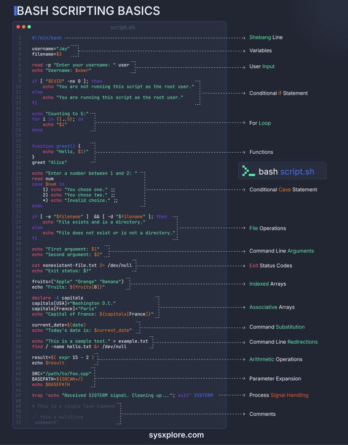

**Source:** [https://twitter.com/i/web/status/1868731434967675047](https://twitter.com/i/web/status/1868731434967675047)
**Original Post Date:** 2025-06-17 10:28:39

# Bash Scripting Fundamentals: Core Concepts and Syntax Essentials

## Introduction
Bash scripting is a fundamental skill for system administrators and developers working in Unix-like environments. This article provides an in-depth exploration of core Bash scripting concepts, from basic syntax to advanced features. Understanding these fundamentals enables efficient automation of tasks, management of systems, and creation of robust shell scripts that can handle complex workflows.

## Script Basics and Execution

Every Bash script begins with a shebang line specifying the interpreter to be used. This ensures compatibility across different Unix-like systems and environments.

Command-line arguments provide flexibility by allowing users to pass data directly when executing scripts, making them more versatile and reusable.

_The shebang line specifies Bash as the interpreter, while command-line arguments are accessed using positional parameters like $1._

```bash
#!/bin/bash
# Script begins here
username=$1
echo "Hello $username!"
```

## Variables and Data Handling

Variables in Bash store data that can be used throughout a script. They're essential for storing user input, filenames, or any dynamic values needed during execution.

Command substitution allows scripts to capture the output of commands into variables, enabling complex workflows based on system state.

_This example demonstrates variable assignment, command substitution with $(...), and indexed arrays using the ${array[@]} syntax to access all elements._

```bash
current_date=$(date)
echo "Today's date is: $current_date"

fruits=("Apple" "Orange" "Banana")
echo "Fruits: ${fruits[@]}"
```

- Variables are case-sensitive in Bash
- Always quote variables to prevent word splitting
- Arrays use square brackets for indexing

## Control Structures and Logic Flow

Bash provides several control structures for conditional execution and iteration, enabling scripts to make decisions based on system state or user input.

The case statement offers an elegant way to handle multiple possible values of a variable in a single block.

_This demonstrates basic if-else conditional checking for file existence and a case statement handling multiple options with pattern matching._

```bash
# Conditional if-else
if [ -f "$filename" ]; then
echo "File exists"
fi

# Case statement
read choice
case $choice in
1) echo "Option 1" ;;
2) echo "Option 2" ;;
*) echo "Invalid option" ;;
esac
```

## Advanced Features

Bash offers advanced features like functions, arithmetic operations, process signal handling, and parameter expansion that enable more sophisticated scripts.

Signal handling is crucial for robust scripts that need to handle system interruptions gracefully.

_Functions encapsulate reusable code, trap handles system signals, and arithmetic operations can be performed using $((...))._

```bash
# Function definition
greet() {
echo "Hello $1"
}

# Signal handling
trap 'echo "Received SIGTERM"; exit' SIGTERM

# Arithmetic
result=$((5 + 3))
```

## Key Takeaways

- Proper use of shebang lines ensures script portability across different systems.
- Variables must be properly quoted to prevent unexpected behavior due to word splitting or globbing.
- Control structures enable dynamic decision-making and iteration in scripts.
- Advanced features like functions, signal handling, and arithmetic operations are essential for robust scripting.

## Conclusion
Mastering Bash scripting fundamentals is crucial for system administration and automation tasks. Understanding variables, control structures, file operations, and advanced features enables the creation of efficient and maintainable shell scripts that can automate complex workflows.

## External References

- [Bash Documentation](https://www.gnu.org/software/bash/manual/)
- [Advanced Bash-Scripting Guide](https://tldp.org/LDP/abs/html/)


## Media

**Image Description:** The image is a comprehensive guide titled **"BASH SCRIPTING BASICS"**, presented in a visually structured format. It provides an overview of fundamental concepts and syntax used in Bash scripting, with code snippets and explanations for each concept. Below is a detailed breakdown of the image:

---

### **Main Subject**
The main subject of the image is a **Bash scripting tutorial**. It covers various essential components of Bash scripting, including syntax, control structures, file operations, and advanced features. The code is annotated with comments explaining each concept.

---

### **Key Sections and Concepts**

1. **Shebang Line**
   - **Code Snippet**: `#!/bin/bash`
   - **Explanation**: The Shebang line specifies the interpreter to be used for executing the script. In this case, it indicates that the script should be executed using the Bash shell.

2. **Variables**
   - **Code Snippet**: 
     ```bash
     username="Jay"
     filename=$3
     ```
   - **Explanation**: Variables are used to store data. The first line assigns the string `"Jay"` to the variable `username`, while the second line assigns the third command-line argument (`$3`) to the variable `filename`.

3. **User Input**
   - **Code Snippet**: 
     ```bash
     read -p "Enter your username: " user
     echo "Username: $user"
     ```
   - **Explanation**: The `read` command is used to prompt the user for input, which is then stored in the variable `user`. The `echo` command displays the entered username.

4. **Conditional If Statement**
   - **Code Snippet**: 
     ```bash
     if [ "$UID" -ne 0 ]; then
         echo "You are not running this script as the root user."
     else
         echo "You are running this script as the root user."
     fi
     ```
   - **Explanation**: The `if` statement checks whether the current user's UID (User ID) is not equal to `0` (root user). If true, it prints a message indicating the user is not root; otherwise, it confirms the user is root.

5. **For Loop**
   - **Code Snippet**: 
     ```bash
     echo "Counting to 5:"
     for i in {1..5}; do
         echo "$i"
     done
     ```
   - **Explanation**: The `for` loop iterates over a range of numbers from `1` to `5`, printing each number.

6. **Functions**
   - **Code Snippet**: 
     ```bash
     function greet() {
         echo "Hello, $1!"
     }
     greet "Alice"
     ```
   - **Explanation**: A function named `greet` is defined, which takes one argument (`$1`) and prints a greeting. The function is called with the argument `"Alice"`.

7. **Conditional Case Statement**
   - **Code Snippet**: 
     ```bash
     echo "Enter a number between 1 and 2: "
     read num
     case $num in
         1) echo "You chose one." ;;
         2) echo "You chose two." ;;
         *) echo "Invalid choice." ;;
     esac
     ```
   - **Explanation**: The `case` statement evaluates the value of the variable `num` and executes the corresponding block of code based on the match.

8. **File Operations**
   - **Code Snippet**: 
     ```bash
     if [ -e "$filename" ] && [ -d "$filename" ]; then
         echo "File exists and is a directory."
     else
         echo "File does not exist or is not a directory."
     fi
     ```
   - **Explanation**: The script checks whether the file specified by `filename` exists (`-e`) and is a directory (`-d`). It prints a message based on the result.

9. **Command Line Arguments**
   - **Code Snippet**: 
     ```bash
     echo "First argument: $1"
     echo "Second argument: $2"
     ```
   - **Explanation**: The script accesses the first (`$1`) and second (`$2`) command-line arguments passed to the script.

10. **Exit Status Codes**
    - **Code Snippet**: 
      ```bash
      cat nonexistent-file.txt.txt 2>/dev/null
      echo "Exit status: $?"
      ```
    - **Explanation**: The `cat` command attempts to read a nonexistent file, and the exit status (`$?`) is printed. The `2>/dev/null` redirects error output to `/dev/null`.

11. **Indexed Arrays**
    - **Code Snippet**: 
      ```bash
      fruits=("Apple" "Orange" "Banana")
      echo "Fruits: ${fruits[@]}"
      ```
    - **Explanation**: An indexed array `fruits` is defined with three elements. The `echo` command prints all elements of the array using `${fruits[@]}`.

12. **Associative Arrays**
    - **Code Snippet**: 
      ```bash
      declare -A capitals
      capitals[USA]="Washington D.C."
      capitals[France]="Paris"
      echo "Capital of France: ${capitals[France]}"
      ```
    - **Explanation**: An associative array `capitals` is declared, where keys are country names and values are their respective capitals. The script prints the capital of France.

13. **Command Substitution**
    - **Code Snippet**: 
      ```bash
      current_date=$(date)
      echo "Today's date is: $current_date"
      ```
    - **Explanation**: The `date` command is executed, and its output is stored in the variable `current_date` using command substitution (`$(...)`).

14. **Command Line Redirections**
    - **Code Snippet**: 
      ```bash
      find . -name hello.txt 2>&1
      ```
    - **Explanation**: The `find` command searches for files named `hello.txt`. The `2>&1` redirects both standard error (file descriptor `2`) and standard output (file descriptor `1`) to the same destination.

15. **Arithmetic Operations**
    - **Code Snippet**: 
      ```bash
      result=$(expr 5 - 2)
      echo $result
      ```
    - **Explanation**: The `expr` command performs arithmetic subtraction (`5 - 2`), and the result is stored in the variable `result`.

16. **Parameter Expansion**
    - **Code Snippet**: 
      ```bash
      SRC="/path/to/foo.cpp"
      BASEPATH=$(dirname "$SRC")
      BASENAME=$(basename "$SRC")
      echo "$BASEPATH"
      echo "$BASENAME"
      ```
    - **Explanation**: The `dirname` and `basename` commands extract the directory path and filename from the `SRC` variable, respectively.

17. **Process Signal Handling**
    - **Code Snippet**: 
      ```bash
      trap 'echo "Received SIGTERM signal. Cleaning up..."; exit' SIGTERM
      ```
    - **Explanation**: The `trap` command sets up a signal handler for the `SIGTERM` signal. When the script receives this signal, it prints a cleanup message and exits.

18. **Comments**
    - **Code Snippet**: 
      ```bash
      # This is a single line comment
      : '
      This is a multi-line
      comment
      '
      ```
    - **Explanation**: Single-line comments start with `#`, while multi-line comments are enclosed between `: '` and ` '`.

---

### **Visual Layout**
- The code is presented in a monospaced font, typical for code editors.
- Each concept is annotated with a comment on the right side, explaining its purpose.
- The background is dark, with syntax highlighting for better readability:
  - **Green**: Keywords and commands.
  - **Cyan**: Variables and file paths.
  - **Yellow**: Comments.
  - **White**: General text and code.

---

### **Footer**
- The bottom of the image includes the website URL: **sysxsplore.com**, indicating the source of the tutorial.

---

### **Overall Purpose**
The image serves as an educational resource for beginners learning Bash scripting. It covers a wide range of fundamental concepts, providing clear examples and explanations for each topic. The structured layout and annotations make it easy to follow and understand the basics of Bash scripting.
