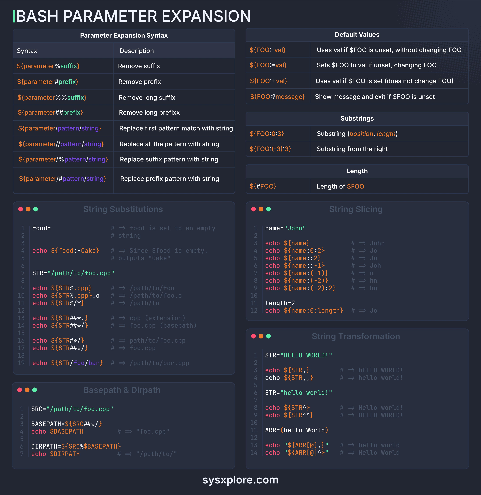

**Source:** [https://twitter.com/i/web/status/1875561282302357530](https://twitter.com/i/web/status/1875561282302357530)
**Original Post Date:** 2025-05-27 23:58:44

# Bash Parameter Expansion: Advanced Techniques & Practical Applications

## Introduction
Parameter expansion is a powerful feature in Bash that enables efficient variable manipulation without external commands. This guide explores advanced techniques, from basic syntax to complex string manipulations, helping you write more robust and concise scripts.

## Basic Parameter Expansion Syntax

Parameter expansion uses the ${} notation to perform operations on variables. It offers a wide range of operations from simple value access to complex string transformations.

```bash
# Basic syntax
var="hello"
echo "${var}"
# Output: hello
```

## Default Value Handling

Parameter expansion provides methods to handle unset or null variables safely.

The :- operator uses a default value without modifying the original variable, while := sets and modifies it.

```bash
# Default values
FOO=
echo "${FOO:-default}"
# Output: default
```

## String Manipulation Techniques

Bash supports various string manipulations including prefix/suffix removal, pattern replacement, and substring extraction.

```bash
# String operations
path="/usr/local/bin/script"
filename="${path##*/}"
echo "$filename"
# Output: script
```

## Advanced Transformations

Parameter expansion can transform strings using case conversion and character manipulation.

```bash
# Case transformations
str="Hello World"
lowercase="${str,,}"
uppercase="${str^^}"
echo "$lowercase $uppercase"
```

## Path Manipulation

Parameter expansion is particularly useful for file path manipulation.

```bash
# Path operations
path="/usr/local/bin/script.sh"
dir="${path%/*}"
base="${path##*/}"
echo "$dir $base"
```

## Key Takeaways

- Parameter expansion provides efficient string manipulation without external commands
- Use appropriate operators (:-, :=) for default value handling to avoid runtime errors
- Master pattern matching and substring extraction for complex text processing tasks
- Implement case transformations using parameter expansion for consistent output formatting

## Conclusion
Bash parameter expansion is a fundamental tool that enables efficient variable manipulation and string processing. By mastering these techniques, you can write more maintainable and performant shell scripts.

## External References

- [GNU Bash Manual](https://www.gnu.org/software/bash/manual/)
- [Bash Parameter Expansion Guide](https://wiki.bash-hackers.org/syntax/pe)


## Media

**Image Description:** The image is a comprehensive guide to **Bash Parameter Expansion**, a powerful feature in Bash scripting that allows for manipulating and extracting information from variables. The guide is structured into several sections, each detailing different aspects of parameter expansion, including syntax, examples, and use cases. Below is a detailed breakdown of the image:

---

### **Main Sections and Content**

#### **1. Parameter Expansion Syntax**
This section provides a table summarizing the syntax and descriptions of various parameter expansion operations. The table is divided into two columns:
- **Syntax**: The specific syntax for each operation.
- **Description**: A brief explanation of what the operation does.

Key syntax examples include:
- `${parameter%suffix}`: Removes the shortest suffix matching `suffix`.
- `${parameter##prefix}`: Removes the longest prefix matching `prefix`.
- `${parameter/pattern/string}`: Replaces the first occurrence of `pattern` with `string`.
- `${parameter//pattern/string}`: Replaces all occurrences of `pattern` with `string`.
- `${parameter:position:length}`: Extracts a substring starting at `position` with a specified `length`.

#### **2. Default Values**
This section explains how to set default values for variables using parameter expansion. It includes:
- `${FOO:-val}`: Uses `val` if `$FOO` is unset or null, without changing `$FOO`.
- `${FOO:=val}`: Sets `$FOO` to `val` if it is unset or null, changing `$FOO`.
- `${FOO:+val}`: Uses `val` if `$FOO` is set, without changing `$FOO`.
- `${FOO:?message}`: Displays `message` and exits if `$FOO` is unset or null.

#### **3. Substrings**
This section explains how to extract substrings from variables using parameter expansion. The syntax is:
- `${parameter:position:length}`: Extracts a substring starting at `position` with a specified `length`.
- `${parameter:-position:length}`: Extracts a substring from the end of the string.

#### **4. Length**
This section explains how to determine the length of a variable using `${#parameter}`.

#### **5. String Substitutions**
This section provides examples of string substitution operations, such as:
- `${parameter/pattern/string}`: Replaces the first occurrence of `pattern` with `string`.
- `${parameter//pattern/string}`: Replaces all occurrences of `pattern` with `string`.

#### **6. String Slicing**
This section demonstrates how to slice strings using parameter expansion. Examples include:
- `${name:0:2}`: Extracts the first two characters of the string.
- `${name:-1}`: Extracts the last character of the string.
- `${name:-2:2}`: Extracts the last two characters of the string.

#### **7. String Transformation**
This section explains how to transform strings using parameter expansion. Examples include:
- `${STR,,}`: Converts the string to lowercase.
- `${STR^^}`: Converts the string to uppercase.
- `${STR^}`: Capitalizes the first character of the string.

#### **8. Basepath & Dirpath**
This section demonstrates how to extract base paths and directory paths from file paths using parameter expansion. Examples include:
- `${SRC##*/}`: Extracts the base name (filename) from a path.
- `${SRC%/*}`: Extracts the directory path from a path.

#### **9. Examples**
The image includes numerous examples demonstrating the use of parameter expansion in practical scenarios. These examples cover:
- Setting default values for variables.
- Removing prefixes and suffixes.
- Replacing patterns in strings.
- Extracting substrings.
- Transforming strings (e.g., converting to uppercase or lowercase).
- Extracting base paths and directory paths from file paths.

---

### **Visual Layout**
- The guide is presented in a clean, structured format with distinct sections.
- Each section is color-coded for clarity:
  - **Syntax** is highlighted in orange.
  - **Comments** (e.g., `# => ...`) are in green.
  - **Variable names** (e.g., `FOO`, `name`, `STR`) are in white.
- The examples are numbered and include comments explaining the output.

---

### **Key Technical Details**
1. **Parameter Expansion Syntax**:
   - `${parameter%pattern}`: Removes the shortest suffix matching `pattern`.
   - `${parameter##pattern}`: Removes the longest prefix matching `pattern`.
   - `${parameter/pattern/string}`: Replaces the first occurrence of `pattern` with `string`.
   - `${parameter//pattern/string}`: Replaces all occurrences of `pattern` with `string`.
   - `${parameter:position:length}`: Extracts a substring starting at `position` with a specified `length`.

2. **Default Values**:
   - `${FOO:-val}`: Uses `val` if `$FOO` is unset or null.
   - `${FOO:=val}`: Sets `$FOO` to `val` if it is unset or null.
   - `${FOO:+val}`: Uses `val` if `$FOO` is set.
   - `${FOO:?message}`: Displays `message` and exits if `$FOO` is unset or null.

3. **String Transformation**:
   - `${STR,,}`: Converts the string to lowercase.
   - `${STR^^}`: Converts the string to uppercase.
   - `${STR^}`: Capitalizes the first character of the string.

4. **Substring Extraction**:
   - `${name:0:2}`: Extracts the first two characters.
   - `${name:-1}`: Extracts the last character.
   - `${name:-2:2}`: Extracts the last two characters.

5. **Path Manipulation**:
   - `${SRC##*/}`: Extracts the base name from a path.
   - `${SRC%/*}`: Extracts the directory path from a path.

---

### **Conclusion**
The image serves as an exhaustive reference for Bash parameter expansion, covering syntax, default values, substring extraction, string transformations, and path manipulation. It is highly useful for both beginners and advanced users of Bash scripting, providing clear examples and explanations for each operation. The structured layout and color-coding enhance readability and make it easy to navigate.
