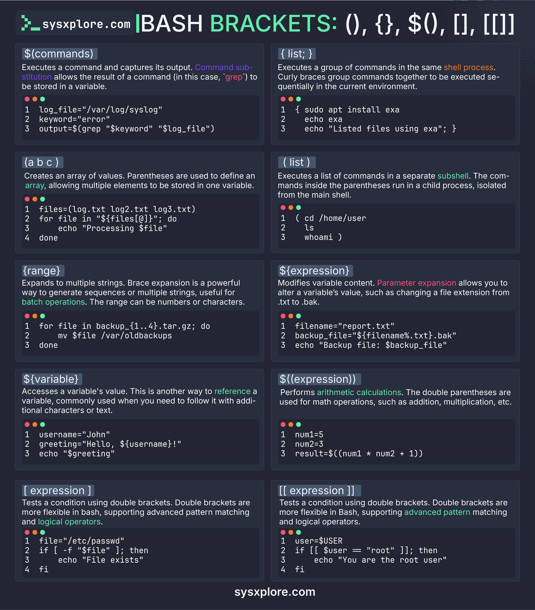

**Source:** [https://twitter.com/i/web/status/1878186893541568872](https://twitter.com/i/web/status/1878186893541568872)
**Original Post Date:** 2025-06-17 12:17:51

# Comprehensive Guide to Bracket Types and Parameter Expansion in Bash Scripting

## Introduction
Bash scripting relies heavily on various bracket constructs for different purposes. This guide explores eight essential bracket types including command substitution, subshells, arithmetic operations, and conditional expressions. Understanding these fundamentals is crucial for writing efficient and maintainable shell scripts.

## Command Substitution ($(commands))

Captures the output of a command execution in real-time.

```bash
log_file="/var/log/syslog"
keyword="error"
output=$(grep "$keyword" "$log_file")
```

## Curly Braces for Command Grouping ({list;})

Executes commands in sequence within the current shell context.

```bash
{
  sudo apt install exa
  echo exa
  echo "Listed files using exa"
}
```

## Parentheses for Subshells ((list))

Executes commands in a separate subshell, isolating the environment.

```bash
(cd /home/user
echo "Processing $file"
ls
whoami)
```

## Brace Expansion ({range})

Generates sequences of strings for batch processing operations.

```bash
for file in backup_{1..4}.tar.gz; do
  mv $file /var/oldbackups
done
```

## Parameter Expansion (${expression})

Modifies variable content through pattern matching and manipulation.

```bash
filename="report.txt"
backup_file="${filename%.txt}.bak"
echo "Backup file: $backup_file"
```

## Arithmetic Expansion ($((expression)))

Performs mathematical calculations within shell scripts.

```bash
num1=5
num2=3
result=$((num1 * num2 + 1))
echo "$result"
```

## Test Brackets ([expression])

Basic conditional testing for file operations and string comparisons.

```bash
file="/etc/passwd"
if [ -f "$file" ]; then
  echo "File exists"
fi
```

## Double Brackets ([[expression]])

Advanced conditional testing with pattern matching and logical operators.

```bash
user=$USER
if [[ $user == "root" ]]; then
echo "You are the root user"
fi
```

## Key Takeaways

- Command substitution is essential for capturing command outputs.
- Understanding shell processes vs subshells affects script performance.
- Parameter expansion provides powerful variable manipulation capabilities.

## Conclusion
Mastery of Bash bracket constructs and parameter expansion enables efficient script development. Each construct serves specific purposes, from process isolation to complex condition testing. Proper usage significantly impacts script reliability and maintainability.

## External References

- [sysxplore.com](https://www.sysxplore.com)


## Media

**Image Description:** The image is a comprehensive guide to the various types of brackets used in Bash scripting, along with their syntax, usage, and examples. The content is organized into a grid format with eight sections, each focusing on a specific type of bracket or syntax. Below is a detailed breakdown of the image:

### **Header**
- **Title**: "BASH BRACKETS: (), {}, $(), [], [[ ]]"
- **Source**: "sysxplore.com"
- The title indicates that the image is about different types of brackets and their usage in Bash scripting.

### **Sections**
The image is divided into eight sections, each explaining a different type of bracket or syntax. Each section includes:
1. **Syntax**: The bracket or syntax being explained.
2. **Description**: A brief explanation of its purpose and usage.
3. **Example Code**: A code snippet demonstrating how to use the syntax.

---

### **Section 1: Command Substitution (`$(commands)`)**
- **Syntax**: `$(commands)`
- **Description**: Executes a command and captures its output. The result of the command can be stored in a variable.
- **Example**:
  ```bash
  log_file="/var/log/syslog"
  keyword="error"
  output=$(grep "$keyword" "$log_file")
  ```
  - **Explanation**: The `grep` command searches for the keyword `"error"` in the log file and stores the output in the `output` variable.

---

### **Section 2: Curly Braces for Command Grouping (`{ list; }`)**
- **Syntax**: `{ list; }`
- **Description**: Executes a group of commands in the same shell process. Commands inside the braces are executed sequentially in the current environment.
- **Example**:
  ```bash
  {
    sudo apt install exa
    echo exa
    echo "Listed files using exa";
  }
  ```
  - **Explanation**: The commands inside the braces are executed in the same shell process, installing `exa`, printing "exa", and displaying a message.

---

### **Section 3: Parentheses for Subshells (`( list )`)**
- **Syntax**: `( list )`
- **Description**: Executes a list of commands in a separate subshell. The commands inside the parentheses run in a child process, isolated from the main shell.
- **Example**:
  ```bash
  (
    cd /home/user
    echo "Processing $file"
    ls
    whoami
  )
  ```
  - **Explanation**: The commands inside the parentheses run in a subshell, changing the directory, printing a message, listing files, and showing the user.

---

### **Section 4: Brace Expansion (`{range}`)**
- **Syntax**: `{range}`
- **Description**: Expands to multiple strings. Useful for generating sequences or multiple strings, often used for batch operations.
- **Example**:
  ```bash
  for file in backup_{1..4}.tar.gz; do
    mv $file /var/oldbackups
  done
  ```
  - **Explanation**: The brace expansion `{1..4}` generates the sequence `1, 2, 3, 4`, and the `for` loop processes each backup file.

---

### **Section 5: Parameter Expansion (`${expression}`)**
- **Syntax**: `${expression}`
- **Description**: Modifies variable content. Useful for altering a variable's value, such as changing file extensions.
- **Example**:
  ```bash
  filename="report.txt"
  backup_file="${filename%.txt}.bak"
  echo "Backup file: $backup_file"
  ```
  - **Explanation**: The parameter expansion `${filename%.txt}` removes the `.txt` extension and appends `.bak`, creating a backup file name.

---

### **Section 6: Arithmetic Expansion (`$((expression))`)**
- **Syntax**: `$((expression))`
- **Description**: Performs arithmetic calculations. Used for math operations like addition, multiplication, etc.
- **Example**:
  ```bash
  num1=5
  num2=3
  result=$((num1 * num2 + 1))
  echo "$result"
  ```
  - **Explanation**: The expression `num1 * num2 + 1` is evaluated, resulting in `16`.

---

### **Section 7: Test Brackets (`[ expression ]`)**
- **Syntax**: `[ expression ]`
- **Description**: Tests a condition using single brackets. Supports basic pattern matching and logical operators.
- **Example**:
  ```bash
  file="/etc/passwd"
  if [ -f "$file" ]; then
    echo "File exists"
  fi
  ```
  - **Explanation**: The `-f` flag checks if the file `/etc/passwd` exists.

---

### **Section 8: Double Brackets for Advanced Condition Testing (`[[ expression ]]`)**
- **Syntax**: `[[ expression ]]`
- **Description**: Tests a condition using double brackets. More flexible than single brackets, supporting advanced pattern matching and logical operators.
- **Example**:
  ```bash
  user=$USER
  if [[ $user == "root" ]]; then
    echo "You are the root user"
  fi
  ```
  - **Explanation**: The `[[ $user == "root" ]]` checks if the current user is `root`.

---

### **Design and Layout**
- **Background**: Dark theme with light text for readability.
- **Sections**: Organized in a grid format with alternating background colors for better visual separation.
- **Code Snippets**: Highlighted with syntax coloring for clarity.
- **Icons**: Small icons (red and green dots) are used to indicate line numbers in the code snippets.

### **Footer**
- **Website**: "sysxplore.com" is mentioned at the bottom, indicating the source of the content.

---

### **Overall Purpose**
The image serves as an educational resource for understanding and utilizing different types of brackets and syntax in Bash scripting. It provides clear explanations and practical examples for each concept, making it a valuable reference for both beginners and experienced Bash users.
