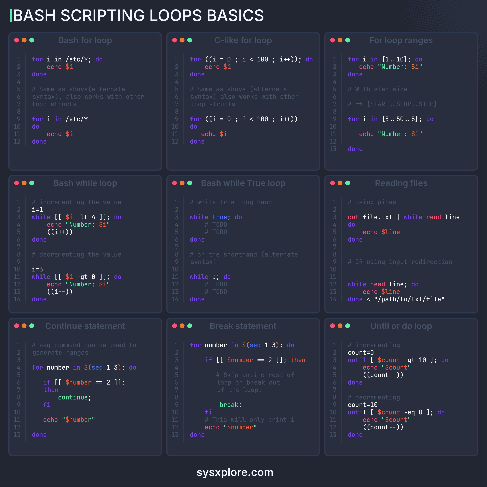

**Source:** [https://twitter.com/i/web/status/1874903329563939273](https://twitter.com/i/web/status/1874903329563939273)
**Original Post Date:** 2025-07-12 21:51:06

# Bash Loops Crash Course: A Comprehensive Guide

## Introduction
This crash course provides a comprehensive overview of Bash scripting loops, focusing on essential constructs such as `for` loops, `while` loops, and control statements. It serves as a quick reference guide for both beginners and experienced scripters, offering practical examples and detailed explanations to enhance understanding and proficiency in Bash scripting.

## For Loops

The `for` loop is a fundamental construct in Bash scripting used to iterate over a list of items. It can be used with various syntaxes, including iterating over files and directories or using C-style loops.

A basic `for` loop iterates over all files and directories in a specified path, such as `/etc`. This is useful for tasks like listing directory contents.

_This loop iterates over all files and directories in the `/etc` directory, printing each item._

```bash
for i in /etc/*; do
    echo $i
done
```

_This C-style loop iterates from `0` to `99`, incrementing the variable `i` by `1` each time._

```bash
for ((i = 0; i < 100; i++)); do
    echo $i
done
```

_This loop iterates over numbers from `1` to `10`. The range can also include a step size, as shown below._

```bash
for i in {1..10}; do
    echo "Number: $i"
done
```

_This loop iterates from `5` to `50` in steps of `5`, demonstrating how ranges can be specified with a step size._

```bash
for i in {5..50..5}; do
    echo "Number: $i"
done
```

## While Loops

The `while` loop is another essential construct in Bash scripting, used to execute commands repeatedly based on a condition. It can handle both incrementing and decrementing values.

An infinite `while` loop can be created using the `true` keyword, which runs indefinitely until explicitly broken.

_This loop starts with `i=1` and increments until `i` is no longer less than `4`._

```bash
i=1
while [[ $i -lt 4 ]]; do
    echo "Number: $i"
    ((i++))
done
```

_This loop starts with `i=3` and decrements until `i` is no longer greater than `0`._

```bash
i=3
while [[ $i -gt 0 ]]; do
    echo "Number: $i"
    ((i--))
done
```

_This infinite loop runs indefinitely until a `break` statement is executed._

```bash
while true; do
    # TODO
    break
done
```

- Using pipes to read files: `cat file.txt | while read line; do echo $line; done`
- Using input redirection: `while read line; do echo $line; done < "file.txt"`

## Control Statements

Control statements like `continue`, `break`, and `until` are crucial for managing loop execution. They allow for skipping iterations, exiting loops prematurely, or running loops until a condition is met.

_This loop skips the number `2` and prints `1` and `3`._

```bash
for number in $(seq 1 3); do
    if [[ $number -eq 2 ]]; then
        continue
    fi
    echo "$number"
done
```

_This loop exits when `number` is `2`, so only `1` is printed._

```bash
for number in $(seq 1 3); do
    if [[ $number -eq 2 ]]; then
        break
    fi
    echo "$number"
done
```

_This loop counts from `0` to `10`._

```bash
count=0
until [ $count -gt 10 ]; do
    echo "$count"
    ((count++))
done
```

_This loop counts down from `10` to `0`._

```bash
count=10
until [ $count -eq 0 ]; do
    echo "$count"
    ((count--))
done
```

## Key Takeaways

- Understand the basic syntax and usage of `for` loops in Bash, including iterating over files and using C-style loops.
- Learn how to implement `while` loops for both incrementing and decrementing values.
- Explore control statements like `continue`, `break`, and `until` to manage loop execution effectively.
- Utilize file handling techniques with pipes and input redirection in Bash scripting.

## Conclusion
This crash course provides a solid foundation in Bash scripting loops, covering essential constructs and practical examples. By mastering these concepts, scripters can enhance their efficiency and effectiveness in writing Bash scripts.

## External References

- [sysxplore.com](https://www.sysxplore.com)


## Media

**Image Description:** The image is a comprehensive cheat sheet or reference guide for Bash scripting, specifically focusing on loops and control structures. The layout is organized into a grid of sections, each detailing different types of loops, control statements, and related concepts in Bash scripting. Below is a detailed breakdown of the image:

### **Main Title**
- The title at the top reads: **"BASH SCRIPTING LOOPS BASICS"**
- This indicates that the content is focused on fundamental looping constructs in Bash scripting.

### **Grid Layout**
The content is organized into a 3x3 grid, with each cell containing a specific topic related to loops and control structures in Bash. Here's a breakdown of each section:

---

### **Top Row: For Loops**
#### **1. Bash for loop**
- **Description**: Demonstrates a basic `for` loop in Bash.
- **Syntax**:
  ```bash
  for i in /etc/*; do
      echo $i
  done
  ```
- **Explanation**: Iterates over all files and directories in the `/etc` directory.
- **Alternate Syntax**:
  ```bash
  for i in /etc/*; do
      echo $i
  done
  ```

#### **2. C-like for loop**
- **Description**: Mimics the C-style `for` loop.
- **Syntax**:
  ```bash
  for ((i = 0; i < 100; i++)); do
      echo $i
  done
  ```
- **Explanation**: Iterates from `0` to `99`, incrementing `i` by `1` each time.

#### **3. For loop ranges**
- **Description**: Demonstrates using ranges in `for` loops.
- **Syntax**:
  ```bash
  for i in {1..10}; do
      echo "Number: $i"
  done
  ```
- **Explanation**: Iterates over numbers from `1` to `10`.
- **With Step Size**:
  ```bash
  for i in {5..50..5}; do
      echo "Number: $i"
  done
  ```
  - Iterates from `5` to `50` in steps of `5`.

---

### **Middle Row: While Loops**
#### **4. Bash while loop**
- **Description**: Demonstrates a `while` loop with incrementing and decrementing values.
- **Incrementing**:
  ```bash
  i=1
  while [[ $i -lt 4 ]]; do
      echo "Number: $i"
      ((i++))
  done
  ```
  - Starts with `i=1` and increments until `i` is no longer less than `4`.
- **Decrementing**:
  ```bash
  i=3
  while [[ $i -gt 0 ]]; do
      echo "Number: $i"
      ((i--))
  done
  ```

#### **5. Bash while True loop**
- **Description**: Demonstrates an infinite `while` loop.
- **Syntax**:
  ```bash
  while true; do
      # TODO
      break
  done
  ```
  - The loop runs indefinitely until a `break` statement is executed.

#### **6. Reading files**
- **Description**: Demonstrates reading files using pipes and redirection.
- **Using Pipes**:
  ```bash
  cat file.txt | while read line; do
      echo $line
  done
  ```
  - Reads each line of `file.txt` and prints it.
- **Using Input Redirection**:
  ```bash
  while read line; do
      echo $line
  done < "/path/to/file.txt"
  ```

---

### **Bottom Row: Control Statements**
#### **7. Continue statement**
- **Description**: Demonstrates the `continue` statement to skip iterations.
- **Syntax**:
  ```bash
  for number in $(seq 1 3); do
      if [[ $number -eq 2 ]]; then
          continue
      fi
      echo "$number"
  done
  ```
  - Skips the number `2` and prints `1` and `3`.

#### **8. Break statement**
- **Description**: Demonstrates the `break` statement to exit a loop.
- **Syntax**:
  ```bash
  for number in $(seq 1 3); do
      if [[ $number -eq 2 ]]; then
          break
      fi
      echo "$number"
  done
  ```
  - Exits the loop when `number` is `2`, so only `1` is printed.

#### **9. Until or do loop**
- **Description**: Demonstrates `until` loops.
- **Incrementing**:
  ```bash
  count=0
  until [ $count -gt 10 ]; do
      echo "$count"
      ((count++))
  done
  ```
  - Counts from `0` to `10`.
- **Decrementing**:
  ```bash
  count=10
  until [ $count -eq 0 ]; do
      echo "$count"
      ((count--))
  done
  ```
  - Counts down from `10` to `0`.

---

### **Footer**
- The bottom of the image includes the website: **sysxplore.com**, indicating the source of the cheat sheet.

---

### **Design and Formatting**
- **Background**: Dark theme with light text for readability.
- **Syntax Highlighting**: Different colors are used to highlight syntax elements:
  - **Keywords** (e.g., `for`, `while`, `do`, `done`) are in green.
  - **Variables** (e.g., `$i`, `$number`) are in orange.
  - **Comments** (e.g., `#`) are in gray.
- **Line Numbers**: Each code snippet includes line numbers for clarity.
- **Icons**: Each section has a small icon with red and green dots, possibly indicating importance or status.

---

### **Overall Purpose**
This image serves as a quick reference guide for Bash scripting, particularly focusing on loops and control structures. It provides examples of various loop types, control statements, and file handling techniques, making it a valuable resource for both beginners and experienced Bash scripters.
