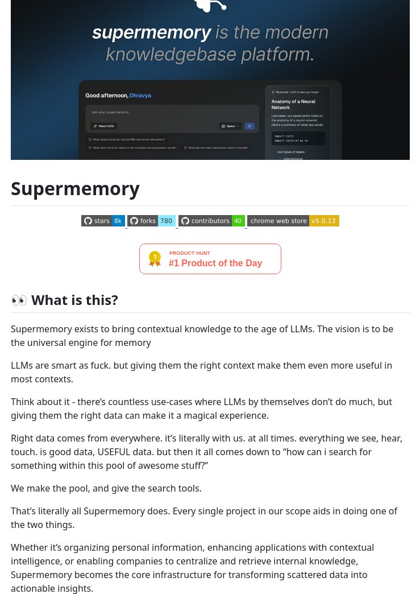

**Source:** [https://twitter.com/i/web/status/1884514150606315598](https://twitter.com/i/web/status/1884514150606315598)
**Original Post Date:** 2025-05-28 01:55:24

# AI-Driven Bookmark Manager with Contextual Knowledge Integration

## Introduction
In the age of information overload, effectively managing and retrieving personal knowledge has become a critical challenge. Supermemory addresses this by combining artificial intelligence with traditional bookmarking, creating a modern knowledgebase platform that leverages Large Language Models (LLMs) to provide context-aware organization and retrieval capabilities. This article explores its architecture, features, and implementation strategies for both individual users and enterprise environments.

## Technical Architecture Overview

Supermemory operates as a unified knowledge engine that integrates LLMs to process and organize data from various sources. The platform employs a three-layer architecture: data ingestion, contextual processing, and retrieval optimization.

At its core, Supermemory's system processes bookmarks through an AI pipeline that analyzes content structure, extracts key metadata, and generates semantic embeddings for efficient search capabilities.

_Example bookmark object structure showing AI-enhanced metadata_

```javascript
const bookmark = {
  url: 'https://example.com',
  title: 'Technical Blog Post',
  tags: ['AI', 'Architecture'],
  contextMetadata: {
    extractedEntities: [],
    semanticScore: 0.85
  }
};
```

- Data ingestion layer for raw content capture
- AI processing pipeline for context extraction
- Semantic search index for efficient retrieval

## Key Features and Capabilities

The platform's core functionality includes personalized knowledge management, cross-platform synchronization, and enterprise-grade security. Users can organize their digital assets with AI-assisted tagging and contextual search.

Supermemory's Chrome extension enables seamless integration into daily browsing workflows while maintaining data privacy through client-side processing.

1. AI-powered bookmark organization and categorization
1. Cross-device synchronization via secure API endpoints
1. Enterprise knowledge base capabilities with team collaboration

## Key Takeaways

- Supermemory integrates AI-driven context processing to transform traditional bookmarks into actionable knowledge units.
- The platform's architecture enables efficient data retrieval through semantic search and contextual understanding.
- Implementation requires careful consideration of LLM integration for optimal performance and accuracy.

## Conclusion
As digital information continues to proliferate, tools like Supermemory that leverage AI for intelligent organization become increasingly valuable. By combining bookmark management with contextual knowledge processing, developers can build more effective personal and enterprise solutions.

## External References

- [Supermemory Chrome Extension](https://chrome.google.com/webstore/detail/supermemory/...)
- [GitHub Repository](https://github.com/supermemory/)


## Media

**Image Description:** The image is a screenshot of a webpage or documentation related to a project called **Supermemory**. The content is structured to introduce the concept, purpose, and vision of the project. Below is a detailed description:

### **Header Section**
1. **Title and Tagline**:
   - The main title at the top reads: **"Supermemory is the modern knowledgebase platform."**
   - The title is prominently displayed in a large, bold font, emphasizing the name "Supermemory."
   - The tagline highlights the project's focus on being a modern knowledgebase platform, suggesting it is designed to handle and organize knowledge effectively.

2. **Visual Elements**:
   - The background is dark blue, creating a professional and modern aesthetic.
   - There is a logo at the top left corner, which appears to be a stylized icon, possibly representing the project's branding.
   - A small search icon is visible near the top right, indicating a search functionality.

3. **Preview Image**:
   - Below the title, there is a screenshot of a user interface (UI) for the Supermemory platform.
   - The UI shows a dark theme with a clean, modern design.
   - Key elements in the UI include:
     - A greeting message: **"Good afternoon, Dhravya"** (personalized).
     - A section labeled **"Add your supermemory"**, suggesting a feature for users to input or manage their knowledge.
     - A progress bar labeled **"Adhun (5%)**", indicating some form of completion or progress tracking.
     - A sidebar with a summary or notes section titled **"Anatomy of a Neural Network"**, suggesting the platform can handle technical or educational content.
     - Buttons and interactive elements, such as **"Add"**, **"Space"**, and **"30"**, indicating functionality for adding or managing content.

### **Main Content Section**
1. **Introduction to Supermemory**:
   - The heading **"Supermemory"** is prominently displayed in large, bold text.
   - Below the heading, there are several metrics displayed:
     - **8k stars**: Indicates the project's popularity on a platform like GitHub.
     - **780 forks**: Shows the number of forks, suggesting active community engagement.
     - **40 contributors**: Highlights the collaborative nature of the project.
     - **Chrome Web Store v5.0.12**: Indicates the project's availability as a Chrome extension or web application, with the version number provided.

2. **Product Hunt Recognition**:
   - A badge is displayed, stating **"#1 Product of the Day"** on **Product Hunt**, a platform for showcasing and voting on new products. This badge is orange with a gold star, emphasizing the project's recognition.

3. **Explanation of Supermemory**:
   - The section begins with a question: **"What is this?"**, followed by a detailed explanation.
   - **Purpose and Vision**:
     - Supermemory aims to bring **contextual knowledge** to the age of **Large Language Models (LLMs)**.
     - The vision is to become the **universal engine for memory**, suggesting a comprehensive solution for managing and retrieving knowledge.
   - **Role of LLMs**:
     - LLMs are described as highly intelligent but require the right **context** to be more useful.
     - Providing the right context to LLMs can make them more effective in most scenarios.
   - **Data and Context**:
     - The text emphasizes the importance of **right data** and **context** in enhancing LLMs' capabilities.
     - It suggests that data comes from various sources (e.g., what we see, hear, touch) and is inherently useful.
     - The challenge lies in **searching** and retrieving the right data from a vast pool of information.
   - **Supermemory's Role**:
     - Supermemory creates the **pool of data** and provides the **search tools** to access it.
     - The project aims to organize personal information, enhance applications with contextual intelligence, and centralize internal knowledge for companies.

4. **Technical and Functional Details**:
   - The text highlights the project's focus on:
     - **Organizing personal information**.
     - **Enhancing applications with contextual intelligence**.
     - **Centralizing and retrieving internal knowledge** for companies.
   - The platform is described as the **core infrastructure** for transforming scattered data into actionable insights.

### **Design and Layout**
- The layout is clean and organized, with clear headings and subheadings.
- The use of bold and italicized text helps emphasize key points.
- The color scheme is minimalistic, with dark backgrounds and white/light text for readability.
- The inclusion of metrics (stars, forks, contributors) and the Product Hunt badge adds credibility and highlights community engagement.

### **Overall Impression**
The image effectively communicates the purpose and vision of Supermemory as a modern knowledgebase platform designed to leverage LLMs and contextual data. The emphasis on organization, retrieval, and enhancing applications with contextual intelligence suggests a robust and versatile tool for both personal and professional use. The inclusion of community metrics and recognition from Product Hunt adds a layer of credibility and excitement about the project.
