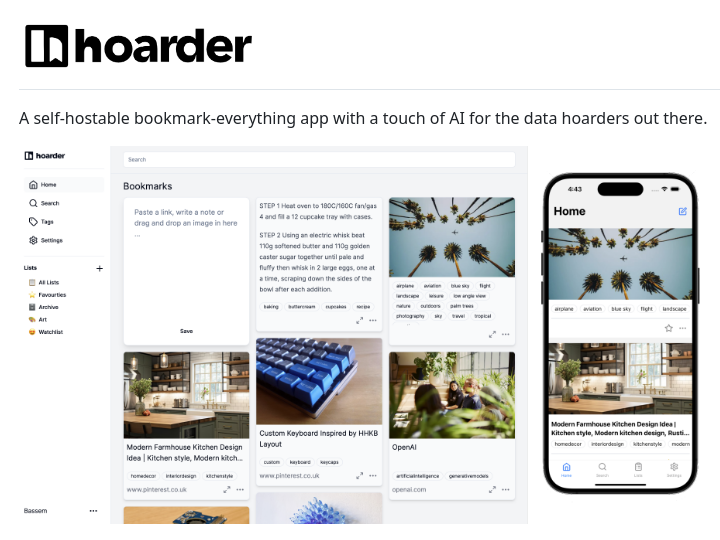

**Source:** [https://twitter.com/i/web/status/1881314782474584560](https://twitter.com/i/web/status/1881314782474584560)
**Original Post Date:** 2025-05-28 02:18:36

# Hoarderder: AI-Enhanced Self-Hosted Bookmark Management System

## Introduction
Self-hosted bookmark management has become essential for privacy-conscious users seeking control over their digital content. Hoarderder emerges as a sophisticated solution that combines modern web architecture with artificial intelligence to address the growing need for robust, customizable data collection systems. This knowledge base explores its technical implementation, features, and architectural considerations.

## Core Technical Architecture

Hoarderder employs a modern MERN (MongoDB, Express.js, React, Node.js) stack optimized for real-time data processing. The architecture prioritizes scalability through containerization and microservices design.

The AI integration layer processes content metadata to suggest tags, organize bookmarks, and generate smart recommendations based on user behavior patterns.

```dockerfile
FROM node:14-alpine
COPY . /app
WORKDIR /app
RUN npm install
CMD ["npm", "start"]
```

## Data Organization & Management

The system implements a hierarchical organization model with nested tags and customizable lists, supporting both manual and automated categorization.

Bookmarks are stored as rich media objects containing metadata, links, images, and text snippets, indexed for efficient retrieval.

- Tag-based filtering system with boolean operators
- Custom list creation with intelligent sorting options
- Watchlist feature for content monitoring

## Cross-Platform Implementation

A responsive UI framework ensures consistent experience across desktop and mobile platforms, utilizing React Native for native performance.

API endpoints are designed with RESTful principles, supporting CORS for third-party integrations.

> **Note/Tip:** Implement caching strategies for improved mobile performance

> **Note/Tip:** Consider implementing PWA capabilities for offline access

## Key Takeaways

- Self-hosting provides complete control over data privacy and security
- AI integration enhances organization through automated tagging and recommendations
- Modular architecture supports easy customization and feature expansion

## Conclusion
Hoarderder represents a robust solution for users requiring comprehensive, privacy-focused bookmark management. Its technical design balances scalability, performance, and user experience while maintaining flexibility for future enhancements.

## External References

- [Official Hoarderder Documentation](https://hoarderder.io/docs)
- [GitHub Repository](https://github.com/hoarderder/core)


## Media

**Image Description:** The image showcases a webpage or promotional material for a self-hostable bookmarking application called **hoarderder**. The app is designed for users who enjoy collecting and organizing content, with a focus on providing a seamless experience for data hoarders. Below is a detailed description of the image:

### **Main Subject:**
The main subject of the image is the **hoarderder app**, which is presented as a self-hostable bookmarking tool with AI integration. The app is designed to allow users to save, organize, and manage a wide variety of content, including links, images, text, and more.

### **Key Elements:**
1. **Header:**
   - The top of the image features the **hoarderder logo**, which consists of a stylized "H" and the word "hoarderder" in a clean, modern font.
   - Below the logo, there is a tagline: *"A self-hostable bookmark-everything app with a touch of AI for the data hoarders out there."* This highlights the app's key features: self-hostability, AI integration, and its target audience (data hoarders).

2. **App Interface:**
   - The central part of the image displays a screenshot of the **hoarderder app interface**. The interface is clean and organized, with a focus on usability and aesthetics.
   - **Left Sidebar:**
     - The sidebar contains navigation options, including:
       - **Home**: Likely the main dashboard or landing page.
       - **Search**: A search functionality to find bookmarks.
       - **Tags**: A section to organize bookmarks using tags.
       - **Lists**: A feature to create and manage lists of bookmarks.
       - **Settings**: Options to customize the app's settings.
     - The sidebar also includes a section labeled **Watchlist**, which might be for tracking specific content or bookmarks.

   - **Main Content Area:**
     - The main area is divided into sections for **Bookmarks** and **Lists**.
     - **Bookmarks Section:**
       - Displays a grid of bookmarked content, including images, text snippets, and links.
       - Each bookmark includes a title, description, and tags for easy organization.
       - Example bookmarks shown:
         - A recipe titled *"STEP 1 Heat oven to 180/160C fan/gas..."* with an image of a baking process.
         - An image of a tropical plant with tags like *"nature," "outdoors," "tropical,"* etc.
         - A screenshot of a custom keyboard layout with tags like *"custom keyboard," "inspired by,"* etc.
       - The bookmarks are visually appealing, with a mix of images and text, and are organized neatly.

     - **Lists Section:**
       - Shows a list of bookmarked content, such as a kitchen design idea titled *"Modern Farmhouse Kitchen Design Layout."*
       - The list includes tags like *"kitchen style," "modern kitchen,"* etc., indicating categorization and organization.

   - **Save Button:**
     - A prominent "Save" button is visible, suggesting an easy way to add new bookmarks.

3. **Mobile App View:**
   - On the right side of the image, there is a screenshot of the **hoarderder app on a mobile device** (likely an iPhone, given the design).
   - The mobile interface mirrors the desktop interface, showing a clean and organized layout.
   - The mobile screenshot includes:
     - A **Home** screen with a similar grid of bookmarks.
     - A **Search** bar at the top for quick access to bookmarks.
     - A **Navigation Bar** at the bottom with icons for Home, Search, Lists, and other features.

4. **Technical Details:**
   - **Self-Hostable:** The app is described as "self-hostable," meaning users can host the application on their own servers or infrastructure, providing greater control and privacy.
   - **AI Integration:** The app includes a "touch of AI," suggesting features like intelligent organization, tagging, or recommendations based on user behavior.
   - **Cross-Platform:** The app is shown to work seamlessly on both desktop and mobile devices, indicating cross-platform compatibility.

5. **Design and Aesthetics:**
   - The overall design is modern and minimalistic, with a clean layout and a focus on usability.
   - The color scheme is neutral, with white backgrounds and black text, making it easy to read and navigate.
   - The use of images and tags adds visual interest and helps users quickly identify and organize their content.

### **Additional Notes:**
- The app appears to cater to users who enjoy collecting and organizing a wide variety of content, such as recipes, images, design ideas, and more.
- The inclusion of AI suggests advanced features like automatic tagging, smart recommendations, or intelligent organization, which could enhance the user experience.

### **Conclusion:**
The image effectively communicates the purpose and features of the **hoarderder app**, highlighting its self-hostable nature, AI integration, and user-friendly interface. The design is modern and functional, catering to users who enjoy collecting and organizing digital content. The inclusion of both desktop and mobile views ensures that the app's versatility and accessibility are emphasized.
