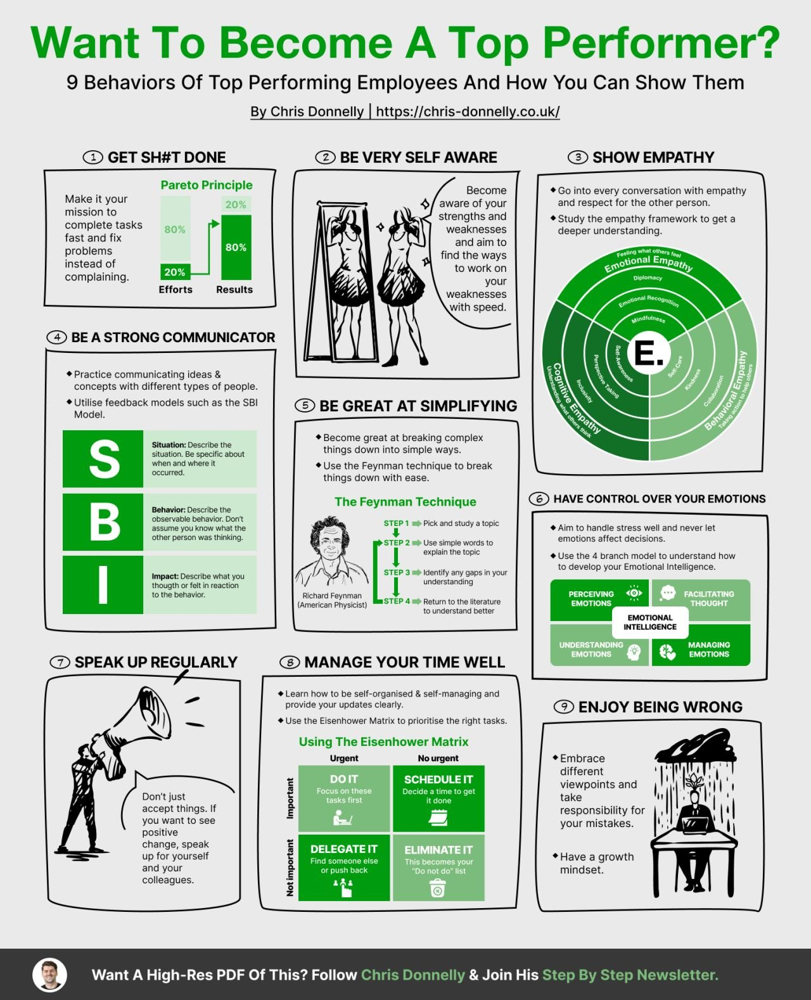

**Source:** [https://twitter.com/i/web/status/1867535186692362632](https://twitter.com/i/web/status/1867535186692362632)
**Original Post Date:** 2025-05-27 21:41:30

# Software Engineering Excellence: Behaviors of Top Performers

## Introduction
In the competitive landscape of software engineering, distinguishing yourself as a top performer requires more than just technical expertise. This guide presents nine proven behaviors that combine practical productivity techniques with emotional intelligence, designed specifically for developers and technical professionals looking to excel in their careers. Each behavior is grounded in frameworks and methodologies tested by industry leaders.

## GET SHIT DONE: Productivity Frameworks

The Pareto Principle (80/20 Rule) provides a mathematical foundation for productivity optimization. As a software engineer, identify the critical 20% of tasks that yield 80% of results.

Apply this principle to your technical workflow by prioritizing system-critical components and high-impact features over low-value maintenance tasks.

- Focus on completion velocity for critical code paths
- Automate repetitive tasks using CI/CD pipelines
- Implement time-boxed coding sessions (e.g., Pomodoro Technique)

> **Note/Tip:** Track your productivity metrics to identify which tasks fall into the 80% category

## EMPATHY IN SOFTWARE DEVELOPMENT

Empathy frameworks are crucial in collaborative software development. Understanding behavioral, cognitive, and emotional aspects of team interactions leads to better code reviews and technical discussions.

1. Use behavioral empathy to understand how team members approach coding challenges
1. Apply cognitive empathy during architectural decisions
1. Implement emotional intelligence in conflict resolution

## COMMUNICATION IN TECHNICAL CONTEXTS

Effective communication is essential for technical professionals. The SBI Model provides a structured approach to feedback and requirements gathering.

```markdown
```bash
# Example of structured feedback using SBI model
Situation: Code review for authentication module
Behavior: Missing input validation in API endpoints
Impact: Potential security vulnerability (OWASP Top 10)
```
```

1. Situation: 'During code review on feature X'
1. Behavior: 'The implementation used excessive try-catch blocks'
1. Impact: 'This increased maintenance overhead by 30%'

## TIME MANAGEMENT FOR DEVELOPERS

The Eisenhower Matrix adapts well to technical workflows, especially for balancing urgent bug fixes with long-term architectural improvements.

1. Urgent & Important: Critical production bugs
1. Not Urgent & Important: Technical debt refactoring
1. Urgent & Not Important: Low-priority support requests
1. Not Urgent & Not Important: Outdated documentation

## Key Takeaways

- Apply the Pareto Principle to technical workflow optimization
- Use empathy frameworks for better team collaboration
- Structure feedback using SBI model for effective communication
- Manage time with Eisenhower Matrix to balance urgent vs important tasks

## Conclusion
Becoming a top-performing software engineer requires mastering both technical skills and soft skills. These behaviors, when implemented consistently, create compound effects in productivity, collaboration, and career growth.

## External References

- [Original Infographic by Chris Donnelly](https://chris-donnelly.co.uk/)
- [Eisenhower Matrix for Developers](https://www.eisenhowermatrix.com/software-engineering/)


## Media

**Image Description:** This image is an infographic titled **"Want To Become A Top Performer?"** by Chris Donnelly. It outlines **9 Behaviors of Top Performing Employees** and provides practical advice on how to develop these behaviors. The infographic is visually organized into sections, each highlighting a specific behavior with accompanying text, diagrams, and illustrations. Below is a detailed breakdown:

---

### **Main Title and Introduction**
- **Title**: "Want To Become A Top Performer?"
- **Subtitle**: "9 Behaviors Of Top Performing Employees And How You Can Show Them"
- **Author**: Chris Donnelly
- **Website**: [https://chris-donnelly.co.uk/](https://chris-donnelly.co.uk/)
- **Purpose**: The infographic aims to guide readers on how to become a top performer by adopting specific behaviors.

---

### **Section 1: GET SHIT DONE**
- **Behavior**: Focus on getting tasks completed efficiently.
- **Key Points**:
  - Make it your mission to complete tasks fast, fix problems, and avoid complaining.
  - Use the **Pareto Principle (80/20 Rule)**:
    - 80% of results come from 20% of efforts.
    - Focus on the most impactful tasks.
  - Illustration: A bar graph showing the Pareto Principle.

---

### **Section 2: BE VERY SELF-AWARE**
- **Behavior**: Develop self-awareness about your strengths and weaknesses.
- **Key Points**:
  - Be aware of your strengths and weaknesses.
  - Aim to find ways to work on your weaknesses.
  - Illustration: A mirror reflecting a person, symbolizing self-reflection.

---

### **Section 3: SHOW EMPATHY**
- **Behavior**: Demonstrate empathy in interactions.
- **Key Points**:
  - Go into every conversation with empathy and respect for the other person.
  - Study the empathy framework to deepen understanding.
  - **Empathy Framework**:
    - **Behavioral Empathy**: Understanding actions.
    - **Cognitive Empathy**: Understanding thoughts.
    - **Emotional Empathy**: Understanding feelings.
    - **Diplomacy**: Balancing empathy with professionalism.
  - Illustration: A circular diagram showing the empathy framework.

---

### **Section 4: BE A STRONG COMMUNICATOR**
- **Behavior**: Practice effective communication.
- **Key Points**:
  - Communicate ideas and concepts with different types of people.
  - Utilize feedback models such as the **SBI Model**:
    - **S**ituation: Describe the situation.
    - **B**ehavior: Describe the observable behavior.
    - **I**mpact: Describe the impact of the behavior.
  - Illustration: A vertical diagram of the SBI Model.

---

### **Section 5: BE GREAT AT SIMPLIFYING**
- **Behavior**: Simplify complex ideas.
- **Key Points**:
  - Break down complex things into simple ways.
  - Use the **Feynman Technique**:
    - Step 1: Pick and study a topic.
    - Step 2: Use simple words to explain the topic.
    - Step 3: Identify gaps in understanding.
    - Step 4: Return to the literature to understand better.
  - Illustration: A diagram of the Feynman Technique with Richard Feynman's image.

---

### **Section 6: HAVE CONTROL OVER YOUR EMOTIONS**
- **Behavior**: Manage emotions effectively.
- **Key Points**:
  - Handle stress well and avoid letting emotions affect decisions.
  - Use the **4-Branch Model** to understand emotional intelligence:
    - **Perceiving Emotions**: Recognizing emotions.
    - **Facilitating Thought**: Using emotions to think.
    - **Understanding Emotions**: Interpreting emotions.
    - **Managing Emotions**: Regulating emotions.
  - Illustration: A circular diagram showing the 4-Branch Model.

---

### **Section 7: SPEAK UP REGULARLY**
- **Behavior**: Regularly communicate and provide updates.
- **Key Points**:
  - Don’t just accept things; speak up for yourself and your colleagues.
  - Provide clear updates and self-manage.
  - Illustration: A person holding a megaphone, symbolizing speaking up.

---

### **Section 8: MANAGE YOUR TIME WELL**
- **Behavior**: Prioritize tasks effectively.
- **Key Points**:
  - Use the **Eisenhower Matrix** to prioritize tasks:
    - **Urgent & Important**: Do it.
    - **Urgent & Not Important**: Delegate it.
    - **Not Urgent & Important**: Schedule it.
    - **Not Urgent & Not Important**: Eliminate it.
  - Illustration: A matrix diagram showing task prioritization.

---

### **Section 9: ENJOY BEING WRONG**
- **Behavior**: Embrace mistakes and learn from them.
- **Key Points**:
  - Embrace different viewpoints and take responsibility for your mistakes.
  - Have a growth mindset.
  - Illustration: A person sitting at a desk with a rain cloud above them, symbolizing embracing failure.

---

### **Footer**
- **Call to Action**: "Want A High-Res PDF Of This? Follow Chris Donnelly & Join His Step By Step Newsletter."
- **Social Media Profile**: A circular icon with a person's face, likely Chris Donnelly's profile picture.

---

### **Design and Layout**
- **Color Scheme**: Primarily green and white, with black text for readability.
- **Visual Elements**: Includes diagrams, bar graphs, circular charts, and illustrations to enhance understanding.
- **Typography**: Clear and concise headings and subheadings for easy navigation.

---

### **Overall Purpose**
The infographic serves as a practical guide for individuals looking to improve their performance in the workplace by adopting behaviors that are characteristic of top performers. It combines theoretical concepts with actionable advice, making it both informative and engaging.
