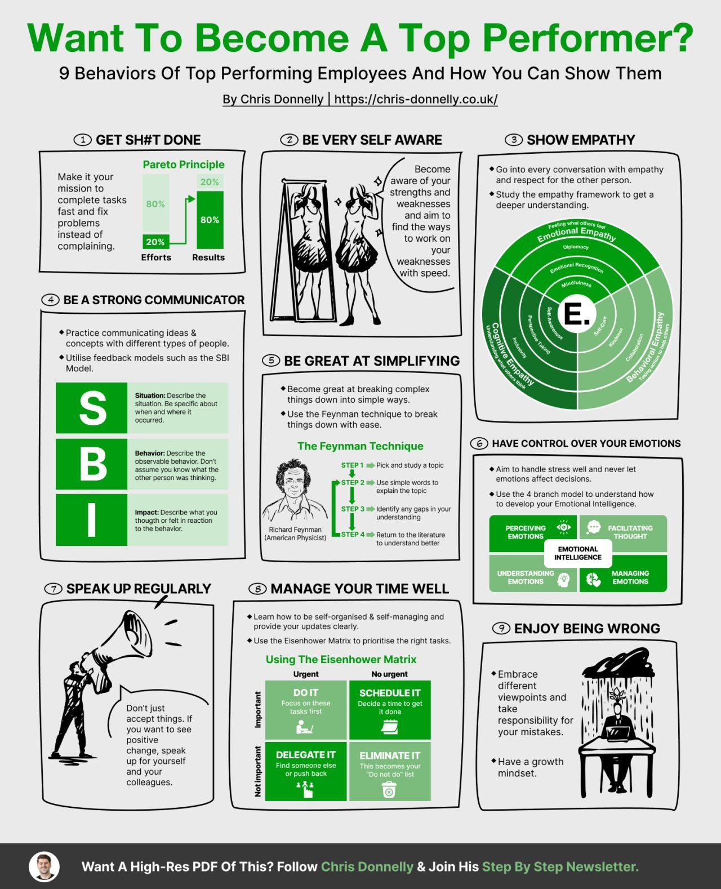

This article provides a comprehensive guide on how to become a top performer in the workplace. It outlines nine key behaviors and strategies that can help individuals improve their performance, build stronger relationships with colleagues, and advance their careers.

#### Detailed Technical Content
To become a top performer, it's essential to adopt certain behaviors and strategies that can help you excel in your role. The following are nine key strategies to achieve success in the workplace:

1. **Get Sh*t Done**: This involves making a mission to complete tasks quickly and efficiently, rather than complaining about them. By applying the Pareto Principle, which states that 20% of efforts result in 80% of results, you can focus on high-impact activities that drive significant outcomes.
2. **Be Very Self-Aware**: Being aware of your strengths and weaknesses is crucial for personal growth and development. This self-awareness enables you to work on improving your areas of weakness and leveraging your strengths to achieve greater success.
3. **Show Empathy**: Showing empathy towards others, including emotional intelligence, is vital for effective communication and relationships. By being able to understand and relate to the feelings of others, you can build stronger, more meaningful connections with your colleagues.
4. **Be a Strong Communicator**: Practicing clear and effective communication is critical for success in the workplace. This involves being able to articulate ideas and concepts in a way that is easy for others to understand, which can help to avoid misunderstandings and errors.
5. **Be Great at Simplifying**: Breaking down complex tasks into simple, manageable steps can increase productivity and efficiency. By simplifying processes and procedures, you can reduce stress and make it easier to achieve your goals.
6. **Have Control Over Emotions**: Managing your emotions and reactions to challenging situations is essential for maintaining a positive attitude and relationships. This involves being able to remain calm under pressure and respond thoughtfully to difficult situations.
7. **Speak Up Regularly**: Sharing your thoughts and ideas regularly can lead to new perspectives and solutions. By speaking up, you can contribute to the development of innovative ideas and approaches that can drive business success.
8. **Manage Your Time Effectively**: Prioritizing tasks and managing your time wisely is critical for achieving goals. This involves using tools like the Eisenhower Matrix to categorize tasks based on their urgency and importance, which can help you focus on high-priority activities.
9. **Enjoy Being Wrong**: Embracing mistakes as opportunities for growth and learning is an essential part of the learning process. By being open to feedback and willing to learn from errors, you can develop a growth mindset that can help you achieve greater success in the long term.

In addition to these strategies, there are several other tips that can help you become a top performer:

* Use the Eisenhower Matrix to prioritize tasks based on their urgency and importance.
* Develop a growth mindset by embracing challenges and learning from failures.

#### Key Takeaways and Best Practices
The key takeaways from this article are:

* Adopting certain behaviors and strategies can help you become a top performer in the workplace.
* Focusing on high-impact activities, being self-aware, showing empathy, and communicating effectively are essential for success.
* Simplifying complex tasks, managing emotions, speaking up regularly, and managing time effectively are also critical for achieving goals.
* Embracing mistakes as opportunities for growth and learning can help you develop a growth mindset.

The best practices outlined in this article include:

* Using the Pareto Principle to focus on high-impact activities
* Practicing self-awareness to identify areas for improvement
* Developing emotional intelligence to build stronger relationships
* Simplifying complex tasks to increase productivity and efficiency
* Managing emotions to maintain a positive attitude and relationships

#### References
The following tools and technologies are mentioned in this article:

* Eisenhower Matrix: a decision-making tool that helps individuals prioritize tasks based on their urgency and importance.
* Pareto Principle: a principle that states that 20% of efforts result in 80% of results, which can help individuals focus on high-impact activities.
## Source

- Original Tweet: [https://twitter.com/i/web/status/1867535186692362632](https://twitter.com/i/web/status/1867535186692362632)
- Date: 2025-02-20 21:02:43

## Media

### Media 1

**Description:** The infographic, titled "Want to Become a Top Performer? 9 Behaviors of Top Performing Employees," presents nine strategies for achieving success in the workplace. The title is displayed in green text at the top of the page.

**Key Strategies:**

* **Get Sh*t Done**: Make your mission to complete tasks quickly and efficiently, rather than complaining about them.
	+ Pareto Principle: 20% of efforts result in 80% of results
* **Be Very Self-Aware**: Be aware of your strengths and weaknesses and work on improving them.
	+ Self-awareness is key to personal growth and development
* **Show Empathy**: Show empathy towards others, including emotional intelligence.
	+ Emotional intelligence is essential for effective communication and relationships
* **Be a Strong Communicator**: Practice communicating ideas and concepts clearly and effectively.
	+ Clear communication is critical for success in the workplace
* **Be Great at Simplifying**: Break down complex tasks into simple, manageable steps.
	+ Simplification leads to increased productivity and efficiency
* **Have Control Over Emotions**: Manage your emotions and reactions to challenging situations.
	+ Emotional control is essential for maintaining a positive attitude and relationships
* **Speak Up Regularly**: Share your thoughts and ideas regularly, rather than keeping them to yourself.
	+ Sharing ideas can lead to new perspectives and solutions
* **Manage Your Time Effectively**: Prioritize tasks and manage your time wisely to achieve goals.
	+ Effective time management is critical for success in the workplace
* **Enjoy Being Wrong**: Embrace mistakes as opportunities for growth and learning.
	+ Mistakes are an essential part of the learning process

**Additional Tips:**

* Use the Eisenhower Matrix to prioritize tasks based on their urgency and importance.
* Develop a growth mindset by embracing challenges and learning from failures.

Overall, this infographic provides valuable insights and strategies for achieving success in the workplace. By implementing these behaviors, individuals can improve their performance, build stronger relationships with colleagues, and advance their careers.

*Last updated: 2025-02-20 21:02:43*