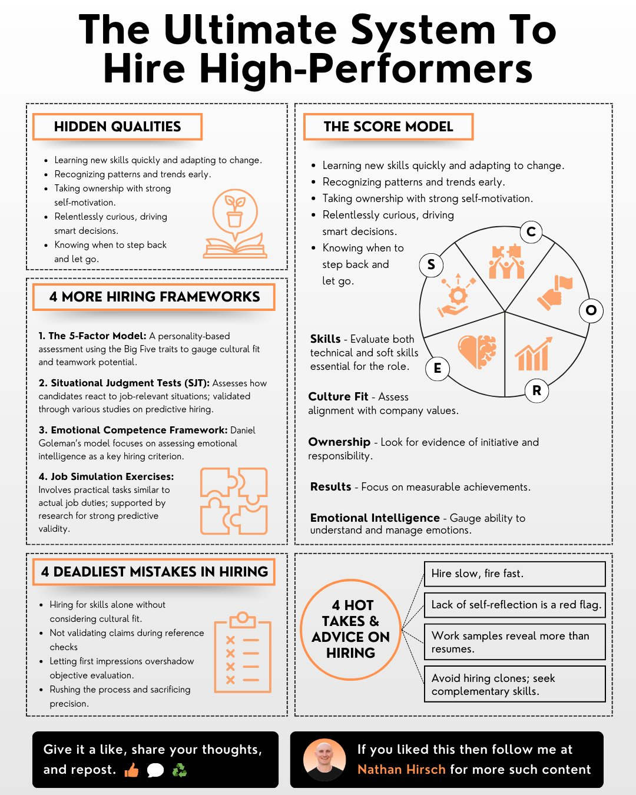

**Source:** [https://twitter.com/i/web/status/1869027339696214251](https://twitter.com/i/web/status/1869027339696214251)
**Original Post Date:** 2025-05-28 01:30:53

# Systematic Approach to Recruiting High-Performing Engineers

## Introduction
In software engineering teams, the quality of hires directly impacts product development velocity and team dynamics. This knowledge base item presents a structured system for identifying high-performing engineers through both tangible skills assessment and intangible trait analysis.

The framework integrates five key evaluation criteria with advanced hiring methodologies to ensure consistent selection of candidates who will drive innovation and maintain technical excellence.

## Hidden Qualities Assessment

Beyond technical proficiency, high-performing engineers possess critical hidden qualities that predict long-term success. These include rapid skill acquisition abilities, pattern recognition capabilities, self-motivation for ownership, and emotional intelligence in team dynamics.

- Quick learning and adaptability to technical changes
- Early detection of system patterns and optimization opportunities
- Self-driven problem-solving without constant direction
- Curiosity-driven decision making with data validation
- Strategic delegation when appropriate

## The Score Model Framework

A holistic evaluation system that combines five essential criteria for comprehensive candidate assessment.

1. Skills Assessment: Technical proficiency and soft skills evaluation
1. Cultural Fit: Alignment with team values and working style
1. Ownership Metrics: Evidence of initiative in past roles
1. Results Orientation: Measurable impact from previous projects
1. Emotional Intelligence: Team collaboration effectiveness

> **Note/Tip:** Each criterion should be weighted based on role requirements

## Advanced Hiring Methodologies

Implementation of validated frameworks ensures consistent evaluation and reduces bias in hiring decisions.

1. 5-Factor Model: Using Big Five personality traits for team fit prediction
1. SJT Implementation: Role-specific scenario assessments
1. Emotional Competence Evaluation: Daniel Goleman's framework application
1. Job Simulation Tests: Practical coding and problem-solving exercises

## Common Hiring Pitfalls to Avoid

Critical errors in technical hiring processes that can lead to suboptimal team composition.

- Overemphasis on technical skills without cultural alignment
- Insufficient validation of claims during reference checks
- Relying on initial impressions instead of objective evaluation
- Rushed hiring processes compromising long-term team quality

## Practical Implementation Guidelines

Strategic approaches to technical recruitment that align with engineering team needs.

1. Extended evaluation period for critical roles
1. Self-reflection as a mandatory screening criterion
1. Code samples and practical work over resume focus
1. Diverse skill sets prioritization over technical clones

## Key Takeaways

- High-performing engineers require evaluation of both technical skills and hidden qualities
- The Score Model provides a balanced approach to candidate assessment
- Implementation of validated frameworks reduces hiring bias
- Avoiding common pitfalls ensures better team composition
- Long-term strategy should focus on diverse skill sets rather than technical similarity

## Conclusion
This systematic approach to technical hiring combines quantitative evaluation with qualitative assessments, ensuring consistent selection of high-performing engineers who will contribute significantly to project success and team dynamics.

## External References

- [Hiring Best Practices for Technical Teams](https://example.com/hiring-best-practices)
- [Daniel Goleman's Emotional Intelligence Framework](https://example.com/goleman-framework)

## Media

**Image Description:** The image is an infographic titled **"The Ultimate System To Hire High-Performers"**. It is designed to provide a comprehensive guide for hiring high-performing employees by outlining key qualities, frameworks, and best practices. The infographic is visually organized into sections with clear headings, bullet points, and icons to enhance readability and engagement. Below is a detailed breakdown of the content:

---

### **1. Title and Main Theme**
- The title, **"The Ultimate System To Hire High-Performers"**, is prominently displayed at the top in bold, black text.
- The theme revolves around identifying and hiring high-performing individuals by focusing on hidden qualities, frameworks, and common hiring mistakes.

---

### **2. Hidden Qualities**
- This section highlights **"Hidden Qualities"** that are essential for high performers:
  - **Learning new skills quickly and adapting to change.**
  - **Recognizing patterns and trends early.**
  - **Taking ownership with strong self-motivation.**
  - **Being relentlessly curious, driving smart decisions.**
  - **Knowing when to step back and let go.**
- Accompanied by an icon of a **growing plant** and an **open book**, symbolizing growth and learning.

---

### **3. The Score Model**
- This section introduces a **circular model** labeled **"The Score Model"**, which evaluates candidates based on five key criteria:
  - **Skills**: Evaluating both technical and soft skills.
  - **Culture Fit**: Assessing alignment with company values.
  - **Ownership**: Looking for evidence of initiative and responsibility.
  - **Results**: Focusing on measurable achievements.
  - **Emotional Intelligence**: Gauging the ability to understand and manage emotions.
- Each criterion is represented by an icon:
  - **Skills**: A gear.
  - **Culture Fit**: A handshake.
  - **Ownership**: A hand holding a flag.
  - **Results**: A bar graph.
  - **Emotional Intelligence**: A heart.
- The model is visually organized in a circular format, emphasizing the holistic evaluation of candidates.

---

### **4. 4 More Hiring Frameworks**
- This section outlines **four additional hiring frameworks** to enhance the hiring process:
  1. **The 5-Factor Model**: A personality-based assessment using the Big Five traits to gauge cultural fit and teamwork potential.
  2. **Situational Judgment Tests (SJT)**: Assessing how candidates react to job-relevant situations, validated through studies on predictive hiring.
  3. **Emotional Competence Framework**: Daniel Goleman's model focusing on assessing emotional intelligence.
  4. **Job Simulation Exercises**: Involving practical tasks similar to actual job duties, supported by research for strong predictive validity.
- Each framework is accompanied by an icon:
  - **The 5-Factor Model**: A book.
  - **SJT**: A puzzle piece.
  - **Emotional Competence Framework**: A brain.
  - **Job Simulation Exercises**: A clipboard.

---

### **5. 4 Deadliest Mistakes in Hiring**
- This section highlights **common pitfalls** in the hiring process:
  - **Hiring for skills alone without considering cultural fit.**
  - **Not validating claims during reference checks.**
  - **Letting first impressions overshadow objective evaluation.**
  - **Rushing the process and sacrificing precision.**
- Each mistake is accompanied by an icon:
  - **Skills alone**: A clipboard with a checkmark.
  - **Not validating claims**: A clipboard with an "X."
  - **First impressions**: A stopwatch.
  - **Rushing the process**: A stopwatch with an "X."

---

### **6. 4 Hot Takes & Advice on Hiring**
- This section provides **practical advice** for effective hiring:
  1. **Hire slow, fire fast.**
  2. **Lack of self-reflection is a red flag.**
  3. **Work samples reveal more than resumes.**
  4. **Avoid hiring clones; seek complementary skills.**
- Each piece of advice is presented in a clean, concise format.

---

### **7. Call to Action**
- At the bottom, there is a **call to action** encouraging engagement:
  - **"Give it a like, share your thoughts, and repost."**
  - **"If you liked this, follow Nathan Hirsch for more such content."**
- Accompanied by social media icons (thumbs up, share, and recycle symbols).

---

### **Design Elements**
- **Color Scheme**: Primarily black, white, and orange, with orange used for headings and icons to draw attention.
- **Icons**: Simple, clean, and relevant icons are used to visually represent key concepts.
- **Typography**: Clear, bold fonts are used for headings, while bullet points and subtext are in a smaller, readable font.
- **Layout**: The infographic is divided into sections with dashed lines for clarity, ensuring a structured and easy-to-follow format.

---

### **Overall Purpose**
The infographic serves as a comprehensive guide for recruiters and hiring managers, providing a structured approach to identifying and hiring high-performing employees. It emphasizes the importance of evaluating both tangible skills and intangible qualities, while also highlighting common pitfalls and actionable advice. The visual design ensures the content is engaging and easy to digest.
