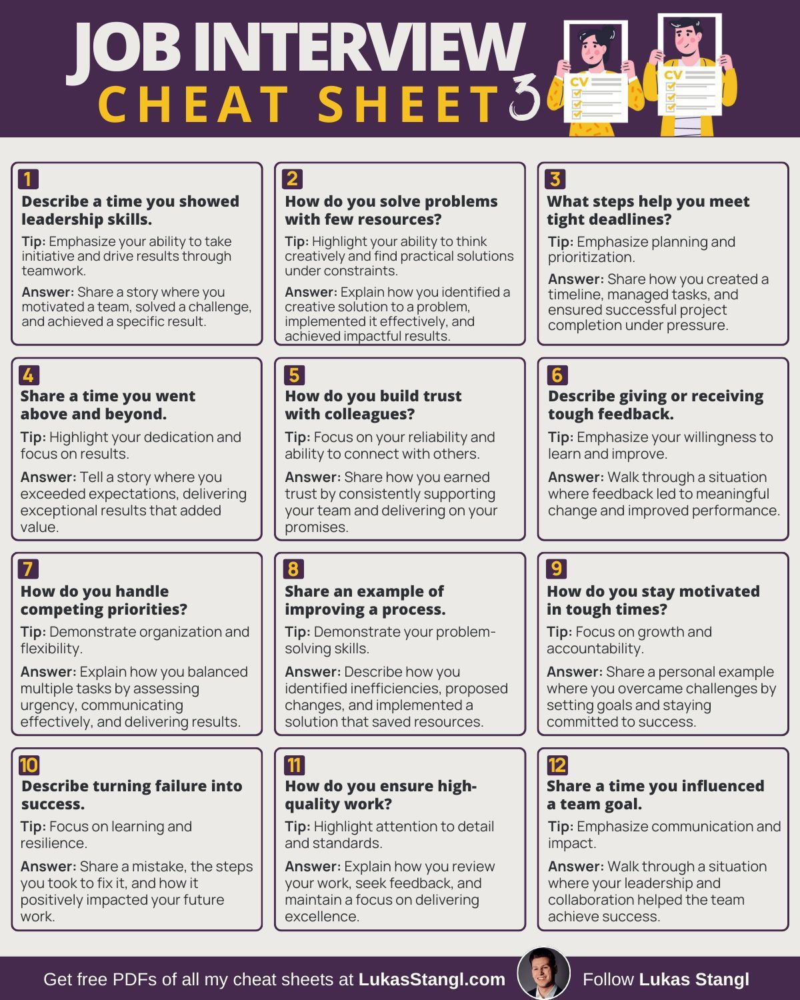

**Source:** [https://twitter.com/i/web/status/1873152954003488820](https://twitter.com/i/web/status/1873152954003488820)
**Original Post Date:** 2025-05-28 02:06:43

# Advanced Job Interview Preparation: Technical Engineer Edition

## Introduction
Technical interview preparation requires mastering both technical skills and communication strategies. This knowledge base provides a structured approach to common behavioral questions, focusing on how to demonstrate technical problem-solving abilities within professional contexts.

Understanding these patterns helps engineers articulate their experiences effectively while maintaining authenticity.

## Leadership Demonstration

Technical leadership often involves mentoring junior developers or guiding cross-functional projects. Focus on specific outcomes and measurable impacts.

Example: Mentored two junior engineers in implementing a microservices architecture, resulting in a 40% reduction in deployment errors.

- Start with STAR method structure (Situation, Task, Action, Result)
- Include metrics where possible to quantify impact

> **Note/Tip:** Always tie leadership actions back to technical outcomes

## Resource-Constrained Problem Solving

Highlight instances where you optimized existing resources or developed innovative solutions under constraints.

Example: Replaced a resource-heavy legacy system with an event-driven architecture, reducing server costs by 60%.

1. Identify the technical constraints first
1. Show how you analyzed available options

## Deadline Management

Demonstrate systematic approaches to project management and time allocation.

Example: Implemented CI/CD pipeline for critical feature, reducing deployment cycles from 3 days to 4 hours.

- Prioritize tasks based on technical dependencies

## Technical Innovation Examples

Focus on specific engineering achievements that went beyond basic requirements.

Example: Developed custom monitoring solution for distributed systems, reducing incident response time by 75%.

> **Note/Tip:** Quantify improvements with concrete metrics

## Key Takeaways

- Structure responses using STAR method to highlight technical achievements
- Always include measurable outcomes when discussing projects or solutions
- Connect leadership examples to specific engineering challenges and solutions

## Conclusion
Mastering these interview patterns allows engineers to effectively communicate their technical expertise while demonstrating soft skills. Regular practice with these scenarios ensures confidence in real interviews.

## External References

- [Behavioral Interview Framework](https://www.interviewcake.com/)
- [Technical Leadership Case Studies](https://engineering.medium.com/technical-leadership)

## Media

**Image Description:** ### Description of the Image

The image is a **job interview cheat sheet** titled **"Job Interview Cheat Sheet 3"**. It is designed to provide guidance and tips for job seekers on how to prepare for common interview questions. The layout is clean, organized, and visually appealing, with a focus on providing actionable advice and sample answers.

#### **Header Section**
- **Title**: The title "JOB INTERVIEW CHEAT SHEET 3" is prominently displayed at the top in bold, large font. The text is split into two lines, with "JOB INTERVIEW" in white and "CHEAT SHEET 3" in yellow.
- **Visual Elements**: 
  - Two cartoon-style illustrations of a man and a woman holding up their resumes (CVs) with checkmarks, symbolizing preparation and readiness.
  - The background of the header is a dark purple color, which contrasts with the white and yellow text, making it stand out.

#### **Main Content**
The main content is organized into **12 numbered sections**, each addressing a common interview question. Each section is structured as follows:

1. **Question**: The interview question is clearly stated.
2. **Tip**: A brief tip or strategy for answering the question effectively.
3. **Answer**: A sample response or guidance on how to structure the answer.

#### **Detailed Breakdown of Each Section**

1. **Question 1: Describe a time you showed leadership skills.**
   - **Tip**: Emphasize your ability to take initiative, drive results, and work with a team.
   - **Answer**: Share a story where you motivated a team, solved a challenge, and achieved a specific result.

2. **Question 2: How do you solve problems with few resources?**
   - **Tip**: Highlight your ability to think creatively and find practical solutions under constraints.
   - **Answer**: Explain how you identified a problem, created a solution, implemented it effectively, and achieved impactful results.

3. **Question 3: What steps help you meet tight deadlines?**
   - **Tip**: Emphasize planning, prioritization, and task management.
   - **Answer**: Share how you created a timeline, managed tasks, and ensured successful project completion under pressure.

4. **Question 4: Share a time you went above and beyond.**
   - **Tip**: Highlight your dedication and focus on results.
   - **Answer**: Tell a story where you exceeded expectations, delivering exceptional results that added value.

5. **Question 5: How do you build trust with colleagues?**
   - **Tip**: Focus on your reliability and ability to connect with others.
   - **Answer**: Share how you consistently supported your team and delivered on your promises.

6. **Question 6: Describe giving or receiving tough feedback.**
   - **Tip**: Emphasize your willingness to learn and improve.
   - **Answer**: Walk through a situation where feedback led to meaningful change and improved performance.

7. **Question 7: How do you handle competing priorities?**
   - **Tip**: Demonstrate organization and flexibility.
   - **Answer**: Explain how you balanced multiple tasks by assessing urgency and delivering results.

8. **Question 8: Share an example of improving a process.**
   - **Tip**: Demonstrate your problem-solving skills.
   - **Answer**: Describe how you identified inefficiencies, proposed changes, and implemented a solution that saved resources.

9. **Question 9: How do you stay motivated in tough times?**
   - **Tip**: Focus on growth and accountability.
   - **Answer**: Share a personal example where you overcame challenges by setting goals and staying committed to success.

10. **Question 10: Describe turning failure into success.**
    - **Tip**: Focus on learning and resilience.
    - **Answer**: Share a mistake, the steps you took to fix it, and how it positively impacted your future.

11. **Question 11: How do you ensure high-quality work?**
    - **Tip**: Highlight attention to detail and standards.
    - **Answer**: Explain how you review your work, seek feedback, and maintain a focus on delivering excellence.

12. **Question 12: Share a time you influenced a team goal.**
    - **Tip**: Emphasize communication and impact.
    - **Answer**: Walk through a situation where your leadership and collaboration helped the team achieve success.

#### **Footer Section**
- **Promotional Text**: 
  - "Get free PDFs of all my cheat sheets at LukasStangl.com"
  - "Follow Lukas Stangl" with a social media handle or link.
- **Visual Elements**: 
  - A circular profile picture of a person, presumably Lukas Stangl, is included in the footer.
  - The background of the footer is a dark purple color, consistent with the header.

#### **Design and Layout**
- **Color Scheme**: The primary colors used are dark purple, white, and yellow. The dark purple background provides a professional and clean look, while the white and yellow text ensures readability.
- **Typography**: The font is clear and legible, with bold headings for questions and tips, and regular text for answers.
- **Organization**: The content is organized into a grid format, making it easy to scan and reference specific questions.

### **Overall Impression**
The image is a well-structured and visually appealing resource for job seekers. It provides practical advice and sample answers for common interview questions, making it a useful tool for preparation. The design is professional, and the content is concise and actionable. The inclusion of tips and sample answers ensures that users can quickly understand how to approach each question effectively.
