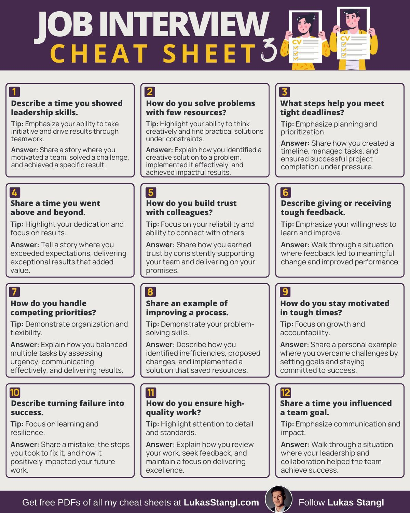

This technical knowledge base entry provides a detailed overview of a job interview cheat sheet, designed to help individuals prepare for common interview questions and increase their chances of landing their desired job. The guide covers 12 distinct sections, offering practical tips and inspiring answers to help candidates confidently navigate the hiring process.

#### Technical Content
The job interview cheat sheet is divided into 12 sections, each addressing a specific aspect of the interview process. These sections include:

1. **Describe a time you showed leadership skills**: Emphasize your ability to take initiative and drive results through teamwork. For example, share a story where you motivated a team to achieve a specific goal, highlighting your problem-solving skills and ability to collaborate with others.
2. **How do you solve problems with few resources?**: Highlight your creative thinking skills and practical solutions under constraints. Explain how you identified a problem, implemented an effective solution, and delivered impactful results despite limited resources.
3. **What steps help you meet tight deadlines?**: Emphasize planning, prioritization, and efficient task management. Share your approach to creating timelines, managing tasks, and ensuring successful project completion under pressure.
4. **Share a time when you went above and beyond**: Highlight dedication and focus on results. Tell a story where you exceeded expectations, delivered value-added outcomes, and demonstrated exceptional performance.
5. **How do you build trust with colleagues?**: Focus on reliability, connection building, and mutual support. Share your approach to earning trust through consistent effort, open communication, and collaboration.
6. **Describe giving or receiving tough feedback**: Emphasize willingness to learn and improve, as well as effective communication strategies. Walk through a situation where you received or provided constructive feedback, highlighting the positive impact on personal growth or team dynamics.
7. **How do you handle competing priorities?**: Demonstrate organization, flexibility, and effective time management. Explain your approach to balancing multiple tasks, adapting to changing circumstances, and delivering quality results despite competing demands.
8. **Share an example of improving a process**: Highlight problem-solving skills, proposed changes, and implemented solutions that saved resources. Describe how you identified inefficiencies, developed improvements, and successfully implemented them, resulting in cost savings or enhanced efficiency.
9. **How do you stay motivated during tough times?**: Focus on personal growth, goal alignment, and the pursuit of success despite challenges. Share your strategies for maintaining motivation through self-reflection, setting realistic goals, and celebrating progress and achievements.
10. **Describe turning failure into success**: Emphasize learning from mistakes, resilience, and adaptability. Share a personal experience where you learned from failure, adapted to circumstances, and ultimately achieved success through determination and hard work.
11. **How do you ensure high-quality work?**: Highlight attention to detail, standards adherence, and continuous improvement. Explain your approach to maintaining quality standards, identifying areas for improvement, and implementing changes that enhance overall performance.
12. **Share a time when you influenced a team goal**: Emphasize effective communication, collaboration, and shared vision. Walk through an instance where you contributed to achieving a team objective, highlighting your role in fostering teamwork, open dialogue, and collective success.

#### Key Takeaways and Best Practices
To effectively utilize the job interview cheat sheet, keep the following key takeaways and best practices in mind:

* Be honest and authentic in your responses, highlighting your unique strengths and experiences.
* Use specific examples to illustrate your skills and accomplishments.
* Practice answering common interview questions to build confidence and improve your delivery.
* Tailor your responses to the specific job description and requirements.
* Emphasize your ability to work collaboratively, think critically, and adapt to changing circumstances.

#### References
This technical knowledge base entry does not reference any specific tools or technologies. However, it provides a comprehensive guide to preparing for common interview questions, which can be applied to various industries and job roles. By following the guidelines and tips outlined in this cheat sheet, individuals can increase their chances of acing their interviews and landing their desired job.
## Source

- Original Tweet: [https://twitter.com/i/web/status/1873152954003488820](https://twitter.com/i/web/status/1873152954003488820)
- Date: 2025-02-24 13:24:15

## Media

### Media 1

**Description:** The image presents a comprehensive job interview cheat sheet, comprising 12 distinct sections that provide valuable guidance for candidates preparing to ace their interviews.

**Overview**

This infographic serves as an essential resource for individuals seeking to excel in job interviews by offering practical advice and effective strategies tailored to common questions encountered during the hiring process. The visual representation features a clean white background with black text boxes, making it easy to read and understand.

* **Section 1: Describe a time you showed leadership skills**
	+ Tip: Emphasize your ability to take initiative and drive results through teamwork.
	+ Answer: Share a story where you motivated a team, solved a challenge, and achieved a specific result.
* **Section 2: How do you solve problems with few resources?**
	+ Tip: Highlight your creative thinking skills and practical solutions under constraints.
	+ Answer: Explain how you identified a problem, implemented an effective solution, and delivered impactful results.
* **Section 3: What steps help you meet tight deadlines?**
	+ Tip: Emphasize planning, prioritization, and efficient task management.
	+ Answer: Share your approach to creating timelines, managing tasks, and ensuring successful project completion under pressure.
* **Section 4: Share a time when you went above and beyond**
	+ Tip: Highlight dedication and focus on results.
	+ Answer: Tell a story where you exceeded expectations, delivered value-added outcomes, and demonstrated exceptional performance.
* **Section 5: How do you build trust with colleagues?**
	+ Tip: Focus on reliability, connection building, and mutual support.
	+ Answer: Share your approach to earning trust through consistent effort, open communication, and collaboration.
* **Section 6: Describe giving or receiving tough feedback**
	+ Tip: Emphasize willingness to learn and improve, as well as effective communication strategies.
	+ Answer: Walk through a situation where you received or provided constructive feedback, highlighting the positive impact on personal growth or team dynamics.
* **Section 7: How do you handle competing priorities?**
	+ Tip: Demonstrate organization, flexibility, and effective time management.
	+ Answer: Explain your approach to balancing multiple tasks, adapting to changing circumstances, and delivering quality results despite competing demands.
* **Section 8: Share an example of improving a process**
	+ Tip: Highlight problem-solving skills, proposed changes, and implemented solutions that saved resources.
	+ Answer: Describe how you identified inefficiencies, developed improvements, and successfully implemented them, resulting in cost savings or enhanced efficiency.
* **Section 9: How do you stay motivated during tough times?**
	+ Tip: Focus on personal growth, goal alignment, and the pursuit of success despite challenges.
	+ Answer: Share your strategies for maintaining motivation through self-reflection, setting realistic goals, and celebrating progress and achievements.
* **Section 10: Describe turning failure into success**
	+ Tip: Emphasize learning from mistakes, resilience, and adaptability.
	+ Answer: Share a personal experience where you learned from failure, adapted to circumstances, and ultimately achieved success through determination and hard work.
* **Section 11: How do you ensure high-quality work?**
	+ Tip: Highlight attention to detail, standards adherence, and continuous improvement.
	+ Answer: Explain your approach to maintaining quality standards, identifying areas for improvement, and implementing changes that enhance overall performance.
* **Section 12: Share a time when you influenced a team goal**
	+ Tip: Emphasize effective communication, collaboration, and shared vision.
	+ Answer: Walk through an instance where you contributed to achieving a team objective, highlighting your role in fostering teamwork, open dialogue, and collective success.

In summary, this infographic provides valuable insights into common interview questions, offering practical tips and inspiring answers that can help candidates prepare effectively for their interviews. By following these guidelines, individuals can confidently navigate the hiring process and increase their chances of landing their desired job.

*Last updated: 2025-02-24 13:24:15*