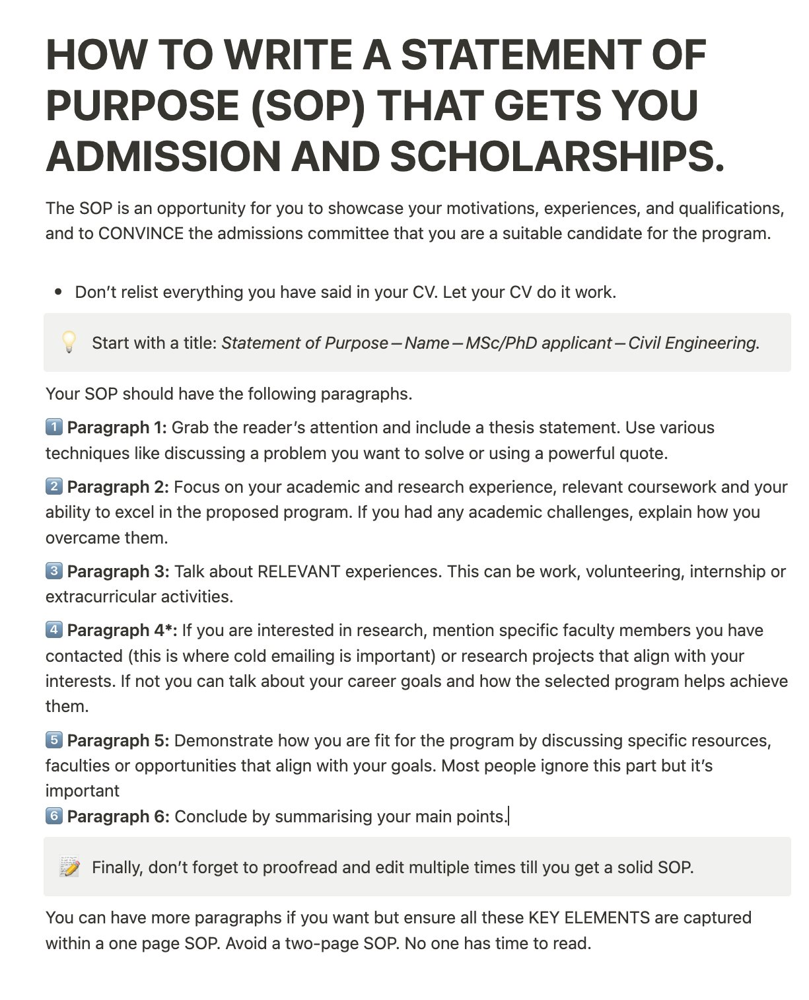

**Source:** [https://twitter.com/i/web/status/1918939111198540266](https://twitter.com/i/web/status/1918939111198540266)
**Original Post Date:** 2025-05-28 01:34:09

# Crafting Compelling Academic SOPs: A Technical Guide for Engineering Applicants

## Introduction
Writing an effective Statement of Purpose is a critical component in securing admission to graduate programs. This technical guide provides structured guidance for crafting SOPs that align with institutional expectations while highlighting unique qualifications and motivations. The focus is on Civil Engineering programs, though the principles apply broadly across STEM disciplines.

## SOP Structure and Formatting

The document should be titled clearly: 'Statement of Purpose – [Name] – MSc/PhD applicant – Civil Engineering'. Maintain brevity by limiting to one page, with clear paragraph divisions for distinct content areas.

Avoid duplicating CV information. Instead, use the SOP to provide narrative context and deeper insight into experiences, motivations, and program fit.

1. Paragraph 1: Introduction with thesis statement or problem statement
1. Paragraph 2: Academic background and research experience
1. Paragraph 3: Relevant professional/extra-curricular experiences
1. Paragraph 4: Research interests or career goals alignment
1. Paragraph 5: Program fit and resource utilization plans
1. Paragraph 6: Summary and conclusion

> **Note/Tip:** Use bold formatting for key phrases to highlight critical information

> **Note/Tip:** Maintain formal academic tone throughout the document

## Content Development Strategies

Begin with a compelling hook using problem statements or relevant quotes. This sets the narrative direction and captures reader attention.

Detail academic challenges overcome, emphasizing perseverance and growth. Include specific coursework that aligns with program requirements.

Highlight extracurricular activities that demonstrate leadership, technical skills, or industry exposure.

- Include specific faculty members whose research interests you
- Mention departmental resources that will support your goals
- Connect past experiences to future program objectives

## Review and Optimization Process

Multiple rounds of proofreading are essential. Focus on eliminating redundancy, improving flow, and ensuring alignment with program requirements.

Consider peer review from faculty or industry professionals to gain diverse perspectives on content effectiveness.

- Check for logical paragraph transitions
- Verify technical terminology accuracy
- Ensure consistent tone and narrative voice

## Key Takeaways

- Structure SOP into six distinct paragraphs, each serving a specific purpose in presenting your profile
- Focus on complementing CV information rather than duplicating it through narrative context
- Maintain brevity (one page) and formal academic tone throughout the document
- Highlight program fit by referencing specific departmental resources and faculty expertise

## Conclusion
A well-crafted SOP serves as a crucial differentiator in academic admissions. By following this structured approach, applicants can effectively communicate their qualifications, motivations, and alignment with program objectives.

## Media

**Image Description:** The image is a screenshot of a text-based guide titled **"How to Write a Statement of Purpose (SOP) That Gets You Admission and Scholarships."** The content is structured to provide detailed advice on crafting an effective Statement of Purpose (SOP) for academic applications, particularly for Master's (MSc) or Ph.D. programs in Civil Engineering. Below is a detailed description of the image, focusing on its main subject and relevant technical details:

### **Main Subject**
The main subject of the image is a step-by-step guide on writing a compelling Statement of Purpose (SOP). The guide is designed to help applicants structure their SOP in a way that highlights their qualifications, motivations, and suitability for the program they are applying to.

### **Structure and Content**
1. **Title:**
   - The title is prominently displayed at the top in bold, uppercase letters:  
     **"HOW TO WRITE A STATEMENT OF PURPOSE (SOP) THAT GETS YOU ADMISSION AND SCHOLARSHIPS."**

2. **Introduction:**
   - The introduction explains the purpose of the SOP:
     - It is an opportunity to showcase motivations, experiences, and qualifications.
     - The goal is to convince the admissions committee that the applicant is a suitable candidate for the program.

3. **Key Advice:**
   - A key piece of advice is provided early on:  
     **"Don’t relist everything you have said in your CV. Let your CV do its work."**  
     This emphasizes the need for the SOP to complement, rather than duplicate, the information in the CV.

4. **Title Formatting:**
   - The guide suggests starting the SOP with a clear title:  
     **"Statement of Purpose – Name – MSc/PhD applicant – Civil Engineering."**

5. **Paragraph Structure:**
   - The guide outlines a recommended structure for the SOP, divided into six paragraphs, each with a specific purpose:
     1. **Paragraph 1:**
        - **Objective:** Grab the reader's attention and include a thesis statement.
        - **Techniques:** Discuss a problem you want to solve or use a powerful quote.
     2. **Paragraph 2:**
        - **Objective:** Focus on academic and research experience, relevant coursework, and ability to excel in the proposed program.
        - **Details:** Mention any academic challenges and how they were overcome.
     3. **Paragraph 3:**
        - **Objective:** Discuss relevant experiences, such as work, volunteering, internships, or extracurricular activities.
     4. **Paragraph 4*:**
        - **Objective:** If interested in research, mention specific faculty members contacted or research projects that align with your interests.
        - **Alternative:** If not interested in research, discuss career goals and how the selected program helps achieve them.
     5. **Paragraph 5:**
        - **Objective:** Demonstrate how you are fit for the program by discussing resources, faculty, or opportunities that align with your goals.
     6. **Paragraph 6:**
        - **Objective:** Conclude by summarizing the main points.

6. **Final Advice:**
   - The guide emphasizes the importance of proofreading and editing the SOP multiple times to ensure it is solid and well-written.

7. **Length Recommendation:**
   - The guide advises keeping the SOP to **one page** and avoiding a two-page SOP, as admissions committees may not have time to read lengthy documents.

### **Visual Elements**
- **Font and Formatting:**
  - The text is written in a clean, readable font.
  - Headings and subheadings are bolded for emphasis.
  - Bullet points and numbered lists are used to organize information clearly.
  - Key phrases and instructions are highlighted in bold for emphasis.

- **Icons:**
  - A lightbulb icon is used next to the section about starting with a title.
  - A pencil icon is used next to the final advice about proofreading.

### **Technical Details**
- **Language and Tone:**
  - The language is formal and professional, suitable for an academic audience.
  - The tone is instructive and provides actionable advice.

- **Clarity and Organization:**
  - The guide is well-organized, with clear sections and numbered steps.
  - Each paragraph is assigned a specific purpose, making it easy for readers to follow along.

- **Length and Conciseness:**
  - The guide is concise, providing essential information without unnecessary details.
  - It emphasizes brevity, especially in the context of the SOP itself (one-page recommendation).

### **Overall Purpose**
The image serves as a comprehensive resource for applicants looking to write a strong Statement of Purpose. It provides a clear, step-by-step framework for structuring the SOP, along with tips for ensuring its effectiveness in securing admission and scholarships.

### **Summary**
The image is a detailed, structured guide on writing a Statement of Purpose (SOP) for academic applications. It emphasizes clarity, relevance, and brevity, offering specific advice on content, structure, and editing. The guide is designed to help applicants present themselves effectively to admissions committees.
