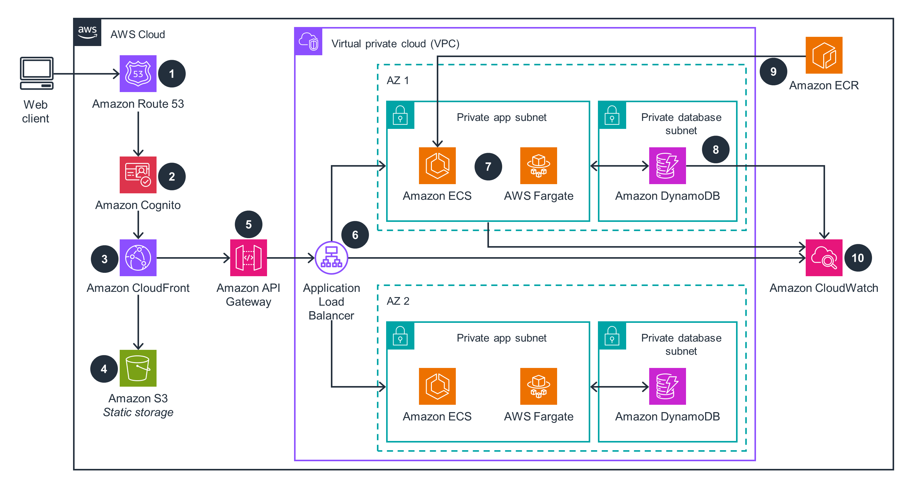

**Source:** [https://twitter.com/i/web/status/1884553905226592463](https://twitter.com/i/web/status/1884553905226592463)
**Original Post Date:** 2025-05-27 23:34:26

# AWS Containerized Web Application Architecture: ECS/Fargate with Multi-Service Integration

## Introduction
Modern cloud applications require a robust infrastructure that balances scalability, performance, and security. This knowledge base item explores the architectural patterns for containerized web applications on AWS, using ECS/Fargate as compute engines within a secure VPC environment. The architecture demonstrates how to integrate multiple AWS services to create a production-ready application with global distribution, authentication, and monitoring capabilities.

## Application Flow and Service Integration

The architectural flow begins with client requests being resolved through Route 53 DNS service. These requests are then validated by Amazon Cognito for user authentication before reaching the content delivery layer via CloudFront.

Dynamic requests pass through API Gateway, which acts as a managed proxy to distribute traffic across Application Load Balancer instances running in multiple availability zones.

1. Route 53 resolves domain names and handles global routing
1. Cognito manages user authentication and authorization
1. CloudFront delivers cached static content
1. API Gateway processes API requests and security policies

> **Note/Tip:** Configure CloudFront to use custom origins when serving dynamic content from your ECS containers.

## Container Orchestration with ECS/Fargate

The application runs in private subnets using Amazon ECS, a container orchestration service, or AWS Fargate, which provides serverless compute without managing EC2 instances.

Docker images are stored in Amazon ECR and pulled dynamically by ECS during deployment.

- Use private subnets to isolate container workloads from public internet
- Implement service discovery using AWS Cloud Map for inter-container communication

## Database and Storage Architecture

Amazon DynamoDB serves as the backend database, deployed in private subnets with dedicated access through VPC endpoints.

Static content storage is handled by Amazon S3, which integrates seamlessly with CloudFront for global content delivery.

## Key Takeaways

- Implement a multi-tier architecture using Route 53, Cognito, and CloudFront for optimal performance
- Deploy containers in private subnets with ECS/Fargate to maintain security and scalability
- Leverage AWS managed services like API Gateway and DynamoDB to reduce operational overhead

## Conclusion
This architecture demonstrates how to build a secure, scalable, and performant web application using AWS containerization services. By following these patterns, developers can ensure high availability while maintaining security through private networking and authentication layers.

## External References

- [AWS Container Service Documentation](https://aws.amazon.com/containers/)
- [ECS Best Practices Guide](https://docs.aws.amazon.com/AmazonECS/latest/userguide/best-practices.html)

## Media

**Image Description:** This image depicts an architectural diagram of a modern, scalable, and secure web application deployed on the AWS (Amazon Web Services) cloud. The diagram illustrates the flow of data and the interaction between various AWS services, organized into different components and layers. Below is a detailed breakdown of the image:

---

### **Main Components and Flow**

#### **1. Client Web Access**
- **Client Device**: The flow begins with a client device (e.g., a web browser or mobile app) accessing the application.
- **Amazon Route 53**: The client's request is directed to **Amazon Route 53**, AWS's DNS service, which resolves the domain name to the appropriate IP address. This ensures high availability and global traffic distribution.

#### **2. Authentication and Authorization**
- **Amazon Cognito**: The request is routed to **Amazon Cognito**, AWS's identity and access management service. Cognito handles user authentication, authorization, and secure user data management. This ensures that only authenticated users can access the application.

#### **3. Content Delivery Network (CDN)**
- **Amazon CloudFront**: After authentication, the request is directed to **Amazon CloudFront**, AWS's CDN service. CloudFront caches static content (e.g., images, CSS, JavaScript files) closer to the user, reducing latency and improving performance.

#### **4. Static Content Storage**
- **Amazon S3**: Static content (e.g., images, CSS, JavaScript files) is stored in **Amazon S3**, a highly scalable and durable object storage service. CloudFront retrieves these files from S3 and serves them to the client.

#### **5. API Gateway**
- **Amazon API Gateway**: Dynamic requests (e.g., API calls for fetching data or performing actions) are routed to **Amazon API Gateway**, a fully managed service for creating, deploying, and managing APIs. API Gateway acts as a proxy between the client and the backend services.

#### **6. Load Balancing**
- **Application Load Balancer**: The API Gateway routes requests to an **Application Load Balancer**. The load balancer distributes incoming traffic across multiple instances of the application, ensuring high availability and fault tolerance.

#### **7. Compute Services**
- **Amazon ECS (Elastic Container Service)** and **AWS Fargate**: Inside the VPC, the application is deployed using **Amazon ECS** or **AWS Fargate**. ECS is a container orchestration service, while Fargate is a serverless compute engine for containers. These services manage the application's containers, ensuring scalability and reliability.
  - **Private App Subnet**: The ECS/Fargate instances are deployed in a **Private App Subnet**, which is isolated from the public internet for enhanced security.

#### **8. Database**
- **Amazon DynamoDB**: The application interacts with **Amazon DynamoDB**, a fully managed NoSQL database service. DynamoDB provides fast and predictable performance, making it suitable for applications requiring low-latency data access.
  - **Private Database Subnet**: The DynamoDB instances are also deployed in a **Private Database Subnet**, ensuring secure access.

#### **9. Container Registry**
- **Amazon ECR (Elastic Container Registry)**: Docker images for the application are stored in **Amazon ECR**, a fully managed container registry service. ECS/Fargate retrieves these images to deploy the application containers.

#### **10. Monitoring and Logging**
- **Amazon CloudWatch**: The application's logs and metrics are sent to **Amazon CloudWatch**, a monitoring and observability service. CloudWatch helps in monitoring application performance, detecting issues, and ensuring the system's health.

---

### **Key AWS Services and Their Roles**
1. **Amazon Route 53**: DNS resolution and global traffic distribution.
2. **Amazon Cognito**: User authentication and authorization.
3. **Amazon CloudFront**: Content delivery network for caching static content.
4. **Amazon S3**: Storage for static content.
5. **Amazon API Gateway**: Manages API requests and acts as a proxy to the backend.
6. **Application Load Balancer**: Distributes traffic across application instances.
7. **Amazon ECS/AWS Fargate**: Orchestrates and runs application containers.
8. **Amazon DynamoDB**: NoSQL database for storing application data.
9. **Amazon ECR**: Container registry for storing Docker images.
10. **Amazon CloudWatch**: Monitoring and logging for application performance.

---

### **Network Architecture**
- **Virtual Private Cloud (VPC)**: The entire application is deployed within a **VPC**, which is a logically isolated network within AWS. The VPC is divided into subnets:
  - **Private App Subnet**: Hosts the application containers (ECS/Fargate).
  - **Private Database Subnet**: Hosts the database (DynamoDB).
- **Availability Zones (AZs)**: The VPC is spread across multiple **Availability Zones (AZs)** (e.g., AZ1 and AZ2) to ensure high availability and fault tolerance. Each AZ is a physically separate data center with independent power, cooling, and networking.

---

### **Security**
- **Private Subnets**: Both the application and database are deployed in private subnets, ensuring they are not directly accessible from the internet.
- **Authentication and Authorization**: Amazon Cognito ensures that only authenticated users can access the application.
- **Secure Communication**: All communication between services is encrypted and secure.

---

### **Scalability**
- **ECS/Fargate**: Automatically scales the number of containers based on demand.
- **DynamoDB**: Automatically scales to handle increased read/write capacity.
- **Load Balancer**: Distributes traffic across multiple instances to handle increased load.

---

### **Summary**
This architecture is designed for high availability, scalability, and security. It leverages AWS services to handle various aspects of the application, from DNS resolution and authentication to compute, storage, and monitoring. The use of private subnets, load balancing, and managed services ensures a robust and efficient deployment. The flow of data is optimized for performance, with static content served via CloudFront and dynamic content processed through API Gateway and ECS/Fargate. Monitoring and logging are handled by CloudWatch to ensure the system's health and performance.
