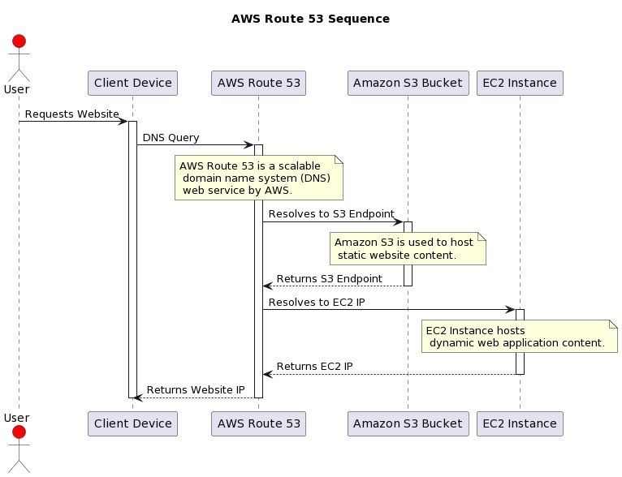

**Source:** [https://twitter.com/i/web/status/1882772794024640532](https://twitter.com/i/web/status/1882772794024640532)
**Original Post Date:** 2025-05-27 17:15:43

# AWS Route 53 Sequence Flow: Integration with S3 and EC2 for Website Serving

## Introduction
Understanding the sequence of events in AWS infrastructure is crucial for building efficient web architectures. This article explores how AWS Route 53 orchestrates requests between user browsers and AWS services (S3/EC2), demonstrating critical concepts in DNS resolution, domain management, and content delivery optimization.

## AWS Route 53 Sequence of Events

The sequence begins with a user's browser requesting a website URL. This triggers a DNS lookup via AWS Route 53, which resolves the domain name to either an S3 endpoint or EC2 instance IP address based on the configured routing policies.

When serving static content (HTML/CSS/JS), Route 53 points to an S3 bucket endpoint. For dynamic applications requiring server-side processing, it routes to an EC2 instance's public IP address.

```yaml
# Example Route53 Hosted Zone Configuration
Resources:
  WebsiteAliasRecord:
    Type: AWS::Route53::RecordSet
    Properties:
      Name: example.com.
      Type: A
      AliasTarget:
        DNSName: !GetAtt MyS3Website.DNSName
        HostedZoneId: Z2FDTNDATAQYW2
```

1. User initiates website request via browser
1. Browser performs DNS lookup to Route 53
1. Route 53 resolves domain to S3 endpoint or EC2 IP
1. Browser retrieves content from resolved destination

> **Note/Tip:** Configure appropriate TTL values for optimal caching and performance

> **Note/Tip:** Use Route 53's weighted routing for A/B testing between S3/EC2 endpoints

## Architecture Considerations

When designing web architectures, consider separating static and dynamic content. Use S3 for static assets to leverage its low-latency edge caching capabilities via CloudFront.

For applications requiring compute resources or custom processing, EC2 instances provide the necessary server environment while maintaining Route 53's load balancing and failover benefits.

```bash
# Example: Create S3 website endpoint
aws s3api put-bucket-website \
    --bucket my-static-site.com \
    --website-configuration file://web-config.json
```

## Key Takeaways

- Route 53 acts as the central DNS resolver, directing traffic to appropriate AWS services
- S3 endpoints are ideal for static content delivery with built-in web hosting capabilities
- EC2 instances provide server-side processing for dynamic applications while maintaining Route 53's routing flexibility

## Conclusion
Understanding this sequence is fundamental to architecting efficient, scalable web solutions. By leveraging AWS Route 53 alongside S3 and EC2, developers can create architectures that efficiently serve both static and dynamic content while maintaining high availability and performance.

## External References

- [AWS Route 53 Documentation](https://docs.aws.amazon.com/Route53/latest/DeveloperGuide/welcome.html)
- [S3 Static Website Hosting Guide](https://docs.aws.amazon.com/AmazonS3/latest/userguide/static-website-hosting.html)


## Media

**Image Description:** The image is a sequence diagram illustrating the flow of interactions between various components in an AWS (Amazon Web Services) environment, specifically focusing on how AWS Route 53, Amazon S3, and EC2 (Elastic Compute Cloud) work together to serve a website. Below is a detailed description of the diagram:

### **Main Subject**
The main subject of the diagram is the **AWS Route 53 Sequence**, which demonstrates how a user's request for a website is resolved and served through AWS services. The diagram shows the interaction between the user, client device, AWS Route 53, Amazon S3, and EC2.

### **Key Components**
1. **User**: The user initiates the process by requesting a website.
2. **Client Device**: The user's device (e.g., a browser) sends the request to the internet.
3. **AWS Route 53**: AWS's scalable DNS service, which resolves domain names to IP addresses.
4. **Amazon S3 Bucket**: A storage service used to host static website content.
5. **EC2 Instance**: A virtual server instance used to host dynamic web applications.

### **Sequence of Events**
The diagram is organized as a sequence of steps, showing the flow of requests and responses between these components:

#### **Step 1: User Requests Website**
- The **User** uses their **Client Device** to request a website (e.g., by typing a URL in a browser).
- The request is sent to the internet.

#### **Step 2: DNS Query to AWS Route 53**
- The **Client Device** sends a **DNS Query** to **AWS Route 53** to resolve the domain name to an IP address.
- **AWS Route 53** is described as a scalable DNS service provided by AWS.

#### **Step 3: Resolution to S3 Endpoint**
- **AWS Route 53** resolves the domain name to an **S3 Endpoint**.
- This indicates that the website content is hosted on **Amazon S3**.
- **Amazon S3** is used to host static website content, such as HTML, CSS, and images.

#### **Step 4: Resolution to EC2 IP**
- Alternatively, **AWS Route 53** can resolve the domain name to an **EC2 IP**.
- This indicates that the website content is hosted on an **EC2 Instance**, which is a virtual server used for dynamic web applications.

#### **Step 5: Returns S3 Endpoint or EC2 IP**
- **AWS Route 53** returns the resolved endpoint (either the **S3 Endpoint** or the **EC2 IP**) to the **Client Device**.
- If the endpoint is an **S3 Endpoint**, the **Client Device** directly accesses the static content hosted on **Amazon S3**.
- If the endpoint is an **EC2 IP**, the **Client Device** accesses the dynamic content hosted on the **EC2 Instance**.

#### **Step 6: Returns Website IP**
- The **Client Device** receives the resolved IP address and connects to the appropriate service (S3 or EC2) to retrieve the website content.

### **Annotations**
- **AWS Route 53**: Described as a scalable DNS service provided by AWS.
- **Amazon S3**: Used to host static website content.
- **EC2 Instance**: Hosts dynamic web application content.

### **Visual Elements**
- **Arrows**: Represent the flow of requests and responses between components.
- **Boxes**: Represent the components involved in the process (e.g., User, Client Device, AWS Route 53, Amazon S3, EC2 Instance).
- **Annotations**: Provide additional details about each component and its role in the sequence.

### **Summary**
The diagram illustrates a typical workflow where a user requests a website, and AWS Route 53 resolves the domain name to either an S3 endpoint (for static content) or an EC2 IP (for dynamic content). This sequence highlights the integration of AWS services to deliver both static and dynamic web content efficiently. The use of AWS Route 53 ensures scalability and reliability in resolving domain names to the appropriate hosting services.
