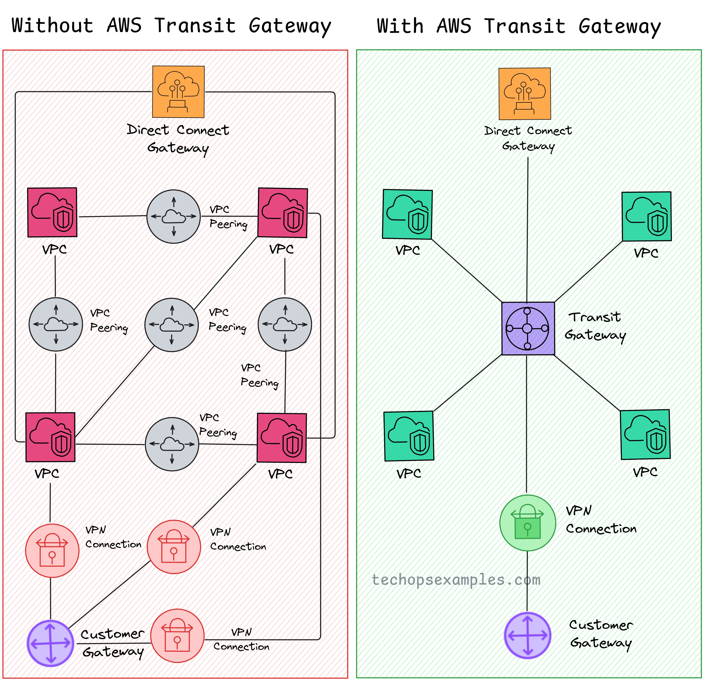

**Source:** [https://twitter.com/i/web/status/1924842965291368666](https://twitter.com/i/web/status/1924842965291368666)
**Original Post Date:** 2025-05-28 08:27:56

# AWS Transit Gateway: Architectural Benefits for Enterprise Network Design

## Introduction
Network architecture in cloud environments presents significant challenges as organizations scale. Traditional methods using VPC Peering and multiple VPN tunnels create complex, hard-to-manage infrastructures. AWS Transit Gateway introduces a hub-and-spoke model that transforms this landscape by centralizing connections and simplifying management across hybrid and multi-cloud deployments.

## Traditional Network Architecture Limitations

Without Transit Gateway, organizations face a mesh network topology where each VPC must establish direct peering connections with every other VPC it needs to communicate with. This results in O(n²) complexity for n VPCs.

Managing these connections becomes increasingly difficult as the number of VPCs grows, requiring separate VPN tunnels and customer gateway configurations for on-premises connectivity.

- VPC Peering limited to 125 connections per VPC
- Manual configuration required for each connection
- No centralized management interface
- High complexity in troubleshooting network issues

> **Note/Tip:** Consider Transit Gateway when managing more than three VPCs or multiple on-premises locations

## Transit Gateway Architecture Advantages

AWS Transit Gateway centralizes all network connections through a single gateway, eliminating the need for direct peering between each pair of VPCs.

This hub-and-spoke model provides scalability and simplifies management while maintaining security and performance.

_Creates a Transit Gateway with automatic route acceptance and DNS support enabled_

```bash
# Example Transit Gateway CLI creation
aws ec2 create-transit-gateway --description 'Enterprise Hub' --options {'AutoAcceptSharedAttachments': 'enable', 'DnsSupport': 'enable'}
```

1. Centralized connectivity management through a single AWS service
1. Automatic route propagation between connected networks
1. Support for multiple connection types (VPC, VPN, Direct Connect)
1. Simplified network policy enforcement

## Performance and Cost Considerations

While Transit Gateway introduces additional networking components, it optimizes network traffic paths by reducing the number of connection points.

Cost benefits typically emerge in larger deployments where traditional peering and VPN configurations would be more expensive to manage.

- Predictable pricing based on connected VPCs and data transfer
- Automatic scaling with workload demands
- Reduced management overhead

## Key Takeaways

- Transit Gateway simplifies network architecture by centralizing connections through a hub-and-spoke model
- Eliminates the need for multiple direct VPC peering connections, reducing complexity and management overhead
- Provides scalable connectivity options suitable for hybrid and multi-cloud environments

## Conclusion
AWS Transit Gateway represents a significant evolution in cloud network architecture by centralizing connectivity management. For organizations with complex networking requirements or those scaling beyond simple VPC peering setups, Transit Gateway offers a more efficient and maintainable solution. By adopting this service, teams can focus on innovation rather than managing complex network configurations.

## External References

- [AWS Transit Gateway Documentation](https://docs.aws.amazon.com/vpc/latest/tgw/what-is.html)
- [AWS Transit Gateway Pricing Details](https://aws.amazon.com/transit-gateway/pricing/)


## Media

**Image Description:** The image is a comparative diagram illustrating the network architecture of AWS (Amazon Web Services) environments **with and without the AWS Transit Gateway**. The diagram is divided into two sections, each representing a different scenario:

### **Left Side: Without AWS Transit Gateway**
This section highlights a complex network architecture where VPCs (Virtual Private Clouds) are interconnected using VPC Peering and VPN connections. Here are the key components and details:

1. **VPCs (Virtual Private Clouds)**:
   - Multiple VPCs are depicted as red squares with a cloud icon inside.
   - These VPCs are spread across the diagram, representing isolated network environments.

2. **VPC Peering**:
   - VPCs are connected to each other using VPC Peering, represented by gray circular icons with arrows pointing in both directions.
   - VPC Peering allows direct communication between VPCs within the same AWS region.

3. **VPN Connections**:
   - Some VPCs are connected to on-premises networks or other external networks via VPN (Virtual Private Network) connections.
   - These are represented by red circular icons with a lock symbol, indicating secure connections.

4. **Direct Connect**:
   - A Direct Connect is shown at the top, represented by an orange square with a cloud icon and a lightning bolt.
   - Direct Connect provides a dedicated, high-bandwidth connection between an on-premises network and AWS.

5. **Customer Gateway**:
   - A customer gateway is depicted at the bottom, represented by a purple circular icon with a crosshair.
   - This represents the on-premises network's endpoint for connecting to AWS.

6. **Complexity**:
   - The diagram shows a highly interconnected network with multiple VPC Peering connections and VPN tunnels.
   - The architecture appears complex, with numerous direct connections between VPCs and external networks.

### **Right Side: With AWS Transit Gateway**
This section illustrates a simplified and centralized network architecture using the AWS Transit Gateway. Here are the key components and details:

1. **AWS Transit Gateway**:
   - The central component is the AWS Transit Gateway, represented by a purple square with a circular icon inside.
   - The Transit Gateway acts as a hub for connecting multiple VPCs and on-premises networks.

2. **VPCs**:
   - Multiple VPCs are depicted as green squares with a cloud icon inside.
   - These VPCs are connected to the Transit Gateway, simplifying the network topology.

3. **Direct Connect**:
   - Similar to the left side, a Direct Connect is shown at the top, represented by an orange square with a cloud icon and a lightning bolt.
   - The Direct Connect is connected to the Transit Gateway, allowing on-premises networks to access all VPCs through a single connection.

4. **VPN Connections**:
   - VPN connections are shown at the bottom, represented by green circular icons with a lock symbol.
   - These VPN connections are also connected to the Transit Gateway, enabling secure access to VPCs.

5. **Customer Gateway**:
   - A customer gateway is depicted at the bottom, represented by a purple circular icon with a crosshair.
   - This represents the on-premises network's endpoint for connecting to the Transit Gateway.

6. **Simplified Architecture**:
   - The Transit Gateway centralizes all connections, reducing the number of direct VPC Peering connections and VPN tunnels.
   - The network topology is significantly simplified, with all VPCs and external networks converging on the Transit Gateway.

### **Comparison**
- **Without Transit Gateway**:
  - Network complexity is high due to multiple direct connections (VPC Peering and VPN tunnels).
  - Scalability is limited as adding new VPCs or on-premises networks requires additional peering and VPN configurations.
  - Management overhead is significant due to the numerous connections.

- **With Transit Gateway**:
  - The network is centralized and simplified, with all VPCs and external networks connected to a single Transit Gateway.
  - Scalability is improved as new VPCs or on-premises networks can be added by connecting them to the Transit Gateway.
  - Management is easier due to the reduced number of direct connections.

### **Key Technical Details**
1. **VPC Peering**:
   - Direct, private connectivity between two VPCs within the same AWS region.
   - Limited to a maximum of 125 VPC Peering connections per VPC.

2. **VPN Connections**:
   - Secure, encrypted connections between on-premises networks and AWS VPCs.
   - Typically used when a Direct Connect is not feasible.

3. **Direct Connect**:
   - A dedicated, high-bandwidth connection between an on-premises network and AWS.
   - Provides a more reliable and faster connection compared to VPNs.

4. **AWS Transit Gateway**:
   - A centralized hub for connecting multiple VPCs and on-premises networks.
   - Simplifies network management and improves scalability.
   - Supports both VPC Peering and VPN connections through a single gateway.

### **Conclusion**
The diagram effectively demonstrates how the AWS Transit Gateway simplifies network architecture by centralizing connections and reducing complexity. It highlights the transition from a mesh-like network of direct connections to a hub-and-spoke model, making it easier to manage and scale AWS environments.
