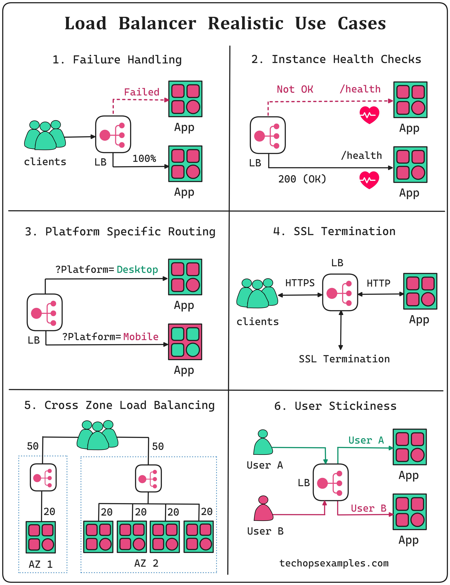

**Source:** [https://twitter.com/i/web/status/1924117903508701368](https://twitter.com/i/web/status/1924117903508701368)
**Original Post Date:** 2025-05-28 08:31:44

# Load Balancer Use Cases: Enhancing Cloud System Reliability and Performance

## Introduction
In distributed systems, effective traffic management is crucial for maintaining system availability and performance. This knowledge base item explores six essential use cases of load balancers that address key challenges in modern cloud architecture: failure handling, instance health monitoring, platform-specific routing, SSL termination, cross-zone distribution, and user session consistency.

## Failure Handling

Load balancers provide crucial redundancy by detecting and isolating failed instances while maintaining service availability. When an application instance fails, the load balancer automatically redirects traffic to healthy instances, ensuring minimal disruption to clients.

The process involves continuous monitoring of instances and immediate rerouting of traffic when failures are detected. This proactive approach prevents cascading failures and maintains system uptime.

> **Note/Tip:** Implement automatic health checks at regular intervals to minimize downtime windows

> **Note/Tip:** Ensure sufficient instance redundancy to handle simultaneous failures

## Instance Health Checks

Health checks are fundamental to maintaining system reliability. Load balancers continuously monitor application instances using HTTP endpoints or custom scripts.

A 200 OK response indicates a healthy instance, while failed responses trigger traffic rerouting. This mechanism ensures only functioning instances receive client requests.

- HTTP GET /health endpoint (standard approach)
- Custom script execution for deep health assessment
- Response time thresholds as health indicators

## Platform-Specific Routing

Load balancers can route traffic based on client platform type, optimizing resource utilization and user experience. This is achieved through URL parameters or custom routing rules.

Separate instance groups for different platforms allow specialized optimization and maintenance strategies.

## SSL Termination

SSL termination at the load balancer level provides several benefits including reduced application server overhead, centralized certificate management, and simplified security configuration.

Traffic flows as encrypted HTTPS to the load balancer, which handles decryption before forwarding plaintext HTTP to backend instances.

## Cross-Zone Load Balancing

Distributing traffic across multiple availability zones enhances fault tolerance and reduces latency. Each zone maintains its own set of application instances and local load balancing capabilities.

This architecture ensures continued operation even if an entire availability zone fails, providing high-availability guarantees.

## User Stickiness

Session persistence ensures users consistently access the same backend instance throughout their session. This is crucial for stateful applications maintaining user sessions.

Load balancers can implement stickiness through cookies or connection tracking, though careful consideration must be given to handle scaling and failure scenarios.

> **Note/Tip:** Monitor stickiness cookie expiration times

> **Note/Tip:** Implement proper failover mechanisms when sticky instances fail

## Key Takeaways

- Load balancers are essential for maintaining high availability in distributed systems
- Proactive health monitoring prevents system-wide failures
- Platform-specific routing enables targeted optimization and maintenance
- SSL termination at the load balancer simplifies security management
- Cross-zone distribution enhances fault tolerance and performance

## Conclusion
Understanding these load balancing patterns is crucial for designing robust cloud architectures. By implementing these strategies, systems can achieve high availability, maintain consistent user experience, and efficiently utilize resources.

## External References

- [AWS Elastic Load Balancing](https://aws.amazon.com/elasticloadbalancing/)
- [Google Cloud Load Balancing](https://cloud.google.com/load-balancing)

## Media

**Image Description:** The image is a detailed diagram illustrating various realistic use cases for a **Load Balancer (LB)** in a distributed system architecture. The diagram is divided into six sections, each highlighting a specific scenario or feature of load balancing. Below is a detailed breakdown of each section:

---

### **1. Failure Handling**
- **Description**: This section demonstrates how a load balancer handles failures in application instances.
- **Key Components**:
  - **Clients**: Represented by green human icons.
  - **Load Balancer (LB)**: A central component that distributes traffic.
  - **Application Instances (App)**: Represented by green and pink squares.
- **Scenario**:
  - Clients send requests to the load balancer.
  - The load balancer distributes traffic to multiple application instances.
  - One of the application instances fails (indicated by a dashed red line and the word "Failed").
  - The load balancer detects the failure and stops sending traffic to the failed instance.
  - Traffic is redirected to the remaining healthy instances.
- **Outcome**: The system remains operational despite the failure of one instance.

---

### **2. Instance Health Checks**
- **Description**: This section shows how the load balancer performs health checks on application instances.
- **Key Components**:
  - **Clients**: Green human icons.
  - **Load Balancer (LB)**: Central component.
  - **Application Instances (App)**: Green and pink squares.
  - **Health Check Endpoint**: `/health` (indicated by a dashed line).
- **Scenario**:
  - The load balancer periodically sends health check requests to each application instance.
  - If an instance responds with a `200 OK` status, it is considered healthy (indicated by a green heart).
  - If an instance does not respond or responds with an error, it is marked as unhealthy (indicated by a red heart).
  - The load balancer routes traffic only to healthy instances.
- **Outcome**: Ensures that only functioning instances receive traffic, improving system reliability.

---

### **3. Platform-Specific Routing**
- **Description**: This section illustrates how the load balancer can route traffic based on the platform type (e.g., desktop vs. mobile).
- **Key Components**:
  - **Clients**: Green human icons.
  - **Load Balancer (LB)**: Central component.
  - **Application Instances (App)**: Green and pink squares.
- **Scenario**:
  - Clients send requests with a query parameter indicating the platform type (e.g., `?Platform=Desktop` or `?Platform=Mobile`).
  - The load balancer uses these parameters to route traffic to specific application instances optimized for the respective platforms.
  - For example:
    - Requests with `?Platform=Desktop` are routed to one set of instances.
    - Requests with `?Platform=Mobile` are routed to another set of instances.
- **Outcome**: Allows for tailored application behavior based on the client's platform, improving user experience.

---

### **4. SSL Termination**
- **Description**: This section demonstrates how the load balancer can handle SSL termination.
- **Key Components**:
  - **Clients**: Green human icons.
  - **Load Balancer (LB)**: Central component.
  - **Application Instances (App)**: Green and pink squares.
- **Scenario**:
  - Clients send HTTPS requests to the load balancer.
  - The load balancer terminates the SSL connection, decrypts the traffic, and forwards it as HTTP to the application instances.
  - The load balancer handles the encryption/decryption process, reducing the load on the application servers.
- **Outcome**: Simplifies the application server setup by offloading SSL processing to the load balancer, enhancing security and performance.

---

### **5. Cross-Zone Load Balancing**
- **Description**: This section shows how the load balancer can distribute traffic across multiple availability zones (AZs).
- **Key Components**:
  - **Clients**: Green human icons.
  - **Load Balancer (LB)**: Central component.
  - **Application Instances (App)**: Green and pink squares.
  - **Availability Zones (AZ)**: Two zones labeled "AZ 1" and "AZ 2."
- **Scenario**:
  - The system is deployed across two availability zones, each with its own set of application instances.
  - The load balancer distributes traffic evenly between the two zones.
  - Each zone has its own load balancer, which further distributes traffic to the application instances within that zone.
  - Traffic distribution is shown as percentages (e.g., 50% to each zone, 20% to each instance).
- **Outcome**: Provides high availability and fault tolerance by ensuring that traffic is spread across multiple zones, reducing the impact of zone-level failures.

---

### **6. User Stickiness**
- **Description**: This section illustrates how the load balancer can maintain session consistency for users.
- **Key Components**:
  - **Clients**: Green and pink human icons representing different users.
  - **Load Balancer (LB)**: Central component.
  - **Application Instances (App)**: Green and pink squares.
- **Scenario**:
  - Users (e.g., User A and User B) send requests to the load balancer.
  - The load balancer ensures that each user is consistently routed to the same application instance throughout their session.
  - For example:
    - User A is always routed to one set of instances.
    - User B is always routed to another set of instances.
- **Outcome**: Maintains session consistency, which is crucial for applications that require stateful behavior (e.g., shopping carts, user sessions).

---

### **Overall Layout and Design**
- The diagram is organized into a 2x3 grid, with each section clearly labeled and visually distinct.
- Icons and colors are used consistently to represent clients, load balancers, and application instances.
- Arrows indicate the flow of traffic and interactions between components.
- The use of dashed lines, hearts, and query parameters helps convey specific technical details (e.g., failures, health checks, and routing logic).

---

### **Conclusion**
The image provides a comprehensive overview of how a load balancer can be used in various scenarios to enhance system reliability, scalability, and performance. Each section highlights a specific feature or use case, making it a valuable resource for understanding load balancing in distributed systems.
