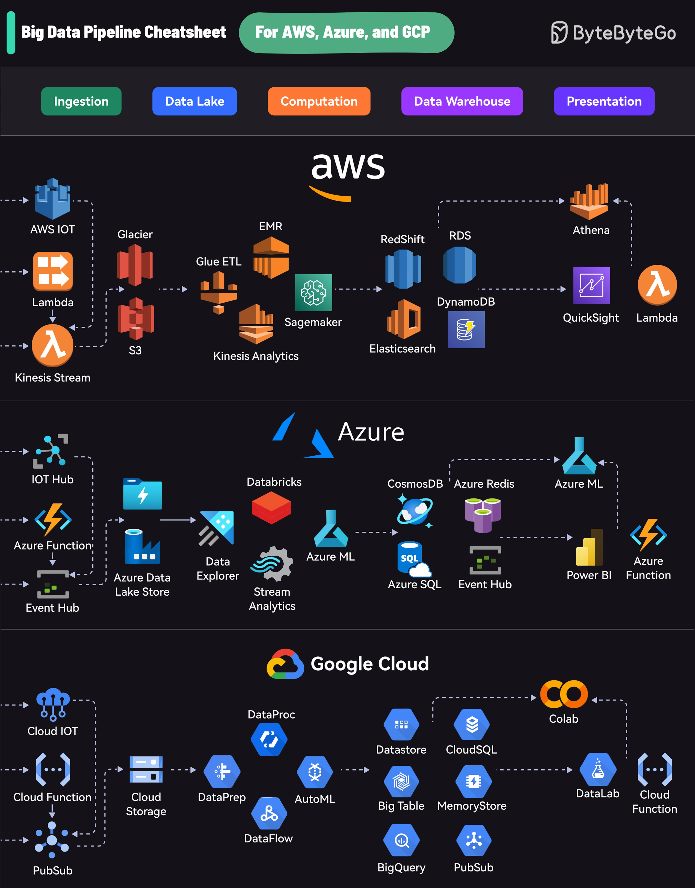

Big data pipelines on the cloud refer to the series of processes and components used to ingest, process, store, and analyze large amounts of data in a cloud-based environment. This entry provides an overview of the data processing pipelines for three prominent cloud providers: Amazon Web Services (AWS), Microsoft Azure, and Google Cloud Platform (GCP).

## Technical Content
The data processing pipeline for each cloud provider can be broken down into four main stages: ingestion, data lake, computation, and data warehouse.

### AWS Data Pipeline
* **Ingestion**: AWS provides several options for ingesting data, including AWS IoT and Kinesis Stream. These services allow users to collect and process data from various sources, such as IoT devices or social media platforms.
* **Data Lake**: Once the data is ingested, it can be stored in a data lake, which is a centralized repository that stores raw, unprocessed data. In AWS, this can be achieved using S3 or Glacier.
* **Computation**: After the data is stored, it can be processed and analyzed using various computation services, such as EMR, Redshift, or DynamoDB. These services provide users with the ability to perform complex data processing tasks, such as data aggregation or machine learning model training.
* **Data Warehouse**: Finally, the processed data can be loaded into a data warehouse, which is a database designed for analytics and reporting. In AWS, this can be achieved using Athena or QuickSight.

### Azure Data Pipeline
* **Ingestion**: Azure provides several options for ingesting data, including IoT Hub and Event Hubs. These services allow users to collect and process data from various sources, such as IoT devices or social media platforms.
* **Data Lake**: Once the data is ingested, it can be stored in a data lake, which is a centralized repository that stores raw, unprocessed data. In Azure, this can be achieved using Azure Data Lake Store or Blob Storage.
* **Computation**: After the data is stored, it can be processed and analyzed using various computation services, such as Databricks, Cosmos DB, or SQL Database. These services provide users with the ability to perform complex data processing tasks, such as data aggregation or machine learning model training.
* **Data Warehouse**: Finally, the processed data can be loaded into a data warehouse, which is a database designed for analytics and reporting. In Azure, this can be achieved using Power BI or Azure Synapse Analytics.

### GCP Data Pipeline
* **Ingestion**: GCP provides several options for ingesting data, including Cloud Functions and Pub/Sub. These services allow users to collect and process data from various sources, such as IoT devices or social media platforms.
* **Data Lake**: Once the data is ingested, it can be stored in a data lake, which is a centralized repository that stores raw, unprocessed data. In GCP, this can be achieved using BigQuery or Cloud Storage.
* **Computation**: After the data is stored, it can be processed and analyzed using various computation services, such as Cloud AI Platform or Cloud SQL. These services provide users with the ability to perform complex data processing tasks, such as data aggregation or machine learning model training.
* **Data Warehouse**: Finally, the processed data can be loaded into a data warehouse, which is a database designed for analytics and reporting. In GCP, this can be achieved using Looker or Google Data Studio.

## Key Takeaways and Best Practices
When designing a big data pipeline on the cloud, there are several key takeaways and best practices to keep in mind:
* **Choose the right ingestion method**: Select an ingestion method that is suitable for your use case, such as IoT devices or social media platforms.
* **Use a data lake**: Store raw, unprocessed data in a centralized repository, such as S3 or Azure Data Lake Store.
* **Select the right computation service**: Choose a computation service that meets your processing needs, such as EMR or Databricks.
* **Load processed data into a data warehouse**: Load processed data into a database designed for analytics and reporting, such as Athena or Power BI.

## References
This entry references several cloud-based services and technologies, including:
* AWS: [https://aws.amazon.com](https://aws.amazon.com)
* Azure: [https://azure.microsoft.com](https://azure.microsoft.com)
* GCP: [https://cloud.google.com](https://cloud.google.com)
* BigQuery: [https://cloud.google.com/bigquery](https://cloud.google.com/bigquery)
* Cloud Storage: [https://cloud.google.com/storage](https://cloud.google.com/storage)
* Databricks: [https://databricks.com](https://databricks.com)
* Power BI: [https://powerbi.microsoft.com](https://powerbi.microsoft.com)
## Source

- Original Tweet: [https://twitter.com/i/web/status/1872514002468929826](https://twitter.com/i/web/status/1872514002468929826)
- Date: 2025-02-20 15:47:24

## Media

### Media 1

**Description:** The infographic presents a comprehensive overview of the data processing pipeline for three prominent cloud providers: AWS, Azure, and Google Cloud Platform (GCP). The image is divided into four sections, each representing one of the cloud providers.

*   **AWS**
    *   Ingestion
        *   AWS IoT
        *   Kinesis Stream
    *   Data Lake
        *   S3
        *   Glacier
    *   Computation
        *   EMR
        *   Redshift
        *   DynamoDB
    *   Data Warehouse
        *   Athena
        *   QuickSight
*   **Azure**
    *   Ingestion
        *   IoT Hub
        *   Event Hubs
    *   Data Lake
        *   Azure Data Lake Store
        *   Blob Storage
    *   Computation
        *   Databricks
        *   Cosmos DB
        *   SQL Database
    *   Data Warehouse
        *   Power BI
        *   Azure Synapse Analytics
*   **Google Cloud Platform (GCP)**
    *   Ingestion
        *   Cloud Functions
        *   Pub/Sub
    *   Data Lake
        *   BigQuery
        *   Cloud Storage
    *   Computation
        *   Cloud AI Platform
        *   Cloud SQL
    *   Data Warehouse
        *   Looker
        *   Google Data Studio

In summary, the infographic provides a visual representation of the data processing pipelines for AWS, Azure, and GCP, highlighting the various components involved in each stage of the pipeline. This allows users to quickly understand the differences between the three cloud providers and make informed decisions about which platform best suits their needs.

*Last updated: 2025-02-20 15:47:24*