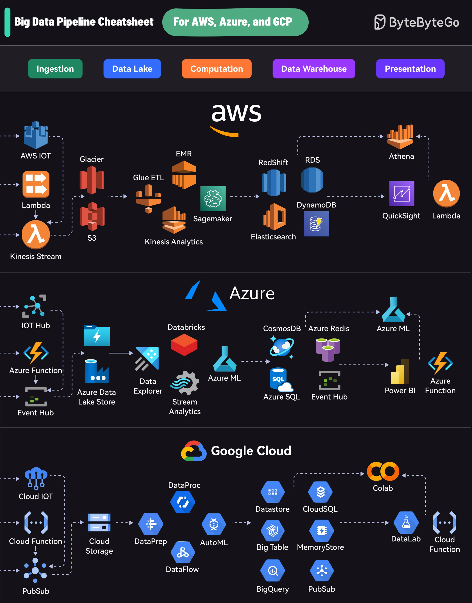

# Cloud Data Pipelines

## Description
Big Data Pipelines on the Cloud...

## Content
Big Data Pipelines on the Cloud

## Category Information

- Main Category: cloud_computing
- Sub Category: aws,_azure,_gcp
- Item Name: cloud_data_pipelines

## Source

- Original Tweet: [https://twitter.com/i/web/status/1872514002468929826](https://twitter.com/i/web/status/1872514002468929826)
- Date: 2025-02-20 15:36:34

## Media

### Media 1

**Description:** The infographic presents a comprehensive overview of the data processing pipeline for three prominent cloud providers: AWS, Azure, and Google Cloud Platform (GCP). The image is divided into four sections, each representing one of the cloud providers.

*   **AWS**
    *   Ingestion
        *   AWS IoT
        *   Kinesis Stream
    *   Data Lake
        *   S3
        *   Glacier
    *   Computation
        *   EMR
        *   Redshift
        *   DynamoDB
    *   Data Warehouse
        *   Athena
        *   QuickSight
*   **Azure**
    *   Ingestion
        *   IoT Hub
        *   Event Hubs
    *   Data Lake
        *   Azure Data Lake Store
        *   Blob Storage
    *   Computation
        *   Databricks
        *   Cosmos DB
        *   SQL Database
    *   Data Warehouse
        *   Power BI
        *   Azure Synapse Analytics
*   **Google Cloud Platform (GCP)**
    *   Ingestion
        *   Cloud Functions
        *   Pub/Sub
    *   Data Lake
        *   BigQuery
        *   Cloud Storage
    *   Computation
        *   Cloud AI Platform
        *   Cloud SQL
    *   Data Warehouse
        *   Looker
        *   Google Data Studio

In summary, the infographic provides a visual representation of the data processing pipelines for AWS, Azure, and GCP, highlighting the various components involved in each stage of the pipeline. This allows users to quickly understand the differences between the three cloud providers and make informed decisions about which platform best suits their needs.

*Last updated: 2025-02-20 15:36:34*