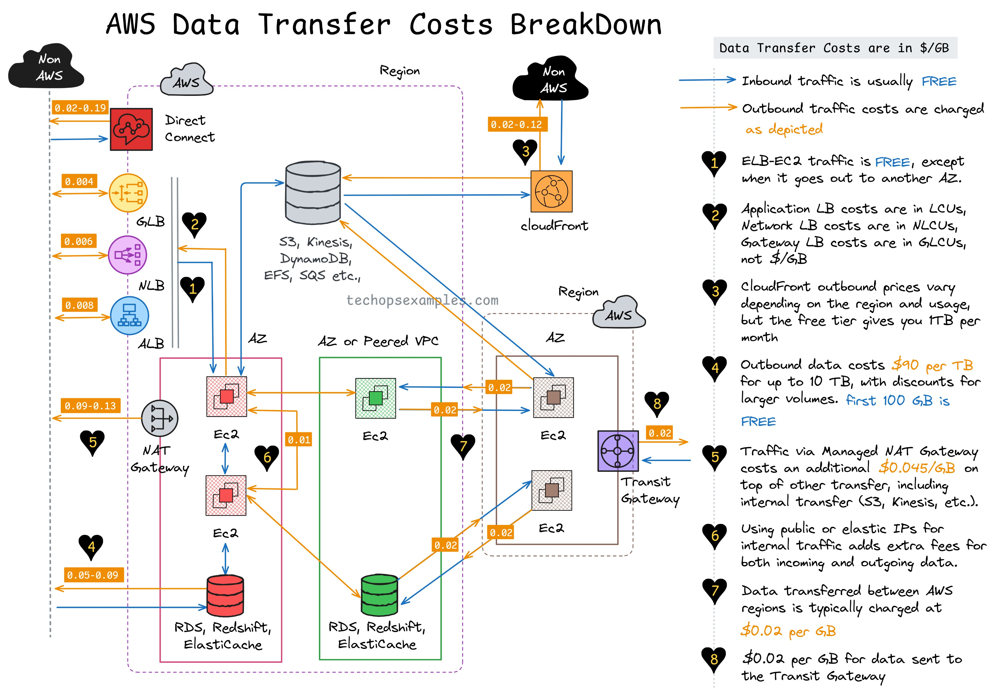

**Source:** [https://twitter.com/i/web/status/1915262328209367334](https://twitter.com/i/web/status/1915262328209367334)
**Original Post Date:** 2025-05-27 15:45:13

# AWS Data Transfer Cost Analysis: Understanding Inbound/Outbound Pricing and Service-Specific Rates

## Introduction
Understanding AWS data transfer costs is crucial for optimizing cloud infrastructure expenses. This guide provides a detailed analysis of how data movement within and outside AWS impacts your bill, focusing on key components including inbound traffic (free), outbound traffic (charged), and internal service-to-service transfers. Whether you're designing cost-effective architectures or troubleshooting unexpected charges, this knowledge is essential.

## Inbound Traffic: Free Data Transfer to AWS

AWS offers free inbound data transfer from non-AWS sources (internet or on-premises) into any AWS region. This cost-free model encourages customers to load data into the cloud without additional charges.

Common scenarios benefiting from free inbound traffic include: uploading files to S3, database migrations using RDS import/export tools, and initial deployments of EC2 instances.

- Non-AWS data center to AWS region
- Internet-based user uploads to S3 buckets
- Database imports via Data Pipeline

## Outbound Traffic: Charged Data Transfer from AWS

Data transferred from AWS to external destinations incurs costs. Rates vary significantly based on destination, service type, and volume.

Key factors affecting outbound costs include region-specific pricing, data transfer method (Direct Connect vs Internet), and monthly usage tiers.

1. Standard pricing: $0.02–$0.19 per GB for internet-based transfers
1. Direct Connect savings: Up to 35% reduction with dedicated connections
1. Volume discounts: $90 per TB for usage over 10TB/month

> **Note/Tip:** Consider using CloudFront CDN to reduce costs for content delivery to end-users.

## Internal Traffic: AWS Service-to-Service Costs

Data movement within the same region or AZ is generally free, but cross-region transfers incur charges. Understanding internal traffic patterns helps optimize both performance and costs.

Services like ALB/NLB provide free load balancing within an Availability Zone, while Transit Gateway offers cost-effective cross-VPC connectivity.

- Free: Traffic between EC2 instances in same AZ
- Charged: Cross-region data transfer via S3 or EFS
- Optimized: Transit Gateway for multi-VPC traffic

## Service-Specific Cost Breakdowns

Different AWS services have distinct data transfer pricing models. Understanding these differences is crucial when designing cost-effective architectures.

- EC2: $0.01–$0.13 per GB outbound
- RDS/Redshift/ElastiCache: $0.05–$0.09 per GB outbound
- S3/DynamoDB/Kinesis: $0.02–$0.12 per GB outbound

## Key Takeaways

- Inbound data transfer to AWS is always free, encouraging efficient cloud loading strategies.
- Outbound costs vary by service and volume; Direct Connect can reduce these costs significantly.
- Internal traffic within the same region/AZ is generally cost-free, optimizing performance without additional charges.

## Conclusion
Effective management of AWS data transfer costs requires careful consideration of service-specific pricing models, transfer methods, and regional architectures. By understanding these components, you can design cloud solutions that balance performance with budget constraints.

## External References

- [AWS Data Transfer Pricing](https://aws.amazon.com/pricing/data-transfer-pricing/)
- [AWS Simple Monthly Calculator](https://calculator.aws/simple)

## Media

**Image Description:** The image is a detailed diagram illustrating the **AWS Data Transfer Costs Breakdown**, focusing on the pricing and cost implications of data transfer within and outside of AWS infrastructure. The diagram is visually rich, using various colors, shapes, and annotations to represent different components and their associated costs. Below is a detailed breakdown of the image:

---

### **Main Subject: AWS Data Transfer Costs**
The diagram provides a comprehensive overview of how data transfer costs are incurred in AWS, depending on the direction and type of data movement. It categorizes data transfer into **inbound** (free) and **outbound** (charged) traffic, along with costs for internal traffic within AWS.

---

### **Key Components and Their Costs**
1. **Inbound Traffic (Free)**:
   - **Non-AWS to AWS**: Data transferred from outside AWS (e.g., from a non-AWS data center or the internet) into AWS is typically **free**.
   - This is represented by blue arrows pointing into AWS regions.

2. **Outbound Traffic (Charged)**:
   - **AWS to Non-AWS**: Data transferred from AWS to external systems (e.g., the internet or non-AWS data centers) incurs costs.
   - Costs are depicted with orange arrows pointing out of AWS regions.
   - Example costs: $0.02–$0.19 per GB, depending on the region and transfer method.

3. **Internal Traffic within AWS**:
   - Data transferred between AWS services or regions incurs specific costs.
   - Costs are represented with blue and orange arrows within AWS regions and between regions.

---

### **AWS Services and Their Costs**
The diagram highlights various AWS services and their associated data transfer costs:

#### **1. Direct Connect (Non-AWS to AWS)**
   - **Cost**: $0.02–$0.19 per GB.
   - **Description**: Direct Connect is used to establish a dedicated connection between on-premises infrastructure and AWS. Data transferred via Direct Connect is charged at these rates.

#### **2. Application Load Balancer (ALB)**
   - **Cost**: Free for internal traffic within the same AZ.
   - **Description**: ALB is used for load balancing HTTP/HTTPS traffic. Traffic between ALB and EC2 instances within the same AZ is free.

#### **3. Network Load Balancer (NLB)**
   - **Cost**: Free for internal traffic within the same AZ.
   - **Description**: NLB is used for load balancing TCP/UDP traffic. Similar to ALB, internal traffic within the same AZ is free.

#### **4. Gateway Load Balancer (GLB)**
   - **Cost**: Free for internal traffic within the same AZ.
   - **Description**: GLB is used for load balancing traffic to multiple VPCs. Internal traffic within the same AZ is free.

#### **5. EC2 Instances**
   - **Cost**: $0.01–$0.13 per GB for outbound traffic.
   - **Description**: EC2 instances are virtual servers. Outbound traffic from EC2 to non-AWS systems is charged.

#### **6. RDS, Redshift, and Elasticache**
   - **Cost**: $0.05–$0.09 per GB for outbound traffic.
   - **Description**: These are managed database and caching services. Outbound traffic from these services to non-AWS systems is charged.

#### **7. S3, Kinesis, DynamoDB, EFS, SQS, etc.**
   - **Cost**: $0.02–$0.12 per GB for outbound traffic.
   - **Description**: These are storage and messaging services. Outbound traffic from these services to non-AWS systems is charged.

#### **8. CloudFront**
   - **Cost**: Varies depending on the region and usage.
   - **Description**: CloudFront is a content delivery network (CDN). Outbound traffic from CloudFront to the internet is charged based on the region and usage.

#### **9. NAT Gateway**
   - **Cost**: $0.05–$0.09 per GB for outbound traffic.
   - **Description**: NAT Gateway is used to enable internet access for private subnets. Outbound traffic from private subnets to the internet is charged.

#### **10. Transit Gateway**
   - **Cost**: $0.02 per GB for inter-region traffic.
   - **Description**: Transit Gateway is used to connect multiple VPCs and regions. Data transferred between regions via Transit Gateway is charged.

---

### **Additional Notes**
- **Free Tier**: The first 1 GB of outbound data transfer per month is free.
- **Discounts**: Larger volumes of data transfer (up to 10 TB) are charged at $90 per TB, with discounts for volumes exceeding 10 TB.
- **Managed NAT Gateway**: Additional costs of $0.005 per GB are incurred for outbound traffic via a managed NAT Gateway.

---

### **Visual Elements**
- **Cloud Shapes**: Represent AWS regions.
- **Boxes and Circles**: Represent AWS services (e.g., EC2, RDS, S3, etc.).
- **Arrows**: Indicate the direction of data transfer (inbound or outbound).
- **Colors**:
  - **Blue**: Free or internal traffic within AWS.
  - **Orange**: Charged outbound traffic.
  - **Red/Pink**: Specialized services or components (e.g., Direct Connect, NAT Gateway).
- **Annotations**: Provide specific cost details for each data transfer path.

---

### **Overall Structure**
The diagram is organized into three main sections:
1. **Non-AWS to AWS**: Inbound traffic (free).
2. **Within AWS**: Internal traffic costs (varies by service).
3. **AWS to Non-AWS**: Outbound traffic (charged).

This structure helps users understand the cost implications of different data transfer scenarios in AWS.

---

### **Conclusion**
The image is a detailed and informative visualization of AWS data transfer costs, breaking down the pricing for inbound, outbound, and internal traffic across various AWS services. It is particularly useful for architects and engineers planning AWS deployments and budgeting for data transfer expenses.
