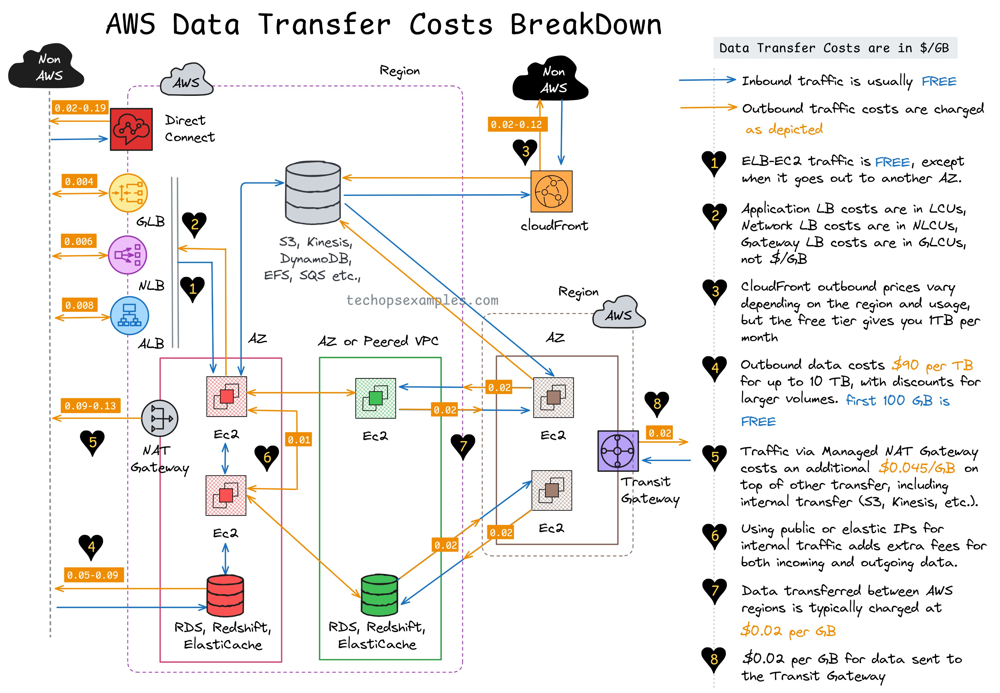

**Source:** [https://twitter.com/i/web/status/1931366011418357791](https://twitter.com/i/web/status/1931366011418357791)
**Original Post Date:** 2025-06-17 11:57:19

# AWS Data Transfer Costs: Comprehensive Breakdown of Pricing and Optimization Strategies

## Introduction
Understanding AWS data transfer costs is crucial for optimizing cloud infrastructure budgets. This knowledge base article provides a comprehensive analysis of data transfer pricing structures across various AWS environments. We'll examine key cost components including inbound traffic, inter-region transfers, load balancer operations, and managed service interactions, enabling you to make informed decisions about your cloud architecture.

## Inbound Traffic (Non-AWS to AWS)

Data transfer from non-AWS sources into AWS is free. This includes traffic from internet endpoints and on-premises connections via Direct Connect, making it cost-effective for data ingestion workflows.

> **Note/Tip:** Leverage inbound traffic costs by designing your architecture to push data processing closer to the source.

> **Note/Tip:** Consider using Direct Connect for high-volume on-premises connections to ensure consistent performance and minimal overhead

## Data Transfer Within Regions

Transfers within the same region or Availability Zone (AZ) are free, while inter-AZ transfers incur a $0.02/GB charge. This pricing structure encourages distributing resources across multiple AZs for high availability without additional costs.

- Free data transfer within same region/AZ
- $0.02/GB between different AZs in the same region

## Outbound Traffic Pricing Tiers

AWS implements a tiered pricing model for outbound traffic, with rates decreasing as volume increases:

1. First 10 TB: $0.09 per GB
1. Next 40 TB: $0.085 per GB
1. Next 100 TB: $0.07 per GB
1. Above 100 TB: $0.05 per GB

> **Note/Tip:** Monitor outbound traffic patterns to optimize usage within lower-cost tiers.

## Load Balancer and Managed Services

Most AWS services exhibit predictable data transfer costs. For instance, EC2 instances behind an Elastic Load Balancer incur no additional charges for internal traffic. However, Network Load Balancers charge based on NLCUs.

- Free ELB to EC2 traffic
- NAT Gateway adds $0.05/GB to other transfer costs

## CloudFront and Content Distribution

CloudFront offers a free tier of 1 TB per month for data transfer out, making it cost-effective for global content delivery. Pricing beyond this threshold varies by region.

> **Note/Tip:** Combine CloudFront with S3 for optimal content distribution pricing.

> **Note/Tip:** Use regional edge locations to minimize data transfer costs

## Key Takeaways

- Inbound traffic into AWS is free, making it cost-effective for data ingestion
- Inter-region transfers incur $0.02/GB charges - design architectures to minimize these transfers
- Outbound pricing decreases with volume - optimize usage patterns accordingly
- Managed services and internal service-to-service traffic are typically free within the same region

## Conclusion
Understanding AWS data transfer costs is essential for building cost-effective cloud solutions. By strategically placing resources, leveraging regional capabilities, and optimizing data flows, you can significantly reduce your overall AWS infrastructure costs.

## External References

- [AWS Data Transfer Pricing](https://aws.amazon.com/pricing/networking/)
- [CloudFront Pricing](https://aws.amazon.com/cloudfront/pricing/)

## Media

**Image Description:** ### Image Description: AWS Data Transfer Costs Breakdown

The image is a detailed diagram illustrating the costs associated with data transfer in the AWS (Amazon Web Services) ecosystem. It provides a comprehensive breakdown of various data transfer scenarios, pricing models, and cost implications. Below is a detailed description of the image, focusing on its main subject and technical details:

---

#### **Title and Overview**
- **Title**: "AWS Data Transfer Costs Breakdown"
- The diagram visually represents the flow of data between different AWS services, regions, and external systems, highlighting the associated costs for data transfer.

---

#### **Key Components and Flow**
1. **Non-AWS to AWS (Inbound Traffic)**:
   - **Inbound Traffic**: Data transfer from non-AWS systems into AWS is typically **FREE**.
   - **Direct Connect**: A dedicated connection between an on-premises network and AWS. Costs are minimal or free for inbound traffic.

2. **AWS Region and Availability Zones (AZs)**:
   - **Region**: A geographical area consisting of multiple, isolated, and independent Availability Zones.
   - **Availability Zones (AZs)**: Each region is divided into multiple AZs, which are isolated from each other to ensure high availability and fault tolerance.
   - **Data Transfer within the Same Region/AZ**: Data transfer within the same region or AZ is **FREE**.
   - **Data Transfer Between AZs**: Data transfer between different AZs within the same region is charged at **$0.02 per GB**.

3. **AWS Services and Data Transfer Costs**:
   - **Elastic Load Balancer (ELB) to EC2**: Traffic between ELB and EC2 instances is **FREE**.
   - **Application Load Balancer (ALB)**: Costs are in **LCUs (Load Balancer Capacity Units)**, not per GB.
   - **Network Load Balancer (NLB)**: Costs are in **NLCUs (Network Load Balancer Capacity Units)**.
   - **Gateway Load Balancer (GLB)**: Costs are in **GLCUs (Gateway Load Balancer Capacity Units)**.
   - **CloudFront**: Outbound traffic costs vary depending on the region, usage, and pricing tier. The free tier provides **1 TB per month** of free data transfer.

4. **Data Transfer Between Regions**:
   - Data transfer between different AWS regions is charged at **$0.02 per GB**.

5. **Elastic IP Addresses and NAT Gateway**:
   - **Elastic IP (EIP)**: Using public IP addresses for internal traffic adds extra costs for both incoming and outgoing data.
   - **NAT Gateway**: Traffic via a managed NAT Gateway incurs an additional cost of **$0.05 per GB** on top of other transfer costs.

6. **Managed Services and Data Transfer**:
   - **S3, Kinesis, DynamoDB, EFS, SQS, etc.**: Internal traffic between these services is **FREE**.
   - **RDS, Redshift, Elasticache**: Data transfer between these services and other AWS resources is **FREE**.

7. **Outbound Data Transfer**:
   - **Outbound Traffic**: Costs are charged based on the volume of data transferred.
   - **First 10 TB**: Costs are **$0.09 per GB**.
   - **Next 40 TB**: Costs are **$0.085 per GB**.
   - **Next 100 TB**: Costs are **$0.07 per GB**.
   - **Above 100 TB**: Costs are **$0.05 per GB**.

8. **Transit Gateway**:
   - Data transfer via a Transit Gateway is charged at **$0.02 per GB** for data sent to the Transit Gateway.

---

#### **Visual Elements**
- **Cloud Shapes**: Represent AWS regions and services.
- **Arrows**: Indicate the direction of data flow.
- **Cost Annotations**: Costs are marked in orange boxes along the data flow paths.
- **Icons**: Represent specific AWS services (e.g., EC2, RDS, CloudFront, etc.).
- **Labels**: Provide detailed explanations of each data transfer scenario and its associated costs.

---

#### **Key Notes on the Right Side**
- **Inbound Traffic**: Typically free.
- **Outbound Traffic**: Costs are charged based on the volume and region.
- **Free Tier**: Provides **1 TB per month** of free data transfer.
- **Cost Breakdown**: Costs are detailed for various scenarios, including:
  - Data transfer between AZs.
  - Data transfer between regions.
  - Outbound traffic pricing tiers.
  - Costs for using NAT Gateways and Elastic IPs.

---

#### **Summary**
The diagram provides a comprehensive view of AWS data transfer costs, breaking down scenarios based on the direction of data flow, the services involved, and the pricing models. It emphasizes that while inbound traffic is generally free, outbound traffic and data transfer between regions or services can incur significant costs depending on the volume and configuration. The use of icons, arrows, and cost annotations makes the information visually accessible and easy to understand.

---

This detailed breakdown should help anyone understand the complexities of AWS data transfer costs and plan their infrastructure accordingly.
