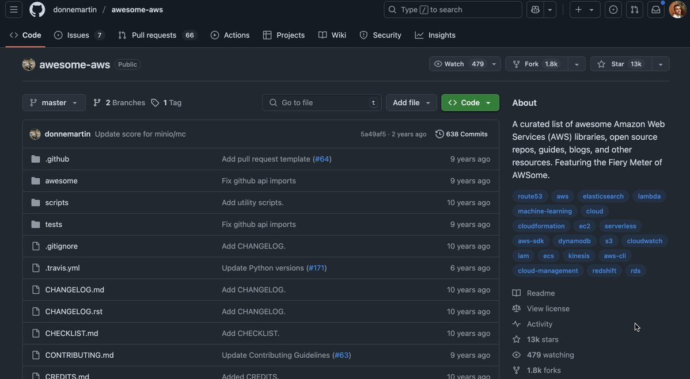

**Source:** [https://twitter.com/i/web/status/1935955814327763378](https://twitter.com/i/web/status/1935955814327763378)
**Original Post Date:** 2025-07-12 21:34:38

# Awesome AWS: A Curated List of Amazon Web Services Resources

## Introduction
The awesome-aws repository is a valuable resource for developers and AWS enthusiasts. It serves as a curated list of AWS-related tools, libraries, and guides, making it easier to find and use the best available resources. This repository has been maintained over a long period and has gained significant popularity with 13k stars and 1.8k forks on GitHub.

## Repository Overview

The awesome-aws repository is owned by donnmartin and is publicly available on GitHub. It has gained significant traction with 479 watchers, 13k stars, and 1.8k forks, indicating its popularity and utility within the AWS community.

The repository contains a variety of files and directories, including .github for workflow configurations, awesome for the main content, scripts for utilities, tests for testing purposes, and various markdown files for documentation and contribution guidelines.

- The repository has 638 commits in total.
- The most recent commit was by donnmartin with the message 'Update score for minio/mc'.

## Repository Structure and Content

The repository's file structure includes several directories and files, such as .github, awesome, scripts, tests, .gitignore, .travis.yml, CHANGELOG.md, CHECKLIST.md, CONTRIBUTING.md, and CREDITS.md.

These files and directories serve various purposes, from configuration and documentation to utility scripts and testing.

- .github: Contains templates and configuration files for GitHub workflows.
- awesome: Likely contains the main content or list of AWS resources.
- scripts: Contains utility scripts.
- tests: Likely contains test files or scripts.
- .gitignore: A file that specifies patterns of files to ignore during commits.
- .travis.yml: Configuration file for Travis CI, a continuous integration service.
- CHANGELOG.md: A file that tracks changes to the repository.
- CHECKLIST.md: A checklist file, possibly for contributors or maintainers.
- CONTRIBUTING.md: Guidelines for contributing to the repository.
- CREDITS.md: A file that lists contributors or acknowledgments.

## Repository Tags and Categories

The About section of the repository includes several tags related to AWS services and technologies, such as route53, aws, elasticsearch, lambda, machine-learning, cloud, cloudformation, ec2, serverless, aws_sdk, dynamodb, s3, cloudwatch, ecs, kinesis, aws-cli, redshift, rds.

These tags help users quickly identify the types of resources and technologies covered in the repository.

- route53
- aws
- elasticsearch
- lambda
- machine-learning
- cloud
- cloudformation
- ec2
- serverless
- aws_sdk
- dynamodb
- s3
- cloudwatch
- ecs
- kinesis
- aws-cli
- redshift
- rds

## Repository Design and Layout

The repository page uses GitHub's standard dark mode theme, with a clean and organized layout.

The file tree is collapsible, allowing users to expand or collapse directories for better navigation.

- The commit history is concise, showing only the most recent commit by default.
- Additional links include Readme, License, and Activity, providing further information about the repository.

## Technical Details

The repository uses Git for version control, as indicated by the presence of .gitignore and commit history.

The repository is on the master branch with 2 branches and 1 tag in total.

- .travis.yml: Configuration file for Travis CI, a continuous integration service.
- Markdown files (e.g., .md): Used for documentation (e.g., README.md, CHANGELOG.md, CONTRIBUTING.md).

## Overall Impression

The repository appears to be a well-maintained and popular resource for AWS-related content.

It serves as a curated list of tools, libraries, and guides, making it useful for developers and AWS enthusiasts.

> **Note/Tip:** The inclusion of a .travis.yml file suggests that the repository may have automated testing or build processes in place.

> **Note/Tip:** The presence of a CHANGELOG.md and CONTRIBUTING.md indicates a structured approach to maintaining and contributing to the repository.

## Key Takeaways

- The awesome-aws repository is a valuable resource for AWS-related tools, libraries, and guides.
- It has gained significant popularity with 13k stars and 1.8k forks on GitHub.
- The repository contains various files and directories serving different purposes, from configuration to documentation.
- Tags and categories help users quickly identify the types of resources and technologies covered in the repository.
- The repository uses Git for version control and has automated testing or build processes in place.

## Conclusion
In conclusion, the awesome-aws repository is a well-maintained and popular resource for AWS-related content. It serves as a curated list of tools, libraries, and guides, making it useful for developers and AWS enthusiasts.

## External References

- [GitHub Repository: awesome-aws](https://github.com/donnmartin/awesome-aws)

## Media

**Image Description:** The image shows a GitHub repository page for a project named **awesome-aws**. Below is a detailed description of the image, focusing on the main elements and technical details:

### **Main Subject: GitHub Repository Page**
The repository is hosted on GitHub and belongs to the user **donnmartin**. The repository is titled **awesome-aws**, which suggests it is a curated list of resources related to Amazon Web Services (AWS).

### **Header Section**
1. **Repository Name and Owner**:
   - The repository is named **awesome-aws**.
   - The owner is **donnmartin**.
   - The repository is marked as **Public**.

2. **Repository Statistics**:
   - **Watchers**: 479 users are watching the repository.
   - **Forks**: The repository has been forked 1.8k times.
   - **Stars**: The repository has 13k stars, indicating its popularity.

3. **Navigation Tabs**:
   - The top navigation bar includes standard GitHub repository tabs:
     - **Code**: Currently selected, showing the repository's files and directories.
     - **Issues**: 7 issues are listed.
     - **Pull requests**: 66 pull requests are listed.
     - **Actions**, **Projects**, **Wiki**, **Security**, and **Insights** are also available.

### **Main Content Area**
#### **File Tree and Commit History**
The main section displays the file structure and recent commits:

1. **File Structure**:
   - The repository contains several directories and files:
     - **.github**: Contains templates and configuration files for GitHub workflows.
     - **awesome**: Likely contains the main content or list of AWS resources.
     - **scripts**: Contains utility scripts.
     - **tests**: Likely contains test files or scripts.
     - **.gitignore**: A file that specifies patterns of files to ignore during commits.
     - **.travis.yml**: Configuration file for Travis CI, a continuous integration service.
     - **CHANGELOG.md**: A file that tracks changes to the repository.
     - **CHECKLIST.md**: A checklist file, possibly for contributors or maintainers.
     - **CONTRIBUTING.md**: Guidelines for contributing to the repository.
     - **CREDITS.md**: A file that lists contributors or acknowledgments.

2. **Recent Commits**:
   - The most recent commit is by **donnmartin**:
     - **Commit Message**: "Update score for minio/mc"
     - **Commit Hash**: `5a4af5`
     - **Date**: 2 years ago.
   - Other commits are older, ranging from 6 to 10 years ago, indicating the repository has been maintained over a long period.

3. **Commit Count**:
   - The repository has **638 commits** in total.

#### **About Section**
On the right side of the page, there is an **About** section that provides a brief description of the repository:
   - **Description**: 
     - "A curated list of awesome Amazon Web Services (AWS) libraries, open source repos, guides, blogs, and other resources."
     - Mentions the "Fiery Meter of AWSome," which is likely a playful metric or theme related to the repository.

### **Tags and Categories**
- The **About** section includes several tags related to AWS services and technologies:
  - **route53**, **aws**, **elasticsearch**, **lambda**
  - **machine-learning**, **cloud**
  - **cloudformation**, **ec2**, **serverless**
  - **aws_sdk**, **dynamodb**, **s3**, **cloudwatch**
  - **cloud-sdkformation**, **ecs**, **kinesis**, **aws-cli**
  - **cloud-cloud-management**, **redshift**, **rds**

### **Additional Links**
- **Readme**: A link to the repository's README file, which typically provides an overview and instructions.
- **License**: A link to view the repository's license.
- **Activity**: A link to view the repository's activity feed.

### **Design and Layout**
- The page uses GitHub's standard dark mode theme, with a clean and organized layout.
- The file tree is collapsible, allowing users to expand or collapse directories.
- The commit history is concise, showing only the most recent commit by default.

### **Technical Details**
1. **Branch Information**:
   - The repository is on the **master** branch.
   - There are **2 branches** and **1 tag** in total.

2. **File Types**:
   - Markdown files (e.g., `.md`): Used for documentation (e.g., `README.md`, `CHANGELOG.md`, `CONTRIBUTING.md`).
   - YAML file (`.travis.yml`): Used for configuring continuous integration with Travis CI.
   - Gitignore file (`.gitignore`): Used to exclude certain files or directories from version control.

3. **Version Control**:
   - The repository uses Git for version control, as indicated by the presence of `.gitignore` and commit history.

### **Overall Impression**
The repository appears to be a well-maintained and popular resource for AWS-related content. It serves as a curated list of tools, libraries, and guides, making it useful for developers and AWS enthusiasts. The inclusion of a `.travis.yml` file suggests that the repository may have automated testing or build processes in place. The presence of a `CHANGELOG.md` and `CONTRIBUTING.md` indicates a structured approach to maintaining and contributing to the repository. 

This repository is a valuable resource for anyone looking to explore or contribute to AWS-related projects.
