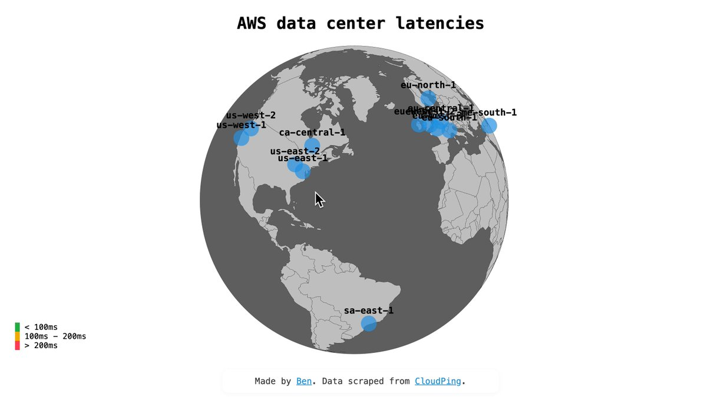

**Source:** [https://twitter.com/i/web/status/1947641754640941353](https://twitter.com/i/web/status/1947641754640941353)
**Original Post Date:** 2025-07-25 15:06:05

# AWS Latency Optimization: Best Practices for Cross-Region Performance

## Introduction
In cloud computing, latency can significantly affect application performance. This article explores latency considerations between AWS regions and provides actionable strategies to minimize latency through optimal resource placement.

## Understanding Latency Across Regions

Latency between AWS regions varies; for instance, us-east-1 to us-east-2 is about 18ms, while us-east-1 to us-west-1 is around 60ms. These latencies can impact real-time applications.

Colocating services within the same region reduces latency and improves performance.

## Best Practices for Latency Optimization

Optimizing latency involves strategic placement of resources to minimize network hops and reduce delay.

- Colocate your database in the same region as your application.
- For critical applications, consider placing resources within the same Availability Zone (AZ).
- Use internal AWS IPs for communication between services to reduce latency.

> **Note/Tip:** Avoid cross-region database calls to prevent increased latency and potential costs.

## Key Takeaways

- Colocate your database in the same region or AZ as other services to minimize latency.
- Use internal AWS IPs for inter-service communication to reduce overhead.
- Avoid cross-region data transfers, especially for databases, to maintain performance.

## Conclusion
Optimizing latency is crucial for application performance. By strategically placing resources within the same region or AZ and using internal IPs, you can significantly reduce latency and enhance your application's efficiency.

## Media

**Image Description:** Media file
