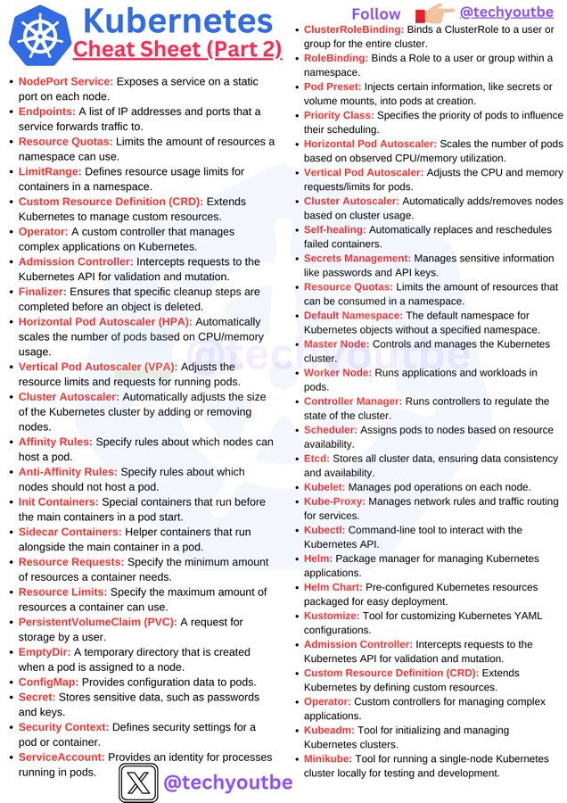

# tech_insight_20250114_18787721

**Tweet URL:** [https://x.com/techyoutbe/status/1878772132110287085](https://x.com/techyoutbe/status/1878772132110287085)

**Tweet Text:** Kubernetes - Cheat Sheet (Part 2)

**Image 1 Description:** The infographic, titled "Kubernetes Cheat Sheet (Part 2)," presents a comprehensive list of Kubernetes concepts, categorized into three columns for easy reference.

**Column 1: Node Management**

* NodePort Service
* Endpoint
* Resource Quotas

These terms relate to managing and configuring nodes within a Kubernetes cluster.

**Column 2: Cluster Configuration**

* Admission Controller
* Finalizer
* Horizontal Pod Autoscaler (HPA)
* Vertical Pod Autoscaler (VPA)
* Self-healing
* Secrets Management

This column covers various aspects of cluster configuration, including admission control, scaling, and self-healing mechanisms.

**Column 3: Kubernetes Core Concepts**

* NodePort Service
* Endpoint
* Resource Quotas
* Horizontal Pod Autoscaler (HPA)
* Vertical Pod Autoscaler (VPA)
* Self-healing
* Secrets Management

This column provides an overview of fundamental Kubernetes concepts, including services, endpoints, quotas, and autoscalers.

The infographic features a blue logo with a white octagon in the top-left corner, accompanied by the title "Kubernetes Cheat Sheet (Part 2)" in large blue text. The bottom-right corner displays the username "@techyoutbe" for reference. Overall, this cheat sheet serves as a valuable resource for individuals seeking to understand and work with Kubernetes.

