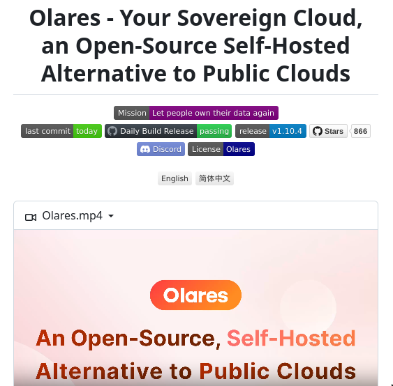

# self_hosted_cloud

**Tweet URL:** [https://x.com/tom_doerr/status/1866924973610180845](https://x.com/tom_doerr/status/1866924973610180845)

**Tweet Text:** Olares is an open-source, self-hosted cloud alternative to public clouds like AWS,  allowing users to manage their data, applications, and computing resources locally

**Image 1 Description:** The image shows a screenshot of a webpage for Olares, an open-source self-hosted alternative to public clouds.

* **Title**: 
	+ The title is "Olares - Your Sovereign Cloud, an Open-Source Self-Hosted Alternative to Public Clouds"
	+ It is written in black text at the top of the page
* **Navigation Bar**:
	+ A navigation bar with various links and icons is located below the title
	+ Links include "Mission", "Let people own their data again", "last commit today", "Daily Build Release", "passing release v1.10.4", "Stars 866"
	+ Icons include a green circle with a white checkmark, a blue square with a white arrow pointing up, and a purple rectangle with a white star
* **Main Content**:
	+ Below the navigation bar is a large block of text that reads "An Open-Source, Self-Hosted Alternative to Public Clouds"
	+ The text is written in orange and pink colors
* **Call-to-Action Button**:
	+ A call-to-action button with the word "Olares" in white text on an orange background is located below the main content
	+ The button has a rounded rectangle shape

Overall, the image suggests that Olares is a platform that allows users to host their own cloud infrastructure without relying on public clouds. The navigation bar provides links to various pages and resources related to Olares, while the main content highlights the benefits of using Olares as an alternative to public clouds.

