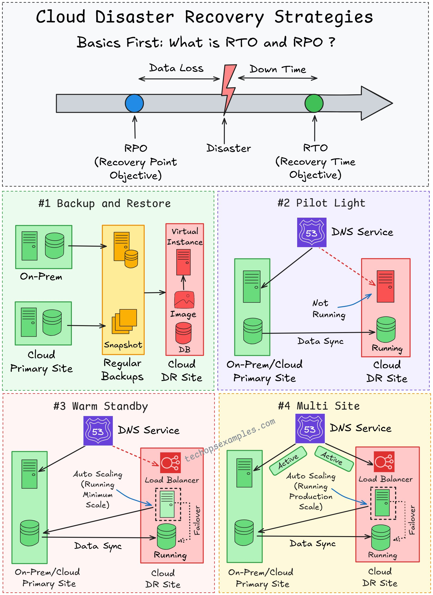

**Source:** [https://twitter.com/i/web/status/1916713440183197698](https://twitter.com/i/web/status/1916713440183197698)
**Original Post Date:** 2025-05-27 23:24:08

# Cloud Disaster Recovery Strategies Simplified: RTO/RPO & Multi-Strategy Framework

## Introduction
Disaster recovery in cloud environments requires a nuanced understanding of both technical components and business requirements. This article explores the essential concepts of Recovery Time Objective (RTO) and Recovery Point Objective (RPO), followed by an analysis of four proven strategies for building resilient systems. Each approach balances cost, complexity, and recovery capabilities to meet specific organizational needs.

## Understanding RTO and RPO Fundamentals

Recovery Time Objective (RTO) measures the maximum acceptable downtime between a disaster event and system restoration. This metric directly impacts business continuity costs, customer satisfaction, and operational integrity.

Recovery Point Objective (RPO) quantifies the maximum tolerable data loss measured in time intervals. Organizations must carefully evaluate their RPO requirements based on data criticality and compliance mandates.

1. RTO < 1 hour: Mission-critical systems (e.g., financial trading platforms)
1. RPO < 5 minutes: Real-time transaction processing systems
1. RTO > 4 hours: Non-essential business applications

> **Note/Tip:** Lower RTO/RPO values increase system complexity and operational costs.

> **Note/Tip:** Balance technical capabilities with business requirements when setting objectives.

## Cloud Disaster Recovery Strategy Framework

The four strategies form a spectrum of recovery approaches, each optimized for different business needs:

1. Backup & Restore: Cost-effective but highest downtime risk.

2. Pilot Light: Balanced approach with minimal operational overhead.

3. Warm Standby: High availability at moderate cost.

4. Multi-Site: Enterprise-grade resilience with full redundancy.

- Backup & Restore components include on-premises storage, cloud backup services, and automated restore procedures.
- Pilot Light requires continuous data synchronization between primary and DR sites.
- Warm Standby maintains fully configured environments ready for immediate activation.
- Multi-Site leverages load balancing across multiple geographical locations.

> **Note/Tip:** Implement automated failover mechanisms to minimize human intervention time.

> **Note/Tip:** Regular testing is crucial for ensuring strategy effectiveness.

> **Note/Tip:** Consider cloud provider SLAs when designing multi-site architectures.

## Key Takeaways

- RTO and RPO are fundamental metrics that define disaster recovery requirements and shape architectural decisions.
- Each strategy represents a trade-off between cost, complexity, and recovery capabilities.
- Continuous data synchronization is critical for minimizing both downtime and data loss.
- Load balancing and DNS-based failover mechanisms are essential components of modern DR strategies.

## Conclusion
Selecting the appropriate disaster recovery strategy requires careful evaluation of business requirements, technical constraints, and operational costs. Regular testing and continuous refinement ensure your chosen approach remains effective as system needs evolve.

## External References

- [AWS Disaster Recovery Guide](https://aws.amazon.com/disaster-recovery/)
- [GCP Disaster Recovery Documentation](https://cloud.google.com/disaster-recovery)

## Media

**Image Description:** The image is a detailed diagram illustrating **Cloud Disaster Recovery Strategies**. It is divided into four main sections, each describing a different approach to disaster recovery in cloud environments. The diagram also introduces the concepts of **RTO (Recovery Time Objective)** and **RPO (Recovery Point Objective)**, which are critical metrics in disaster recovery planning. Below is a detailed breakdown of the image:

---

### **Header: Cloud Disaster Recovery Strategies**
The title at the top of the image emphasizes the focus on **Cloud Disaster Recovery Strategies**. It introduces the importance of understanding **RTO** and **RPO** as foundational concepts.

---

### **Section 1: RTO and RPO Explanation**
- **RPO (Recovery Point Objective)**:
  - Defined as the **maximum tolerable amount of data loss** measured in time.
  - Shown as the time interval between the last backup and the disaster event.
  - Represented by the blue circle labeled "RPO" in the timeline.
- **RTO (Recovery Time Objective)**:
  - Defined as the **maximum tolerable downtime** or the time it takes to restore operations to a functional state after a disaster.
  - Shown as the time interval between the disaster event and the system being restored to operational status.
  - Represented by the green circle labeled "RTO" in the timeline.
- **Disaster Event**:
  - Illustrated by a lightning bolt in the timeline, indicating the point of failure or disruption.
- **Data Loss** and **Downtime**:
  - The diagram visually represents the relationship between data loss and downtime, emphasizing the importance of minimizing both.

---

### **Section 2: Four Disaster Recovery Strategies**
The image is divided into four quadrants, each detailing a different disaster recovery strategy.

#### **#1 Backup and Restore**
- **Description**:
  - This strategy involves creating regular backups of data and restoring them in case of a disaster.
- **Components**:
  - **On-Prem**: The primary site where the application and data are hosted.
  - **Cloud**: The secondary site where backups are stored.
  - **Regular Backups**: Periodic backups are taken from the primary site and stored in the cloud.
  - **Snapshot**: Incremental backups or snapshots are created to reduce the amount of data transferred.
  - **DB (Database)**: The database is backed up and restored as part of the recovery process.
  - **Virtual Instance**: The application or service is restored on a virtual instance in the cloud.
- **Process**:
  - During a disaster, the system is restored from the most recent backup, and the virtual instance is spun up in the cloud.

#### **#2 Pilot Light**
- **Description**:
  - This strategy involves keeping a minimal subset of the application running in the disaster recovery (DR) site at all times.
- **Components**:
  - **On-Prem/Cloud Primary Site**: The primary production environment.
  - **On-Prem/Cloud DR Site**: The disaster recovery site.
  - **DNS Service**: Used to redirect traffic to the DR site during a disaster.
  - **Running Instance**: A minimal version of the application is kept running in the DR site.
  - **Data Sync**: Data is continuously synchronized between the primary and DR sites.
- **Process**:
  - During a disaster, the DNS service redirects traffic to the DR site, which is already running a minimal version of the application. This minimizes downtime.

#### **#3 Warm Standby**
- **Description**:
  - This strategy involves keeping a fully configured but inactive environment in the DR site, ready to be activated in case of a disaster.
- **Components**:
  - **On-Prem/Cloud Primary Site**: The primary production environment.
  - **On-Prem/Cloud DR Site**: The disaster recovery site.
  - **DNS Service**: Used to redirect traffic to the DR site during a disaster.
  - **Load Balancer**: Manages traffic distribution between the primary and DR sites.
  - **Auto Scaling**: Ensures the DR site can scale up resources as needed.
  - **Data Sync**: Data is continuously synchronized between the primary and DR sites.
- **Process**:
  - During a disaster, the DNS service redirects traffic to the DR site, which is already configured and can be scaled up to handle the load.

#### **#4 Multi-Site**
- **Description**:
  - This strategy involves distributing the application and data across multiple sites to ensure high availability and disaster recovery.
- **Components**:
  - **On-Prem/Cloud Primary Site**: The primary production environment.
  - **On-Prem/Cloud DR Site**: The disaster recovery site.
  - **DNS Service**: Used to manage traffic distribution.
  - **Load Balancer**: Distributes traffic across multiple sites.
  - **Auto Scaling**: Ensures each site can scale resources as needed.
  - **Data Sync**: Data is continuously synchronized across all sites.
- **Process**:
  - Traffic is distributed across multiple sites using a load balancer. In case of a disaster at one site, traffic is redirected to the remaining sites, ensuring continuous operation.

---

### **Visual Elements**
- **Color Coding**:
  - Green: Represents the primary site or operational state.
  - Red: Represents the disaster recovery site or failover state.
  - Blue: Represents the DNS service or network redirection.
  - Orange: Represents data backups or snapshots.
- **Icons**:
  - Servers, databases, load balancers, DNS services, and other infrastructure components are represented by icons for clarity.
- **Arrows**:
  - Arrows indicate the flow of data, traffic, and processes between different components.

---

### **Key Takeaways**
1. **RPO and RTO** are critical metrics for measuring the effectiveness of disaster recovery strategies.
2. The four strategies—Backup and Restore, Pilot Light, Warm Standby, and Multi-Site—each have different trade-offs in terms of cost, complexity, and recovery time.
3. Continuous data synchronization and load balancing are key components in minimizing downtime and data loss.

This diagram provides a comprehensive overview of disaster recovery strategies in cloud environments, highlighting the importance of planning and implementing robust recovery mechanisms.
