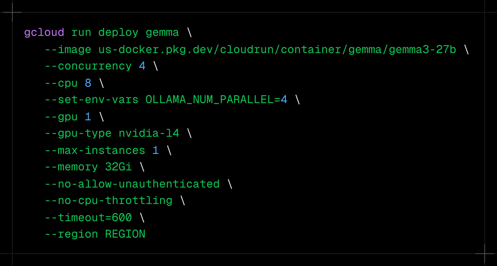

**Source:** [https://twitter.com/i/web/status/1929638760758874428](https://twitter.com/i/web/status/1929638760758874428)
**Original Post Date:** 2025-06-17 11:14:16

# Google Cloud Run Serverless Deployment: Advanced GPU-Enabled Configuration

## Introduction
This article explores advanced deployment techniques for serverless applications on Google Cloud Run, focusing on a real-world example of deploying a GPU-accelerated service. We'll examine the comprehensive command structure, resource allocation strategies, and critical configuration parameters that enable high-performance computing workloads in a managed environment.

## Command Structure and Resource Allocation

The deployment command utilizes Google Cloud's gcloud CLI to configure a service named 'gemma' with extensive resource specifications. The command structure follows standard gcloud conventions, utilizing line continuation for improved readability.

Resource allocation demonstrates sophisticated configuration: 8 vCPUs, 32Gi of memory, and one NVIDIA L4 GPU, indicating this is designed for computationally intensive workloads.

```bash
gcloud run deploy gemma \
--image us-docker.pkg.dev/cloudrun/container/gemma/gemma3-27b \
--concurrency 4 \
--cpu 8 \
--memory 32Gi
```

- CPU allocation: 8 vCPUs
- Memory: 32 GiB
- GPU Type: NVIDIA L4
- Concurrent requests per instance: 4

> **Note/Tip:** Resource specifications should align with workload requirements to avoid cost inefficiencies

## Security and Access Configuration

The deployment implements strict security measures by disabling unauthenticated access (--no-allow-unauthenticated). This ensures all requests must authenticate, critical for production environments.

Environment variables are set using --set-env-vars to configure runtime behavior (OLLAMA_NUM_PARALLEL=4) without exposing sensitive data in the command itself.

```bash
--no-allow-unauthenticated \
--set-env-vars OLLAMA_NUM_PARALLEL=4
```

## Performance Optimization Settings

The configuration disables CPU throttling (--no-cpu-throttling) to ensure consistent performance under load. Combined with a 10-minute timeout (--timeout=600), this setup handles long-running requests effectively.

1. Maximum instances: 1 (for controlled scaling)
1. Request concurrency: 4 per instance
1. Timeout duration: 600 seconds

## Key Takeaways

- Google Cloud Run enables GPU-accelerated serverless applications through specific CLI configuration parameters.
- Resource allocation and security settings are crucial for performance optimization in production deployments.
- Environment variables and deployment flags provide fine-grained control over service behavior.

## Conclusion
This advanced deployment example demonstrates the flexibility of Google Cloud Run in handling high-performance workloads. The combination of GPU resources, optimized resource allocation, and security measures creates a robust foundation for running sophisticated applications in a managed environment.

## External References

- [Google Cloud Run Documentation](https://cloud.google.com/run/docs)
- [gcloud CLI Reference](https://cloud.google.com/sdk/gcloud/reference)


## Media

**Image Description:** The image shows a command-line interface with a long, multi-line command written in green text on a black background. The command appears to be related to deploying a containerized application using Google Cloud Run. Below is a detailed breakdown of the command and its components:

### **Main Subject**
The main subject of the image is a command-line deployment script for Google Cloud Run. The command uses the `gcloud` CLI tool to deploy a service named `gemma` with specific configurations.

### **Command Breakdown**
The command is structured as follows:
```bash
gcloud run deploy gemma \
  --image us-docker.pkg.dev/cloudrun/container/gemma/gemma3-27b \
  --concurrency 4 \
  --cpu 8 \
  --set-env-vars OLLAMA_NUM_PARALLEL=4 \
  --gpu 1 \
  --gpu-type nvidia-l4 \
  --max-instances 1 \
  --memory 32Gi \
  --no-allow-unauthenticated \
  --no-cpu-throttling \
  --timeout=600 \
  --region REGION
```

#### **1. Command Structure**
- **`gcloud run deploy gemma`**: 
  - The primary command is `gcloud run deploy`, which deploys a service to Google Cloud Run.
  - The service name being deployed is `gemma`.

#### **2. Options and Parameters**
- **`--image`**:
  - Specifies the Docker image to be used for the deployment.
  - The image is hosted on Google Container Registry (GCR) at `us-docker.pkg.dev/cloudrun/container/gemma/gemma3-27b`.

- **`--concurrency`**:
  - Sets the maximum number of concurrent requests that a single instance of the service can handle.
  - Value: `4`.

- **`--cpu`**:
  - Specifies the number of virtual CPUs allocated to the service.
  - Value: `8`.

- **`--set-env-vars`**:
  - Sets environment variables for the deployed service.
  - The variable `OLLAMA_NUM_PARALLEL` is set to `4`.

- **`--gpu`**:
  - Indicates that the service will use a GPU.
  - Value: `1` (one GPU).

- **`--gpu-type`**:
  - Specifies the type of GPU to be used.
  - Value: `nvidia-l4` (NVIDIA L4 GPU).

- **`--max-instances`**:
  - Limits the maximum number of instances that can be created for the service.
  - Value: `1`.

- **`--memory`**:
  - Specifies the amount of memory allocated to the service.
  - Value: `32Gi` (32 GiB).

- **`--no-allow-unauthenticated`**:
  - Disables unauthenticated access to the service, requiring authentication for all requests.

- **`--no-cpu-throttling`**:
  - Disables CPU throttling, allowing the service to use the full allocated CPU resources without throttling.

- **`--timeout`**:
  - Sets the maximum request timeout in seconds.
  - Value: `600` seconds (10 minutes).

- **`--region`**:
  - Specifies the region where the service will be deployed.
  - Placeholder: `REGION` (user needs to specify the actual region, e.g., `us-central1`).

### **Formatting**
- The command is split across multiple lines using the backslash (`\`) to improve readability.
- Each option is prefixed with `--` and follows the standard format for `gcloud` CLI commands.

### **Technical Details**
1. **Cloud Run Configuration**:
   - The command configures a Cloud Run service with specific resource allocations (CPU, memory, GPU) and concurrency settings.
   - It also sets environment variables and disables unauthenticated access for security.

2. **GPU Support**:
   - The service is configured to use an NVIDIA L4 GPU, indicating that the application may require GPU acceleration (e.g., for machine learning or high-performance computing tasks).

3. **Memory and CPU**:
   - The service is allocated `32 GiB` of memory and `8 vCPUs`, suggesting that the application is resource-intensive.

4. **Concurrency and Throttling**:
   - The concurrency is set to `4`, meaning each instance can handle up to 4 concurrent requests.
   - CPU throttling is disabled, allowing the service to utilize the full allocated CPU resources.

5. **Timeout and Authentication**:
   - The timeout is set to `600 seconds` to handle long-running requests.
   - Unauthenticated access is disabled for security.

### **Overall Purpose**
The command is designed to deploy a scalable, GPU-accelerated service named `gemma` on Google Cloud Run. The service is configured with specific resource limits (CPU, memory, GPU), concurrency settings, and security measures (disabling unauthenticated access). The environment variable `OLLAMA_NUM_PARALLEL=4` suggests that the application may involve parallel processing or distributed computing.

### **Notes**
- The placeholder `REGION` indicates that the user needs to specify the actual region (e.g., `us-central1`, `europe-west1`) where the service will be deployed.
- The use of `gcloud` CLI suggests that this command is intended to be run in a terminal or command-line environment. 

This detailed breakdown provides a comprehensive understanding of the command and its technical implications.
