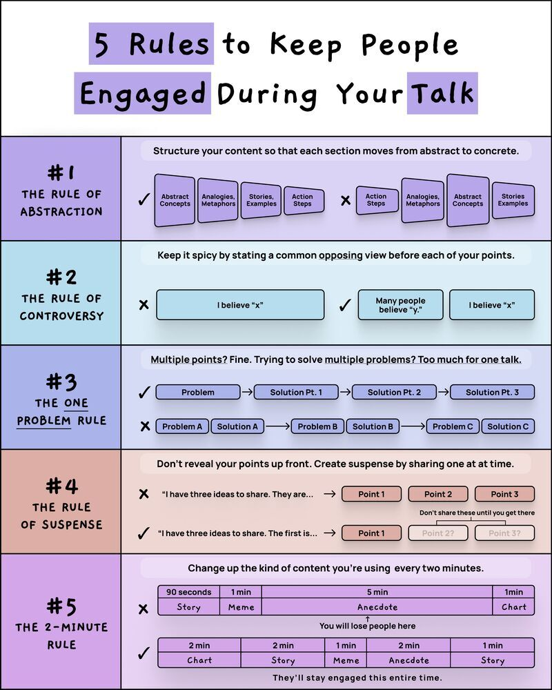

Effective communication is crucial in presentation techniques, and engaging audiences is a key aspect of successful talks. The "5 Rules to Keep People Engaged During Your Talk" provide actionable advice for creating captivating content that maintains audience interest. This entry delves into the details of these rules, offering insights into how to apply them for enhanced engagement.

#### Technical Content
The five rules for engaging talks are designed to help presenters structure their content in a way that captivates and retains audience attention. Each rule is outlined below, along with descriptions and visuals to illustrate the concepts:

1. **The Rule of Abstraction**
   - **Description**: This rule emphasizes the importance of using abstract concepts, such as analogies, metaphors, stories, examples, and action steps, to keep people engaged.
   - **Visuals**: The concept is represented by a purple box with accompanying diagrams that show how to structure content effectively.
   - **Example**: Starting a presentation with a thought-provoking question or a relatable story can abstractly introduce the topic, making it more engaging.

2. **The Rule of Controversy**
   - **Description**: Introducing controversy by presenting opposing views can spark interest and maintain audience engagement.
   - **Visuals**: A blue box outlines this concept, with diagrams illustrating how to present contrasting ideas before each point.
   - **Example**: Presenting a common myth related to the topic and then debunking it with facts can create an engaging controversial element.

3. **The One Problem Rule**
   - **Description**: Focusing on one problem at a time helps maintain audience attention by avoiding confusion and keeping the content concise.
   - **Visuals**: A light blue box explains this rule, accompanied by diagrams showing how to break down multiple problems into manageable parts.
   - **Example**: Instead of overwhelming the audience with several issues, focusing on one key challenge and offering solutions can keep them engaged.

4. **The Rule of Suspense**
   - **Description**: Creating suspense by sharing ideas at strategic intervals keeps the audience interested and looking forward to what comes next.
   - **Visuals**: A pink box outlines this concept, featuring diagrams that illustrate how to create suspense by leaving space for more information after sharing a few key points.
   - **Example**: Ending a segment of the talk with an intriguing statement or question can create suspense, making the audience eager to hear the next part.

5. **The Two-Minute Rule**
   - **Description**: This rule suggests keeping content concise and changing the type of content used every two minutes to maintain engagement.
   - **Visuals**: A purple box explains this concept, with diagrams showing how to alternate between charts, stories, memes, anecdotes, and other formats.
   - **Example**: Switching from a detailed explanation to a visual aid like a chart or a short video can help keep the audience engaged by providing a change of pace.

#### Key Takeaways and Best Practices
- **Engage with Abstract Concepts**: Use analogies, metaphors, and stories to make your content more relatable and engaging.
- **Encourage Controversy**: Present opposing views to spark interest but ensure to resolve them effectively.
- **Focus on One Problem**: Address one challenge at a time for clearer communication and audience retention.
- **Create Suspense**: Strategically share information to keep the audience curious about what comes next.
- **Vary Content**: Change the type of content every two minutes to maintain audience engagement.

#### References
The infographic titled "5 Rules to Keep People Engaged During Your Talk" serves as a primary reference, offering a visually appealing guide to effective presentation techniques. For further learning, individuals can explore resources on communication skills, presentation techniques, and audience engagement strategies. Tools and technologies such as presentation software (e.g., PowerPoint, Keynote) and visual content creation tools (e.g., Canva, Adobe Creative Cloud) can be utilized to apply these rules in practice.
## Source

- Original Tweet: [https://twitter.com/i/web/status/1879251639707783184](https://twitter.com/i/web/status/1879251639707783184)
- Date: 2025-02-24 12:32:55

## Media

### Media 1

**Description:** The infographic presents a visually appealing guide titled "5 Rules to Keep People Engaged During Your Talk," designed to captivate audiences through engaging content. The title is prominently displayed at the top of the image, followed by five rules that provide actionable advice for effective communication.

**Rule 1: The Rule of Abstraction**

* **Description:** This rule emphasizes the importance of abstract concepts in keeping people engaged.
* **Visuals:** A purple box with black text explains the concept, accompanied by a diagram illustrating how to structure content using abstract concepts, analogies, metaphors, stories, examples, action steps, and other relevant elements.

**Rule 2: The Rule of Controversy**

* **Description:** This rule highlights the value of controversy in sparking interest and maintaining audience engagement.
* **Visuals:** A blue box with black text outlines the concept, featuring a diagram that illustrates how to keep things spicy by stating opposing views before each point.

**Rule 3: The One Problem Rule**

* **Description:** This rule focuses on presenting one problem at a time to maintain audience attention and interest.
* **Visuals:** A light blue box with black text explains the concept, accompanied by a diagram that shows how to solve multiple problems by breaking them down into smaller parts.

**Rule 4: The Rule of Suspense**

* **Description:** This rule emphasizes the importance of creating suspense by sharing ideas at strategic intervals.
* **Visuals:** A pink box with black text outlines the concept, featuring a diagram that illustrates how to create suspense by sharing three ideas and leaving space for more.

**Rule 5: The Two-Minute Rule**

* **Description:** This rule provides guidance on keeping content concise and engaging within a two-minute time frame.
* **Visuals:** A purple box with black text explains the concept, accompanied by a diagram that illustrates how to change up the kind of content used every two minutes using charts, stories, memes, anecdotes, and other formats.

Overall, this infographic offers practical advice for creating engaging content that captures and maintains audience attention. By following these five rules, individuals can create presentations that are both informative and entertaining.

*Last updated: 2025-02-24 12:32:55*