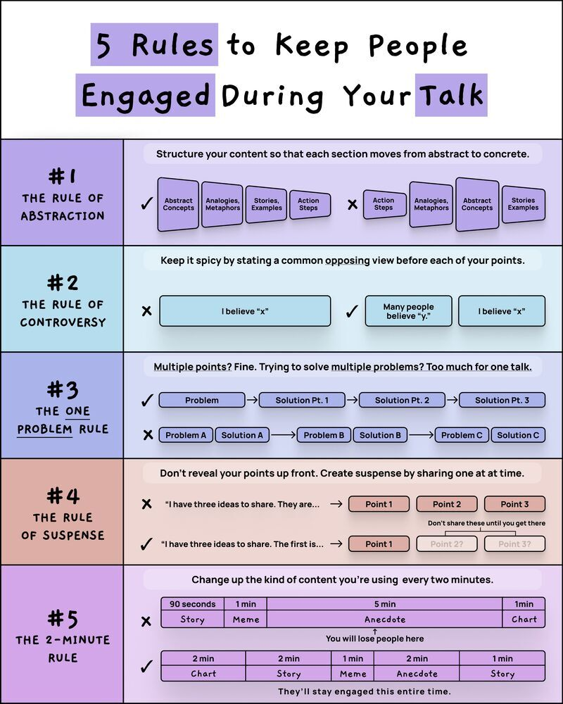

**Source:** [https://twitter.com/i/web/status/1879251639707783184](https://twitter.com/i/web/status/1879251639707783184)
**Original Post Date:** 2025-05-28 07:13:02

# Mastering Audience Engagement in Technical Presentations

## Introduction
Delivering effective technical presentations requires more than just subject matter expertise. This guide presents five empirically validated rules to enhance audience engagement during your talks. By applying these techniques, you can transform complex technical concepts into memorable narratives that resonate with your audience.

This knowledge base item focuses on actionable strategies derived from presentation psychology and professional speaking best practices.

## The Rule of Abstraction

Structured content progression is crucial for maintaining engagement. Begin with abstract concepts, metaphors, or stories before introducing concrete technical details.

- Start with broad concepts and gradually narrow down to specific implementations
- Use analogies to bridge familiar territory with complex technical ideas

## The Rule of Controversy

Creating cognitive dissonance through opposing viewpoints enhances audience engagement. Present common misconceptions before introducing your perspective.

- Acknowledge and address common objections upfront
- Use contrast to strengthen your technical arguments

## The One Problem Rule

Focus on a single problem domain per presentation. This depth-first approach ensures comprehensive coverage without overwhelming the audience.

- Select one core technical challenge to address
- Provide multiple solutions or approaches to the selected problem

## The Rule of Suspense

Maintain audience interest by revealing key points gradually. This narrative technique prevents information overload and builds anticipation.

- Present the total number of concepts upfront without details
- Reveal each point sequentially with increasing detail

## The 2-Minute Rule

Vary your presentation format every two minutes to maintain audience attention. Alternate between different content types such as demonstrations, stories, and technical deep-dives.

- Rotate through different content formats (demos, code reviews, case studies)
- Maintain engagement by preventing monotonous delivery patterns

## Key Takeaways

- Structure presentations from abstract to concrete concepts for optimal understanding
- Use controversy and opposing viewpoints to strengthen technical arguments
- Focus on solving one problem thoroughly rather than addressing multiple topics superficially
- Build narrative tension by revealing key points gradually
- Vary content format every two minutes to maintain audience attention

## Conclusion
By implementing these five rules in your technical presentations, you can significantly improve audience engagement and retention. These strategies work together to create a compelling narrative structure that bridges complex technical concepts with accessible explanations.

## External References

- [Presentation Science](https://www.presentation-science.com/)
- [TED Talks Official Guide](https://www.ted.com/guides)

## Media

**Image Description:** The image is a structured infographic titled **"5 Rules to Keep People Engaged During Your Talk"**. It provides a set of guidelines for delivering engaging presentations or talks. The infographic is divided into five sections, each corresponding to one rule. Below is a detailed description of each section:

---

### **1. The Rule of Abstraction**
- **Color Theme**: Light purple.
- **Rule Description**: Structure your content so that each section moves from abstract to concrete.
  - **Explanation**: Start with abstract concepts, analogies, metaphors, or stories, and gradually move toward concrete action steps.
  - **Visual Representation**:
    - **Correct Approach**: A flowchart showing a progression from abstract concepts (e.g., "Abstract Concepts," "Analogies, Metaphors") to concrete action steps (e.g., "Action Steps").
    - **Incorrect Approach**: A flowchart showing a reverse progression, starting with action steps and moving to abstract concepts, which is marked as incorrect.

---

### **2. The Rule of Controversy**
- **Color Theme**: Light blue.
- **Rule Description**: Keep it spicy by stating a common opposing view before each of your points.
  - **Explanation**: Introduce a controversial or opposing viewpoint before presenting your own argument to engage the audience and encourage critical thinking.
  - **Visual Representation**:
    - **Correct Approach**: A sequence showing "Many people believe 'y,'" followed by "I believe 'x,'" which is marked as correct.
    - **Incorrect Approach**: A sequence showing only "I believe 'x,'" without mentioning an opposing view, which is marked as incorrect.

---

### **3. The One Problem Rule**
- **Color Theme**: Light purple.
- **Rule Description**: Focus on solving one problem per talk rather than multiple problems.
  - **Explanation**: Addressing multiple problems in a single talk can overwhelm the audience and dilute the impact of your message.
  - **Visual Representation**:
    - **Correct Approach**: A flowchart showing a single problem with multiple solutions (e.g., "Problem" → "Solution Pt. 1" → "Solution Pt. 2" → "Solution Pt. 3").
    - **Incorrect Approach**: A flowchart showing multiple problems with separate solutions (e.g., "Problem A" → "Solution A," "Problem B" → "Solution B," etc.), which is marked as incorrect.

---

### **4. The Rule of Suspense**
- **Color Theme**: Light orange.
- **Rule Description**: Don't reveal all your points upfront; create suspense by sharing one point at a time.
  - **Explanation**: Reveal your main ideas gradually to maintain audience interest and engagement.
  - **Visual Representation**:
    - **Correct Approach**: A sequence showing "I have three ideas to share. The first is..." followed by "Point 1," with subsequent points ("Point 2?" and "Point 3?") left as suspenseful placeholders.
    - **Incorrect Approach**: A sequence revealing all points upfront (e.g., "I have three ideas to share. They are... → Point 1, Point 2, Point 3"), which is marked as incorrect.

---

### **5. The 2-Minute Rule**
- **Color Theme**: Light purple.
- **Rule Description**: Change the type of content every two minutes to keep the audience engaged.
  - **Explanation**: Vary the content format (e.g., stories, memes, anecdotes, charts) to maintain audience interest and prevent monotony.
  - **Visual Representation**:
    - **Incorrect Approach**: A sequence showing repetitive content (e.g., "Story" → "Meme" → "Anecdote" → "Chart" → "Story"), which is marked as incorrect.
    - **Correct Approach**: A sequence showing varied content every two minutes (e.g., "Chart" → "Story" → "Meme" → "Anecdote" → "Story"), which is marked as correct.
    - **Additional Note**: The infographic highlights that failing to vary content can lead to losing the audience's attention.

---

### **Overall Design and Layout**
- The infographic uses a clean, structured layout with numbered sections for clarity.
- Each rule is accompanied by:
  - A brief explanation in text.
  - Visual flowcharts or sequences to illustrate correct and incorrect approaches.
  - Color-coded checkmarks (✓) and crosses (✗) to highlight best practices.
- The use of contrasting colors (purple, blue, orange) helps differentiate the sections and makes the content visually engaging.

---

### **Key Takeaways**
The infographic provides practical advice for speakers to enhance audience engagement by structuring their content effectively, introducing controversy, focusing on one problem, building suspense, and varying content formats. Each rule is supported by clear visual examples to reinforce the concepts.
