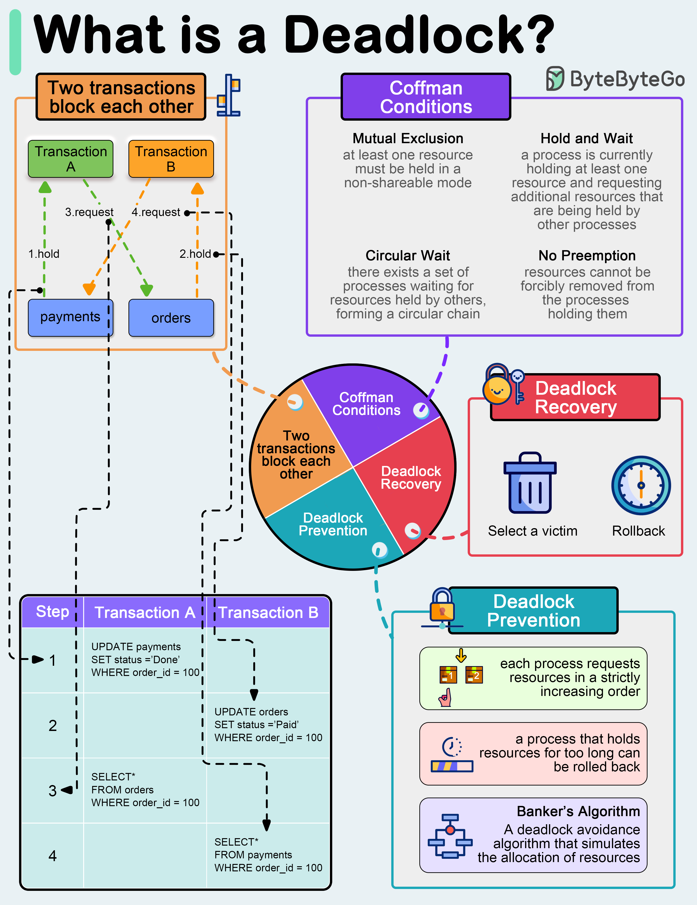

**Source:** [https://twitter.com/i/web/status/1911084003957833860](https://twitter.com/i/web/status/1911084003957833860)
**Original Post Date:** 2025-05-27 23:02:03

# Deadlock Analysis in Database Transactions: Understanding, Prevention, and Recovery

## Introduction
Deadlocks represent a critical challenge in concurrent database transactions, where multiple processes wait indefinitely for resources held by each other. Understanding the root causes and implementing effective mitigation strategies is essential for maintaining system reliability. This analysis explores deadlock scenarios, necessary conditions, prevention mechanisms, and recovery techniques using real-world examples.

## Deadlock Scenario Analysis

A typical deadlock occurs when two transactions create a circular dependency: Transaction A holds the 'payments' table lock while requesting the 'orders' table, while Transaction B holds the 'orders' table lock and requests the 'payments' table.

This scenario demonstrates how simple resource acquisition patterns can lead to system-wide blocking if not properly managed.

```SQL
BEGIN TRANSACTION;
UPDATE payments SET status = 'Done' WHERE order_id = 100;
SELECT * FROM orders WHERE order_id = 100;
COMMIT;
```

_Example transactions demonstrating deadlock formation_

```SQL
BEGIN TRANSACTION;
UPDATE orders SET status = 'Paid' WHERE order_id = 100;
SELECT * FROM payments WHERE order_id = 100;
COMMIT;
```

## Coffman Conditions

The four necessary conditions for a deadlock are mutually exclusive and must all be present.

1. Mutual Exclusion: Resources cannot be shared simultaneously.
1. Hold and Wait: Processes hold resources while waiting for others.
1. Circular Wait: A circular chain of processes each waiting on another's resource.
1. No Preemption: Resources must be released voluntarily.

> **Note/Tip:** Breaking any one condition can prevent deadlocks, but some conditions (like mutual exclusion) are inherent to database operations.

## Prevention and Recovery Strategies

Deadlock prevention involves techniques implemented before potential deadlock formation.

Recovery mechanisms address existing deadlocks by identifying victims and rolling back transactions.

- Prevention: Strict resource ordering, timeouts, Banker's algorithm
- Avoidance: Dynamic resource allocation based on process requirements
- Recovery: Victim selection algorithms, transaction rollback

## Key Takeaways

- Deadlocks require all four Coffman conditions to occur simultaneously.
- Prevention strategies must balance deadlock avoidance with system performance.
- Effective recovery requires efficient victim selection and rollback mechanisms.

## Conclusion
Understanding deadlocks is crucial for database system design. While prevention should be prioritized, robust recovery mechanisms are essential for maintaining operational integrity during inevitable deadlock occurrences.

## External References

- [Database Systems: The Complete Book](https://www.amazon.com/Database-Systems-Complete-Book-2nd/dp/0131873253)
- [Oracle Deadlock Detection and Resolution](https://docs.oracle.com/en/database/oracle/oracle-database/19/tgsql/deadlocks.html)


## Media

**Image Description:** ### Description of the Image

The image is an informative diagram explaining the concept of **deadlocks** in the context of database transactions and resource management. It is visually structured to break down the problem, its conditions, and potential solutions. Below is a detailed breakdown of the image:

---

#### **Main Title**
- The title at the top reads: **"What is a Deadlock?"**
  - This sets the context for the entire diagram, indicating that the focus is on understanding and addressing deadlocks.

---

#### **Left Section: Deadlock Scenario**
- **Two Transactions Blocking Each Other**
  - The diagram illustrates two transactions, **Transaction A** and **Transaction B**, which are blocking each other.
  - **Transaction A**:
    - Holds a lock on the `payments` table.
    - Requests a lock on the `orders` table.
  - **Transaction B**:
    - Holds a lock on the `orders` table.
    - Requests a lock on the `payments` table.
  - This creates a **circular wait** where each transaction is waiting for the other to release its lock, resulting in a deadlock.

- **Steps in the Deadlock Scenario**:
  - The steps are outlined in a table format:
    1. **Transaction A**:
       - Updates the `payments` table, setting the status to `Done` for `order_id = 100`.
       - Locks the `payments` table.
    2. **Transaction B**:
       - Updates the `orders` table, setting the status to `Paid` for `order_id = 100`.
       - Locks the `orders` table.
    3. **Transaction A**:
       - Attempts to select from the `orders` table (locked by Transaction B).
    4. **Transaction B**:
       - Attempts to select from the `payments` table (locked by Transaction A).

- **Visual Representation**:
  - Arrows show the flow of lock requests and dependencies between the two transactions.
  - The circular dependency is highlighted, emphasizing the deadlock condition.

---

#### **Right Section: Coffman Conditions**
- The diagram explains the **Coffman Conditions**, which are the necessary conditions for a deadlock to occur. These conditions are:
  1. **Mutual Exclusion**:
     - At least one resource must be held in a non-shareable mode.
     - Example: A lock on a table in a database.
  2. **Hold and Wait**:
     - A process is currently holding at least one resource and requesting additional resources that are being held by other processes.
  3. **Circular Wait**:
     - There exists a set of processes waiting for resources held by others, forming a circular chain.
  4. **No Preemption**:
     - Resources cannot be forcibly removed from the processes holding them.

- These conditions are visually represented in a purple box, with each condition explained in detail.

---

#### **Central Section: Deadlock Prevention and Recovery**
- The central part of the diagram is a pie chart divided into three sections, representing the key strategies for handling deadlocks:
  1. **Deadlock Prevention**:
     - Techniques to avoid deadlocks before they occur.
     - Examples:
       - **Strict Ordering of Resources**: Each process requests resources in a strictly increasing order to avoid circular dependencies.
       - **Timeouts**: A process that holds resources for too long can be rolled back.
       - **Banker's Algorithm**: Simulates resource allocation to prevent deadlocks by ensuring that a safe state is maintained.
  2. **Deadlock Avoidance**:
     - Dynamic strategies to avoid deadlocks during execution.
     - Example:
       - A deadlock avoidance algorithm ensures that a process does not enter a state where a deadlock could occur.
  3. **Deadlock Recovery**:
     - Techniques to resolve deadlocks after they occur.
     - Steps:
       - **Select a Victim**: Choose a transaction to roll back.
       - **Rollback**: Undo the changes made by the selected transaction to free up resources and resolve the deadlock.

- Each strategy is visually represented with icons and brief explanations.

---

#### **Bottom Section: Deadlock Recovery Example**
- The bottom section provides a detailed example of deadlock recovery:
  - **Select a Victim**: One of the transactions (e.g., Transaction A or Transaction B) is chosen to be rolled back.
  - **Rollback**: The selected transaction is rolled back, releasing its locks and allowing the other transaction to proceed.

---

#### **Visual Elements**
- **Icons and Colors**:
  - Different colors (e.g., green, orange, purple) are used to distinguish between transactions, conditions, and strategies.
  - Icons (e.g., locks, clocks, trash bins) are used to represent concepts like locking, timeouts, and rollback.
- **Arrows and Flow**:
  - Arrows are used to show the flow of lock requests and dependencies between transactions.
  - Dashed lines indicate blocked or pending requests.

---

#### **Overall Structure**
- The diagram is well-organized, with a clear flow from the problem (deadlock scenario) to the conditions (Coffman Conditions) and then to the solutions (prevention, avoidance, and recovery).
- The use of visuals, such as the pie chart and flow diagrams, makes the complex concept of deadlocks more accessible and understandable.

---

### Summary
The image provides a comprehensive explanation of deadlocks in the context of database transactions. It covers the scenario, the necessary conditions for deadlocks (Coffman Conditions), and strategies for preventing, avoiding, and recovering from deadlocks. The use of visuals and clear explanations makes it an effective educational tool for understanding this technical concept.
