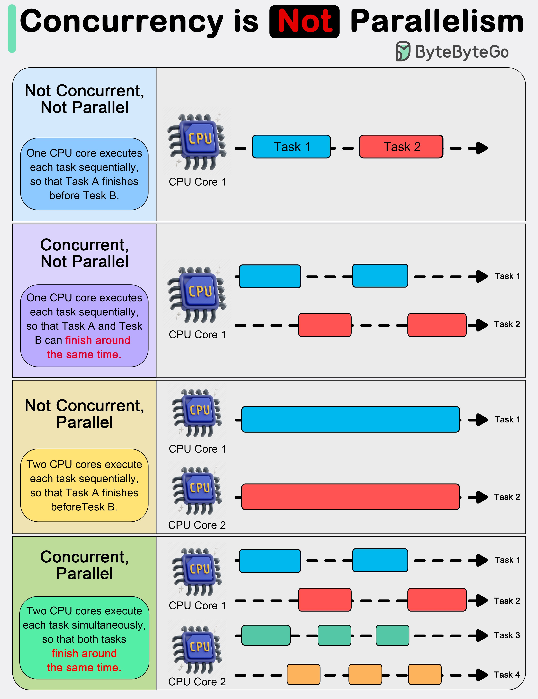

**Source:** [https://twitter.com/i/web/status/1891170983114875313](https://twitter.com/i/web/status/1891170983114875313)
**Original Post Date:** 2025-05-28 00:01:59

# Understanding Concurrency vs Parallelism: A Visual Guide to Execution Models

## Introduction
Concurrency and parallelism are fundamental concepts in computing that often lead to confusion. While they may seem similar, their underlying mechanisms differ significantly. This article explores these concepts through a detailed analysis of four key execution scenarios, using visual representations to clarify how tasks are scheduled and executed across CPU cores. Understanding these distinctions is crucial for designing efficient systems and optimizing performance.

## Not Concurrent, Not Parallel

This scenario represents the simplest form of task execution where a single CPU core processes tasks sequentially.

Task 1 must complete entirely before Task 2 begins, resulting in no overlap or simultaneous work.

- Single CPU core utilization
- Sequential task execution
- No interleaving of tasks

## Concurrent, Not Parallel

In this scenario, a single CPU core executes multiple tasks by interleaving their execution.

While tasks appear to run simultaneously from an external perspective, they are actually time-sliced on the same processor.

> **Note/Tip:** Concurrent execution often involves context switching overhead

> **Note/Tip:** Best suited for I/O-bound or event-driven applications

## Not Concurrent, Parallel

This scenario demonstrates true parallelism without concurrency.

Two separate CPU cores each execute their tasks sequentially but simultaneously on different processors.

1. Task 1 runs exclusively on Core 1
1. Task 2 runs exclusively on Core 2
1. No task interleaving within cores

## Concurrent, Parallel

The most complex scenario combines both concurrency and parallelism.

Multiple CPU cores execute tasks concurrently through time-slicing while maintaining parallel execution across different cores.

> **Note/Tip:** Provides maximum utilization of multi-core systems

> **Note/Tip:** Requires careful synchronization to avoid race conditions

## Key Takeaways

- Concurrency is about managing multiple tasks within a single CPU core through time-slicing
- Parallelism involves simultaneous task execution across multiple CPU cores
- The combination of both concepts enables optimal system performance in modern architectures

## Conclusion
Understanding the distinction between concurrency and parallelism is essential for effective software design. By carefully considering these execution models, developers can create systems that efficiently utilize available hardware resources while maintaining proper task management.

## External References

- [Operating Systems: Three Easy Pieces](https://pages.cs.wisc.edu/~remzi/OSTEP/)
- [Concurrency vs Parallelism in Java](https://www.oracle.com/java/technologies/concurrency-parallelism.html)

## Media

**Image Description:** The image is a detailed infographic that explains the concepts of **Concurrency** and **Parallelism** in computing. It uses a visual and textual approach to differentiate between these two related but distinct ideas. The main subject of the image is the comparison of four scenarios: 

1. **Not Concurrent, Not Parallel**
2. **Concurrent, Not Parallel**
3. **Not Concurrent, Parallel**
4. **Concurrent, Parallel**

### **Key Components of the Image:**

#### **1. Title:**
- The title at the top reads: **"Concurrency is Not Parallelism"** in bold, with the word **"Not"** highlighted in red to emphasize the distinction between the two concepts.

#### **2. Layout:**
- The infographic is divided into four sections, each representing a different scenario. Each section is color-coded for clarity:
  - **Not Concurrent, Not Parallel:** Blue
  - **Concurrent, Not Parallel:** Purple
  - **Not Concurrent, Parallel:** Yellow
  - **Concurrent, Parallel:** Green

#### **3. Scenarios:**

##### **(a) Not Concurrent, Not Parallel (Blue Section):**
- **Description:** 
  - One CPU core executes tasks sequentially.
  - Task 1 is completed before Task 2 begins.
- **Visual Representation:**
  - A single CPU core is shown.
  - Task 1 (blue) is executed first, followed by Task 2 (red).
  - The tasks are depicted as sequential blocks, with no overlap.

##### **(b) Concurrent, Not Parallel (Purple Section):**
- **Description:**
  - One CPU core executes tasks in an interleaved manner.
  - Task 1 and Task 2 are executed concurrently, but not in parallel.
  - The CPU switches between tasks, allowing them to finish around the same time.
- **Visual Representation:**
  - A single CPU core is shown.
  - Task 1 (blue) and Task 2 (red) are depicted as overlapping blocks, indicating that the CPU is switching between them.
  - The tasks are not executed simultaneously but are interleaved.

##### **(c) Not Concurrent, Parallel (Yellow Section):**
- **Description:**
  - Two CPU cores execute tasks sequentially, but on separate cores.
  - Task 1 is executed on CPU Core 1, and Task 2 is executed on CPU Core 2.
  - Each task is executed sequentially on its respective core.
- **Visual Representation:**
  - Two CPU cores are shown.
  - Task 1 (blue) is executed on CPU Core 1, and Task 2 (red) is executed on CPU Core 2.
  - The tasks are sequential on their respective cores but are executed in parallel across the two cores.

##### **(d) Concurrent, Parallel (Green Section):**
- **Description:**
  - Two CPU cores execute tasks concurrently and in parallel.
  - Task 1 and Task 2 are executed on separate cores, and each task is also executed in an interleaved manner on its respective core.
  - This results in both tasks finishing around the same time.
- **Visual Representation:**
  - Two CPU cores are shown.
  - Task 1 (blue) and Task 2 (red) are executed on separate cores, with each task being interleaved on its respective core.
  - Additional tasks (Task 3 in green and Task 4 in orange) are also shown, further illustrating the concept of multiple tasks being executed concurrently and in parallel across the cores.

#### **4. Visual Elements:**
- **CPU Representation:** Each section shows a CPU icon labeled as "CPU" with a core number (e.g., CPU Core 1, CPU Core 2).
- **Task Representation:** Tasks are represented as colored blocks (e.g., blue for Task 1, red for Task 2, green for Task 3, orange for Task 4).
- **Arrows:** Arrows indicate the flow of execution for each task.
- **Dashed Lines:** Dashed lines are used to show interleaving or concurrent execution of tasks.

#### **5. Textual Explanations:**
- Each section includes a detailed textual explanation of the scenario, highlighting the key differences between concurrency and parallelism.

### **Key Takeaways:**
- **Concurrency** refers to the ability of a system to handle multiple tasks at the same time, even if they are not executed simultaneously. Tasks can be interleaved on a single CPU core.
- **Parallelism** refers to the ability of a system to execute multiple tasks simultaneously using multiple CPU cores.
- The combination of concurrency and parallelism allows for efficient multitasking and improved performance.

### **Overall Purpose:**
The infographic aims to clarify the distinction between concurrency and parallelism, emphasizing that they are related but distinct concepts in computing. It uses visual aids and clear explanations to make the concepts accessible and understandable.
