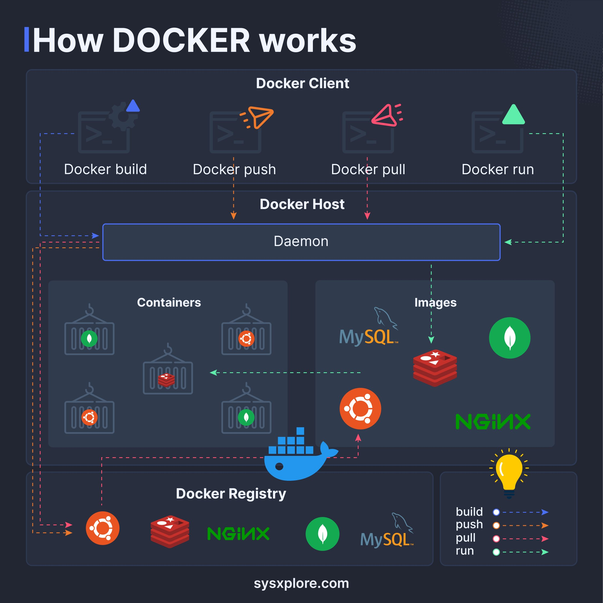

**Source:** [https://twitter.com/i/web/status/1869076561431032065](https://twitter.com/i/web/status/1869076561431032065)
**Original Post Date:** 2025-05-28 02:15:23

# Docker Containerization Architecture: Understanding Core Components & Workflow

## Introduction
Docker revolutionizes application deployment through containerization, providing a consistent environment from development to production. This article explores Docker's core components (client, daemon, containers, images), their workflow interactions, and how they integrate with registries. Understanding this architecture is essential for effective container management and orchestration.

## Docker Client Architecture

The Docker client acts as the primary interface between users and the Docker ecosystem. It sends commands to the Docker daemon via REST API or Unix socket, managing containers and images through a consistent CLI experience.

```bash
docker build -t myapp:1.0 .
# Builds image from local Dockerfile

docker push myapp:1.0
# Uploads built image to registry
```

1. Docker build - Creates reproducible images from Dockerfiles
1. Docker run - Instantiates containers from existing images
1. Docker push/pull - Manages image distribution between local and registry

## Docker Host & Daemon Operations

The Docker host executes container processes, with the daemon orchestrating operations. Containers isolate applications while sharing the host kernel, providing lightweight virtualization without full VM overhead.

```bash
docker run -d --name mydb mysql:8.0
# Launches MySQL container in detached mode
```

## Docker Registry Management

Registries store and distribute Docker images, with Docker Hub as the primary public registry. Private registries enable secure image management within organizations.

```bash
docker pull nginx:latest
# Downloads official Nginx container

docker tag myapp local-registry:5000/myapp
# Prepares for private registry upload
```

## Key Takeaways

- Docker's client-server model enables distributed container management
- Images provide immutable, versioned templates for containers
- Registries facilitate secure image distribution and lifecycle management

## Conclusion
Understanding Docker's architectural components is crucial for effective containerization. By mastering the interaction between client, daemon, containers, images, and registries, developers can create robust, scalable applications with consistent deployment pipelines.

## External References

- [Docker Official Documentation](https://docs.docker.com/)
- [Docker Architecture Guide](https://www.docker.com/what-docker)


## Media

**Image Description:** The image is a detailed diagram illustrating the workflow and key components of Docker, a popular containerization platform. The diagram is structured to show how Docker operates, from building and managing containers to deploying them. Below is a detailed breakdown of the image:

### **Main Title**
- The title at the top reads: **"How Docker works"**.
- The text is bold and clear, indicating the focus of the diagram.

### **Key Components and Workflow**
The diagram is divided into several sections, each representing a different aspect of Docker's functionality. Here's a breakdown:

#### **1. Docker Client**
- **Location**: At the top of the diagram.
- **Description**: The Docker client is the user interface through which developers interact with Docker. It sends commands to the Docker daemon.
- **Commands Shown**:
  - **Docker build**: Builds a Docker image from a Dockerfile.
  - **Docker push**: Pushes a Docker image to a registry.
  - **Docker pull**: Pulls a Docker image from a registry.
  - **Docker run**: Runs a container from a Docker image.

#### **2. Docker Host**
- **Location**: Below the Docker client.
- **Description**: The Docker host is the machine where Docker is installed and where containers are executed.
- **Components**:
  - **Docker Daemon**: The background service that manages containers, images, and other Docker objects. It listens for commands from the Docker client and executes them.
  - **Containers**: Represented by icons of shipping containers. These are the isolated, executable units that run applications.
  - **Images**: Represented by icons of stacks and databases (e.g., MySQL, Nginx). These are the read-only templates used to create containers.

#### **3. Docker Registry**
- **Location**: At the bottom of the diagram.
- **Description**: The Docker registry is a storage and distribution system for Docker images. It can be public (like Docker Hub) or private.
- **Icons**:
  - **Ubuntu**: Represents a base operating system image.
  - **MySQL**: Represents a database image.
  - **Nginx**: Represents a web server image.
  - **Stacked Boxes**: Represents a custom or composite image.

#### **4. Workflow Arrows**
- The diagram uses arrows to illustrate the flow of commands and data:
  - **Docker build**: The arrow points from the Docker client to the Docker daemon, indicating that the build command is sent to the daemon to create an image.
  - **Docker push**: The arrow points from the Docker daemon to the Docker registry, indicating that the image is pushed to the registry.
  - **Docker pull**: The arrow points from the Docker registry to the Docker daemon, indicating that an image is pulled from the registry.
  - **Docker run**: The arrow points from the Docker daemon to the containers, indicating that a container is created and run from an image.

#### **5. Visual Elements**
- **Icons**:
  - **Containers**: Represented by shipping container icons, each with a unique color or logo (e.g., Ubuntu, MySQL, Nginx).
  - **Images**: Represented by stacked boxes or database icons.
  - **Docker Daemon**: A horizontal bar labeled "Daemon."
  - **Docker Registry**: A whale icon (Docker's logo) with arrows pointing to and from it.
- **Colors**:
  - Different colors (e.g., green, orange, red) are used to differentiate between commands and components, making the flow easier to follow.

#### **6. Legend**
- At the bottom right, there is a legend explaining the meaning of the dashed arrows:
  - **Dashed Blue Arrows**: Represent the "build" command.
  - **Dashed Orange Arrows**: Represent the "push" command.
  - **Dashed Red Arrows**: Represent the "pull" command.
  - **Dashed Green Arrows**: Represent the "run" command.

### **Overall Structure**
The diagram is organized in a top-to-bottom flow:
1. **Docker Client**: Sends commands.
2. **Docker Host**: Executes commands via the Docker daemon.
3. **Docker Registry**: Stores and distributes images.

### **Conclusion**
The image effectively visualizes the Docker workflow, highlighting the interaction between the Docker client, daemon, containers, images, and registry. It uses clear icons, colors, and arrows to explain the sequence of operations, making it easy for users to understand how Docker builds, pushes, pulls, and runs containers. The inclusion of a legend ensures that the meaning of the arrows is unambiguous. 

This diagram is a valuable resource for both beginners and experienced users looking to understand Docker's architecture and functionality.
