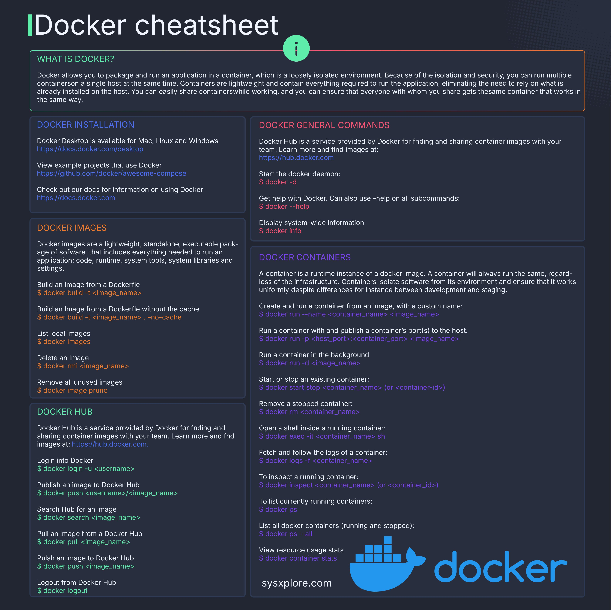

**Source:** [https://twitter.com/i/web/status/1876229585936973891](https://twitter.com/i/web/status/1876229585936973891)
**Original Post Date:** 2025-06-17 09:43:48

# Docker Essentials: A Comprehensive Crash Course

## Introduction
Docker has revolutionized modern software development by enabling applications to run consistently across different environments. This comprehensive guide covers essential Docker concepts and commands, from basic installations to advanced container orchestration techniques. Whether you're a developer seeking reliable deployments or an architect designing scalable systems, this knowledge base provides practical insights into leveraging Docker's powerful capabilities.

## Understanding Containers and Docker

Docker containers provide isolated environments containing all necessary components for application execution. Unlike traditional virtualization, containers share the host OS kernel, making them lightweight and efficient.

- Lightweight packaging with code, runtime, libraries, and system tools
- Environment consistency across development, staging, and production
- High portability between different host systems

## Installation and Setup

Docker Desktop simplifies installation for Mac, Linux, and Windows environments. Follow official documentation for system-specific setup instructions.

```bash
# Verify Docker installation
sudo docker --version
# Check daemon status
docker info
```

## Image Management

Docker images are the building blocks of containers. Proper image management is crucial for efficient development and deployment workflows.

```bash
# Build an image without cache
docker build --no-cache -t myapp:1.0 .
# List available images
docker images
```

## Container Operations

Efficient container management is key to leveraging Docker's full potential in production environments.

```bash
# Run with port mapping
docker run -p 80:80 myapp
# Monitor resource usage
docker stats
```

> **Note/Tip:** Always use specific tags for production images to ensure reproducibility

> **Note/Tip:** Implement proper health checks for container orchestration

## Docker Hub Integration

Leverage Docker Hub's repository system for sharing and distributing images within teams or globally.

```bash
# Push to Docker Hub
docker push user/myapp:1.0
# Search public repositories
docker search nginx
```

## Key Takeaways

- Master the fundamentals of containerization for consistent application deployment across environments
- Implement efficient image management practices for optimal development and production workflows
- Understand container orchestration principles for scalable applications

## Conclusion
Docker's containerization platform provides robust solutions for modern software development challenges. By mastering these core concepts, you can build, deploy, and maintain applications with enhanced consistency and efficiency across different environments.

## External References

- [Official Docker Documentation](https://docs.docker.com/)
- [Docker Desktop Installation Guide](https://docs.docker.com/desktop/)


## Media

**Image Description:** ### Image Description: Docker Cheat Sheet

The image is a comprehensive **Docker Cheat Sheet** designed to provide a quick reference guide for Docker commands, installation instructions, and general usage. The layout is clean, organized, and visually appealing, with a dark theme and highlighted sections for easy readability. Below is a detailed breakdown of the content:

---

#### **Header**
- **Title**: "Docker cheatsheet"
- **Icon**: A Docker logo is prominently displayed in the bottom-right corner, featuring a blue whale with a Docker logo inside it.
- **Footer**: The text "sysxplore.com" is visible, indicating the source or creator of the cheat sheet.

---

#### **Main Sections**
The cheat sheet is divided into several sections, each focusing on a specific aspect of Docker. Below is a detailed breakdown of each section:

---

### **1. What is Docker?**
- **Description**: 
  - Docker is a platform that allows users to package and run applications in containers. Containers are isolated environments that provide isolation, security, and portability.
  - Key points:
    - Containers are lightweight and contain everything needed to run an application, including code, runtime, system tools, and libraries.
    - Multiple containers can run on a single host simultaneously.
    - Containers ensure consistency across different environments (development, staging, production).
    - Containers can be easily shared and distributed.

---

### **2. Docker Installation**
- **Description**: Instructions for installing Docker Desktop on different operating systems.
- **Key Points**:
  - Docker Desktop is available for Mac, Linux, and Windows.
  - Links to official Docker documentation:
    - [Docker Desktop](https://docs.docker.com/desktop/)
    - [Example Projects](https://github.com/docker/awesome-compose)
    - [Docker Documentation](https://docs.docker.com/)

---

### **3. Docker Images**
- **Description**: Commands and explanations related to Docker images.
- **Key Points**:
  - **What are Docker Images?**
    - Docker images are lightweight, standalone, executable packages of software that include everything needed to run an application.
  - **Commands**:
    - **Build an Image from a Dockerfile**:
      ```bash
      $ docker build -t <image_name>
      ```
    - **Build an Image from a Dockerfile without the cache**:
      ```bash
      $ docker build -t <image_name> --no-cache
      ```
    - **List Local Images**:
      ```bash
      $ docker images
      ```
    - **Delete an Image**:
      ```bash
      $ docker rmi <image_name>
      ```
    - **Remove All Unused Images**:
      ```bash
      $ docker image prune
      ```

---

### **4. Docker General Commands**
- **Description**: General Docker commands for system-wide information and daemon management.
- **Key Points**:
  - **Display System-Wide Information**:
    ```bash
    $ docker info
    ```
  - **Start the Docker Daemon**:
    ```bash
    $ docker -d
    ```
  - **Get Help with Docker**:
    ```bash
    $ docker --help
    ```
  - **Help for Specific Subcommands**:
    ```bash
    $ docker <subcommand> --help
    ```

---

### **5. Docker Containers**
- **Description**: Commands and explanations related to Docker containers.
- **Key Points**:
  - **What is a Docker Container?**
    - A container is a runtime instance of a Docker image. Containers ensure consistent behavior regardless of the underlying infrastructure.
  - **Commands**:
    - **Create and Run a Container from an Image**:
      ```bash
      $ docker run --name <container_name> <image_name>
      ```
    - **Run a Container with Port Mapping**:
      ```bash
      $ docker run -p <host_port>:<container_port> <image_name>
      ```
    - **Run a Container in the Background**:
      ```bash
      $ docker run -d <image_name>
      ```
    - **Start or Stop an Existing Container**:
      ```bash
      $ docker start/stop <container_name> or <container_id>
      ```
    - **Remove a Stopped Container**:
      ```bash
      $ docker rm <container_name>
      ```
    - **Open a Shell Inside a Running Container**:
      ```bash
      $ docker exec -it <container_name> sh
      ```
    - **Fetch and Follow Logs of a Container**:
      ```bash
      $ docker logs -f <container_name>
      ```
    - **Inspect a Running Container**:
      ```bash
      $ docker inspect <container_name> or <container_id>
      ```
    - **List Currently Running Containers**:
      ```bash
      $ docker ps
      ```
    - **List All Containers (Running and Stopped)**:
      ```bash
      $ docker ps --all
      ```
    - **View Resource Usage Stats**:
      ```bash
      $ docker container stats
      ```

---

### **6. Docker Hub**
- **Description**: Commands and explanations related to Docker Hub, a service for finding, sharing, and distributing container images.
- **Key Points**:
  - **What is Docker Hub?**
    - Docker Hub is a service provided by Docker for finding and sharing container images with your team.
  - **Commands**:
    - **Login to Docker Hub**:
      ```bash
      $ docker login -u <username>
      ```
    - **Publish an Image to Docker Hub**:
      ```bash
      $ docker push <username>/<image_name>
      ```
    - **Search for an Image on Docker Hub**:
      ```bash
      $ docker search <image_name>
      ```
    - **Pull an Image from Docker Hub**:
      ```bash
      $ docker pull <image_name>
      ```
    - **Logout from Docker Hub**:
      ```bash
      $ docker logout
      ```

---

### **Visual Design**
- **Color Scheme**:
  - Dark background with white and light text for readability.
  - Green and red highlights for section titles and important commands.
- **Icons**:
  - A green information icon (`i`) next to the "What is Docker?" section.
  - The Docker logo in the bottom-right corner.
- **Layout**:
  - Sections are clearly separated with borders and distinct headings.
  - Commands are presented in a monospace font for clarity.

---

### **Purpose**
The cheat sheet serves as a quick reference guide for Docker users, providing essential commands and explanations for installation, image management, container operations, and Docker Hub interactions. It is designed to be concise, organized, and easy to navigate, making it a valuable resource for both beginners and experienced Docker users.

---

### **Overall Impression**
The cheat sheet is well-structured, visually appealing, and highly informative. It effectively condenses key Docker concepts and commands into a single, easy-to-use reference. The inclusion of links to official documentation and examples adds value for users seeking more in-depth information. The Docker logo and branding reinforce the official nature of the content.
