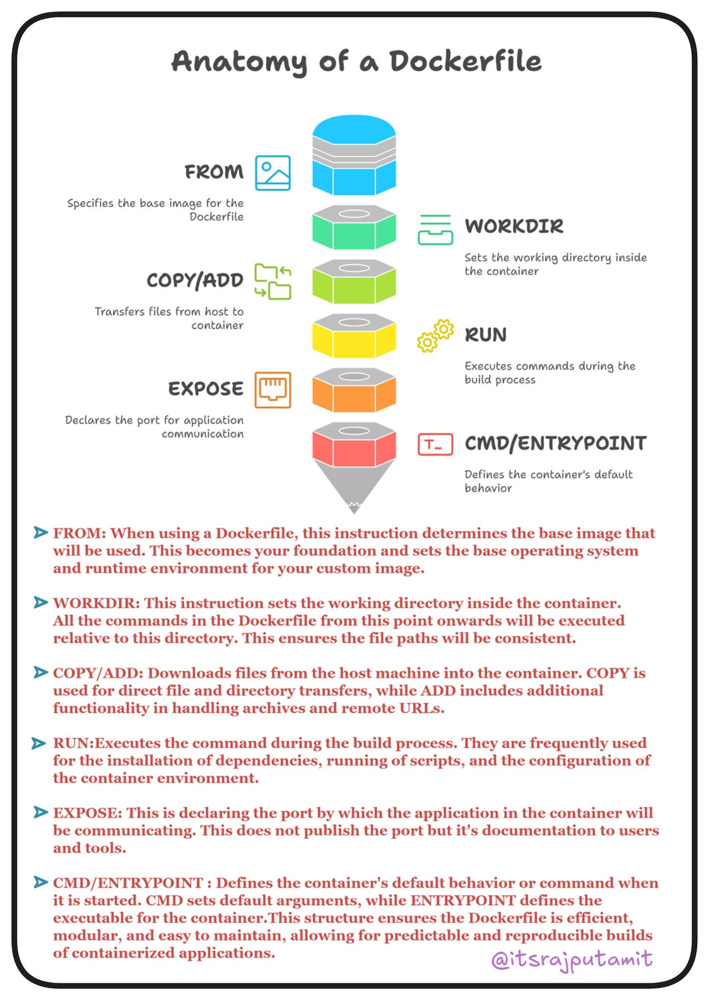

**Source:** [https://twitter.com/i/web/status/1880218561303703586](https://twitter.com/i/web/status/1880218561303703586)
**Original Post Date:** 2025-05-27 18:26:30

# Dockerfile Best Practices: Essential Instructions Explained

## Introduction
Understanding the anatomy of a Dockerfile is crucial for building efficient and maintainable containerized applications. This article delves into the essential instructions that form the foundation of any Dockerfile, explaining their purpose, proper usage, and best practices. We'll explore each instruction in detail, from setting up the base image to defining container behavior.

## Base Image Configuration

The FROM instruction establishes the foundation of your Dockerfile by specifying a base image. This determines the operating system and pre-installed software available in your container environment.

```Dockerfile
FROM node:14-alpine
# Use alpine-based images for smaller footprint
```

> **Note/Tip:** Always use specific versions instead of 'latest' to ensure reproducible builds.

> **Note/Tip:** Choose lightweight base images when possible (e.g., alpine) to reduce image size.

## File Management and Environment Setup

WORKDIR sets the working directory for subsequent instructions, ensuring consistent file paths. COPY/ADD are used to transfer files from host to container.

COPY is preferred over ADD unless you need advanced features like auto-extraction of archives.

```Dockerfile
WORKDIR /app
COPY package*.json ./
RUN npm install
```

- Use relative paths in COPY to maintain consistency with WORKDIR.
- Avoid copying unnecessary files into the image.

## Build-time Commands and Container Execution

RUN executes commands during build time, typically for installing dependencies or configuring software. CMD/ENTRYPOINT define how the container runs.

CMD provides default arguments, while ENTRYPOINT sets the executable that will run when the container starts.

```Dockerfile
RUN apt-get update && apt-get install -y python3
CMD ["python", "app.py"]
```

> **Note/Tip:** Use multi-stage builds to reduce final image size.

> **Note/Tip:** Combine RUN commands using && to minimize layers.

## Key Takeaways

- Start with a minimal base image and use specific versions.
- Structure Dockerfile instructions for optimal build caching.
- Define clear entry points using CMD or ENTRYPOINT.
- Avoid unnecessary file copying and layer creation.

## Conclusion
Mastering Dockerfile structure is essential for creating efficient container images. By following these best practices, you can ensure your containers are secure, lightweight, and easy to maintain.

## External References

- [Docker Official Documentation](https://docs.docker.com/engine/reference/builder/)


## Media

**Image Description:** ### Description of the Image: Anatomy of a Dockerfile

The image provides a detailed breakdown of the structure and key components of a Dockerfile, which is a text file used to build Docker images. The image is visually organized with a vertical flowchart-like structure, where each section represents a specific Dockerfile instruction. Below is a detailed description of the image, focusing on the main subject and relevant technical details:

---

#### **Main Title**
- The title at the top of the image reads: **"Anatomy of a Dockerfile"**.
- This sets the context for the image, indicating that it will explain the key components and structure of a Dockerfile.

---

#### **Visual Structure**
- The image uses a vertical flowchart format, with each Dockerfile instruction represented by a colored hexagonal block. The blocks are stacked from top to bottom, illustrating the typical order in which these instructions are used in a Dockerfile.

---

#### **Key Components (Instructions)**
Each instruction is explained with a brief description and an icon. Here’s a breakdown:

1. **FROM**
   - **Icon**: A blue hexagon with an image icon.
   - **Description**: Specifies the base image for the Dockerfile.
   - **Details**: This is the first instruction in a Dockerfile and defines the base image that the new image will be built upon. It sets the foundation for the custom image, including the base operating system and any pre-installed software.

2. **WORKDIR**
   - **Icon**: A green hexagon with a folder icon.
   - **Description**: Sets the working directory inside the container.
   - **Details**: This instruction defines the directory where subsequent commands (e.g., `COPY`, `RUN`, etc.) will be executed. It ensures consistency in file paths and simplifies navigation within the container.

3. **COPY/ADD**
   - **Icon**: A yellow hexagon with a file transfer icon.
   - **Description**: Transfers files from the host machine to the container.
   - **Details**: 
     - `COPY`: Used for direct file and directory transfers.
     - `ADD`: Similar to `COPY`, but also supports additional functionalities like handling archives and remote URLs.
   - This instruction is crucial for adding application files, dependencies, and other resources into the container.

4. **RUN**
   - **Icon**: An orange hexagon with a gear icon.
   - **Description**: Executes commands during the build process.
   - **Details**: This instruction is used to run commands inside the container during the image build process. Common uses include installing dependencies, running scripts, or configuring the environment.

5. **EXPOSE**
   - **Icon**: A red hexagon with a network port icon.
   - **Description**: Declares the port for application communication.
   - **Details**: This instruction specifies the port(s) that the application inside the container will use for communication. However, it does not publish the port; it only documents it for reference.

6. **CMD/ENTRYPOINT**
   - **Icon**: A pink hexagon with a terminal icon.
   - **Description**: Defines the container's default behavior or command.
   - **Details**:
     - **CMD**: Sets default arguments for the entry point or the command to run when the container starts.
     - **ENTRYPOINT**: Defines the executable that will run when the container starts. It can be overridden by specifying a command when running the container.
   - These instructions are essential for defining the primary function of the container.

---

#### **Additional Textual Explanations**
Below the visual flowchart, there are detailed explanations for each instruction:

1. **FROM**
   - Specifies the base image that will be used for building the Docker image.
   - Sets the foundation for the custom image, including the base operating system and pre-installed software.

2. **WORKDIR**
   - Sets the working directory inside the container.
   - All subsequent commands in the Dockerfile will be executed relative to this directory, ensuring consistent file paths.

3. **COPY/ADD**
   - Transfers files from the host machine to the container.
   - `COPY` is used for direct file and directory transfers, while `ADD` supports additional functionalities like handling archives and remote URLs.

4. **RUN**
   - Executes commands during the build process.
   - Commonly used for installing dependencies, running scripts, or configuring the environment.

5. **EXPOSE**
   - Declares the port(s) that the application will use for communication.
   - Does not publish the port but serves as documentation for the port used by the application.

6. **CMD/ENTRYPOINT**
   - Defines the default behavior or command when the container starts.
   - `CMD` sets default arguments, while `ENTRYPOINT` defines the primary executable. These instructions ensure the container knows what to do when it starts.

---

#### **Visual Design**
- The image uses a clean, minimalist design with a white background and colored hexagons for each instruction.
- Icons are used to visually represent each instruction, making the image more intuitive and easier to understand.
- The text is organized in a clear, hierarchical manner, with brief descriptions next to each instruction and more detailed explanations below the flowchart.

---

#### **Footer**
- The image includes a social media handle at the bottom right: **@itsrajputamit**.

---

### Summary
The image provides a comprehensive overview of the key instructions in a Dockerfile, using a visually appealing and structured format. It explains each instruction with both a brief description and detailed notes, making it an excellent resource for understanding the anatomy of a Dockerfile. The use of icons and color-coding enhances the readability and clarity of the content.
