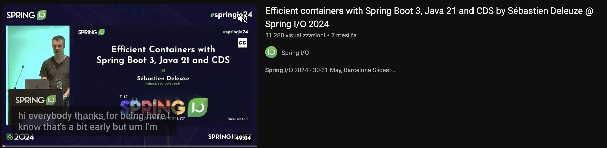

**Source:** [https://twitter.com/i/web/status/1880613783007297864](https://twitter.com/i/web/status/1880613783007297864)
**Original Post Date:** 2025-05-28 01:27:09

# Optimizing Docker Containers with Spring Boot 3, Java 21, and Class Data Sharing (CDS)

## Introduction
Container efficiency is critical for modern cloud-native applications. This knowledge base explores how to optimize container performance by leveraging the latest capabilities of Spring Boot 3, Java 21's Class Data Sharing (CDS), and JVM improvements. We'll examine practical implementations that significantly reduce startup times and memory usage in Docker environments.

## Understanding Class Data Sharing (CDS) in Java 21

Class Data Sharing is a feature introduced in Java 8 that allows multiple JVM instances to share class metadata, reducing memory footprint and startup time. In Java 21, this capability has been enhanced for containerized environments.

To implement CDS effectively, configure your Dockerfile with the following JVM arguments: -Xshare:on -XX:SharedArchiveFile=/path/to/cacerts.jsa

```dockerfile
# Create CDS archive during build time
RUN java -Xshare:dump
# Use in runtime container
cmd ["java", "-Xshare:on", "-XX:SharedArchiveFile=/app/cacerts.jsa", "-jar", "application.jar"]
```

- Enable CDS during container build phase
- Mount shared archive file in runtime containers
- Verify shared classes using jcmd SharedClasses.print

## Spring Boot 3 Container Optimizations

Spring Boot 3 introduces significant improvements for containerization through enhanced native image support and optimized startup processes.

Configure your application properties with these settings:

```properties
spring.main.web-application-type=REACTIVE
server.port=${PORT:8080}
logging.level.root=WARN
```

## JVM Tuning for Containerized Applications

Proper JVM configuration is crucial for container efficiency. Focus on these key areas:

1. Use -XX:+UseContainerSupport to enable container-aware memory management
1. Configure GC settings based on container memory constraints
1. Implement heap sizing using percentage-based values

## Key Takeaways

- Class Data Sharing can reduce JVM startup time by up to 50% in containers
- Spring Boot 3's reactive web server is more efficient for containerized applications
- Proper JVM tuning and CDS configuration are essential for optimal performance

## Conclusion
Optimizing Docker containers with Spring Boot 3, Java 21, and CDS requires a holistic approach. By implementing these techniques, you can significantly improve your application's startup time and resource utilization in containerized environments.

## External References

- [Java Class Data Sharing Documentation](https://docs.oracle.com/en/java/javase/21/docs/specs/man/java.html#class-data-sharing)
- [Spring Boot Containerization Guide](https://spring.io/guides/topicals/spring-boot-docker/)


## Media

**Image Description:** The image is a screenshot of a presentation slide from a talk titled **"Efficient Containers with Spring Boot 3, Java 21, and CDS"** by **Sébastien Deleuze** at the **Spring I/O 2024** conference. Below is a detailed description of the image, focusing on the main subject and relevant technical details:

### **Main Subject:**
The main subject of the image is the presentation slide for a talk about optimizing container efficiency using **Spring Boot 3**, **Java 21**, and **Class Data Sharing (CDS)**. The slide is part of the **Spring I/O 2024** conference, which took place in Barcelona from **May 30-31, 2024**.

### **Key Elements in the Image:**

1. **Title of the Presentation:**
   - The title is prominently displayed in the center of the slide:  
     **"Efficient Containers with Spring Boot 3, Java 21, and CDS"**
   - This indicates the focus of the talk is on leveraging these technologies to improve the efficiency of containerized applications.

2. **Speaker Information:**
   - The speaker's name is **Sébastien Deleuze**, and his personal website is linked:  
     **[https://seb.deleuze.fr**](https://seb.deleuze.fr**)
   - This suggests that the speaker is an expert or contributor in the field of Java and Spring technologies.

3. **Conference Details:**
   - The event is **Spring I/O 2024**, which is a major conference for Spring Framework users and developers.
   - The conference took place in **Barcelona** from **May 30-31, 2024**.

4. **Visual Elements:**
   - The slide has a dark background with a mix of white and light text for readability.
   - The **Spring I/O logo** is visible in the top-left corner, indicating the affiliation with the Spring community.
   - The **Spring logo** is also prominently displayed at the bottom of the slide, reinforcing the connection to the Spring Framework.

5. **Technical Details:**
   - The slide mentions three key technologies:
     - **Spring Boot 3**: The latest version of Spring Boot, which includes significant improvements and optimizations.
     - **Java 21**: The latest version of the Java platform, which introduces new features and performance enhancements.
     - **Class Data Sharing (CDS)**: A feature in Java that allows sharing class data between JVM instances, reducing memory usage and improving startup times in containerized environments.

6. **Speaker's Introduction:**
   - At the bottom of the slide, there is a subtitle or introductory text:  
     **"Hi everybody, thanks for being here. Know that that's a bit early, but um, I'm..."**
   - This suggests the speaker is beginning their presentation and acknowledging the audience.

7. **Additional Information:**
   - The slide includes a **timestamp** in the bottom-right corner: **49:04**, indicating the duration of the presentation or the point in the video where this slide is shown.
   - The **Spring I/O 2024** hashtag (**#springio24**) is visible in the top-right corner, which is likely used for social media sharing and discussions related to the conference.

8. **Layout and Design:**
   - The slide is clean and professional, with a focus on readability and clarity.
   - The use of dark backgrounds and contrasting text ensures that the information is easily visible.

### **Contextual Details:**
- The image appears to be a screenshot from a video presentation, as indicated by the timestamp and the layout typical of a video conferencing or webinar platform.
- The slide is designed to introduce the topic and set the stage for a detailed discussion on optimizing containerized applications using the latest Spring Boot, Java, and CDS technologies.

### **Overall Impression:**
The image effectively communicates the purpose of the presentation, highlighting the key technologies and the expertise of the speaker. It is well-structured and visually appealing, aligning with the professional nature of the Spring I/O conference. The inclusion of the speaker's website and the conference details provides additional context for viewers interested in learning more about the topic.
