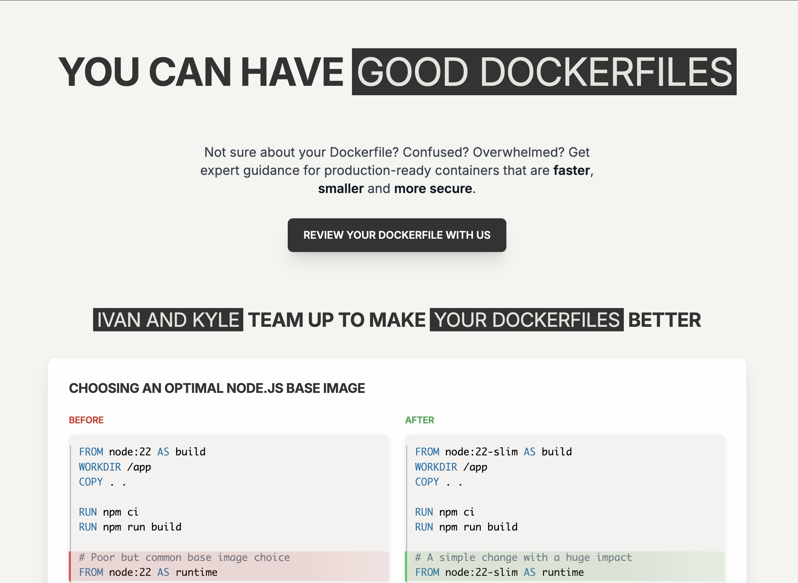

**Source:** [https://twitter.com/i/web/status/1880271036781928683](https://twitter.com/i/web/status/1880271036781928683)
**Original Post Date:** 2025-05-27 23:09:00

# Optimizing Dockerfiles for Node.js Applications: Base Image Selection & Multi-Stage Builds

## Introduction
Building efficient containerized applications requires careful consideration of Dockerfile optimization. This knowledge base item focuses on critical aspects like base image selection and multi-stage build strategies for Node.js applications, demonstrating how simple changes can significantly impact container performance and security.

Key areas covered include base image selection patterns, multi-stage build techniques, and practical examples that highlight the benefits of optimized configurations.

## Base Image Selection Strategies

Choosing the right base image is fundamental to creating efficient Docker containers. The difference between full and slim images can dramatically affect container size, build time, and security posture.

_Poor practice using full Node.js image in both stages, leading to larger container size and potential security risks._

```dockerfile
FROM node:22 AS build
WORKDIR /app
COPY . .
RUN npm ci
RUN npm run build

FROM node:22 AS runtime
```

_Improved approach using slim variant, resulting in smaller container size and enhanced security._

```dockerfile
FROM node:22-slim AS build
WORKDIR /app
COPY . .
RUN npm ci
RUN npm run build

FROM node:22-slim AS runtime
```

- Full images include development tools not needed at runtime
- Slim variants reduce attack surface by excluding unnecessary components
- Base image selection impacts both build time and deployment efficiency

> **Note/Tip:** Always use slim variants for production applications unless specific development tools are required.

## Multi-Stage Build Optimization

Multi-stage builds allow separation of build and runtime environments, significantly reducing final image size while maintaining application functionality.

The build stage handles dependency installation and compilation, while the runtime stage contains only necessary components.

1. Use separate stages for building dependencies and running applications
1. Copy only built artifacts to runtime stage to minimize image size
1. Implement consistent structure across all application services

## Key Takeaways

- Selecting slim base images can reduce container size by up to 90% while maintaining functionality.
- Multi-stage builds enable separation of concerns and significantly improve deployment efficiency.
- Proper base image selection directly impacts security posture through reduced attack surface.

## Conclusion
Optimizing Dockerfile configurations requires careful consideration of base image selection and build strategies. By implementing these practices, developers can achieve smaller container sizes, faster deployments, and improved security. Regular review and updates to Dockerfile configurations ensure continuous optimization.

## External References

- [Docker Official Node.js Images Documentation](https://hub.docker.com/_/node)
- [Best Practices for Building Multi-Stage Dockerfiles](https://docs.docker.com/develop/develop-images/multistage-build/)


## Media

**Image Description:** ### Description of the Image

The image is a promotional or educational webpage focused on improving Dockerfile configurations for Node.js applications. The content is structured to highlight the importance of optimizing Dockerfiles for better performance, security, and efficiency. Below is a detailed breakdown:

---

#### **Header Section**
- **Title**: The main heading reads:
  - **"YOU CAN HAVE GOOD DOCKERFILES"**
    - The word "GOOD" is emphasized in a black box with white text.
  - The title is bold and large, drawing attention to the central theme of the page.

- **Subheading**: Below the title, there is a brief introductory paragraph:
  - **Text**: 
    - "Not sure about your Dockerfile? Confused? Overwhelmed? Get expert guidance for production-ready containers that are faster, smaller, and more secure."
  - This text aims to address common challenges faced by developers when working with Dockerfiles and promises expert advice for optimizing them.

- **Call-to-Action Button**: 
  - A black button with white text that says:
    - **"REVIEW YOUR DOCKERFILE WITH US"**
  - This encourages users to engage with the service or resource being promoted.

---

#### **Main Content Section**
- **Subheading**: 
  - **"IVAN AND KYLE TEAM UP TO MAKE YOUR DOCKERFILES BETTER"**
    - This section introduces the individuals or team ("Ivan and Kyle") responsible for providing guidance on Dockerfile optimization.
    - The phrase "MAKE YOUR DOCKERFILES BETTER" is emphasized in a black box with white text.

---

#### **Technical Comparison Section**
- **Subheading**: 
  - **"CHOOSING AN OPTIMAL NODE.JS BASE IMAGE"**
    - This section focuses on the importance of selecting the right base image for Node.js applications in Dockerfiles.

- **Before and After Comparison**:
  - The content is divided into two columns: **BEFORE** (poor practice) and **AFTER** (improved practice).

  #### **BEFORE Column**
  - **Code Snippet**:
    ```dockerfile
    FROM node:22 AS build
    WORKDIR /app
    COPY . .
    RUN npm ci
    RUN npm run build

    FROM node:22 AS runtime
    ```
  - **Explanation**:
    - **Text**: 
      - `# Poor but common base image choice`
    - **Observations**:
      - Uses the full `node:22` image for both the build and runtime stages.
      - This approach is common but not optimal, as the full image is larger and includes unnecessary development tools in the runtime stage.

  #### **AFTER Column**
  - **Code Snippet**:
    ```dockerfile
    FROM node:22-slim AS build
    WORKDIR /app
    COPY . .
    RUN npm ci
    RUN npm run build

    FROM node:22-slim AS runtime
    ```
  - **Explanation**:
    - **Text**: 
      - `# A simple change with a huge impact`
    - **Observations**:
      - Uses the `node:22-slim` image, which is a smaller, minimal version of the Node.js image.
      - This reduces the size of the Docker image, leading to faster builds and deployments.
      - The `slim` variant excludes unnecessary tools and dependencies, making the runtime image more secure and efficient.

---

#### **Design and Layout**
- **Color Coding**:
  - **BEFORE** section uses a **red** highlight to indicate poor practices.
  - **AFTER** section uses a **green** highlight to indicate improved practices.
  - This visual contrast helps users quickly identify the differences between the two approaches.

- **Code Formatting**:
  - Dockerfile syntax is clearly formatted and indented for readability.
  - Keywords like `FROM`, `WORKDIR`, `COPY`, and `RUN` are highlighted in bold or colored text to emphasize their importance.

- **Typography**:
  - Headings and subheadings are bold and large, making them stand out.
  - The main text is clear and concise, using a clean, readable font.

---

### Key Technical Details
1. **Base Image Selection**:
   - **Poor Choice**: `node:22` (full image)
   - **Improved Choice**: `node:22-slim` (slim image)
   - The `slim` variant is smaller and more secure, as it excludes unnecessary tools and dependencies.

2. **Multi-Stage Build**:
   - The Dockerfile uses a multi-stage build approach:
     - **Build Stage**: Uses the `node:22-slim` image to install dependencies and build the application.
     - **Runtime Stage**: Uses the same `node:22-slim` image to run the application, ensuring a minimal and secure runtime environment.

3. **COPY and RUN Commands**:
   - The `COPY` command is used to transfer files into the container.
   - The `RUN` commands are used to execute npm commands (`npm ci` and `npm run build`) during the build stage.

---

### Summary
The image is a well-structured educational resource aimed at helping developers optimize their Dockerfiles for Node.js applications. It emphasizes the importance of choosing the right base image (`node:22-slim` over `node:22`) and demonstrates a before-and-after comparison to illustrate the benefits of these optimizations. The use of color coding, clear headings, and concise explanations makes the content easy to understand and actionable.
