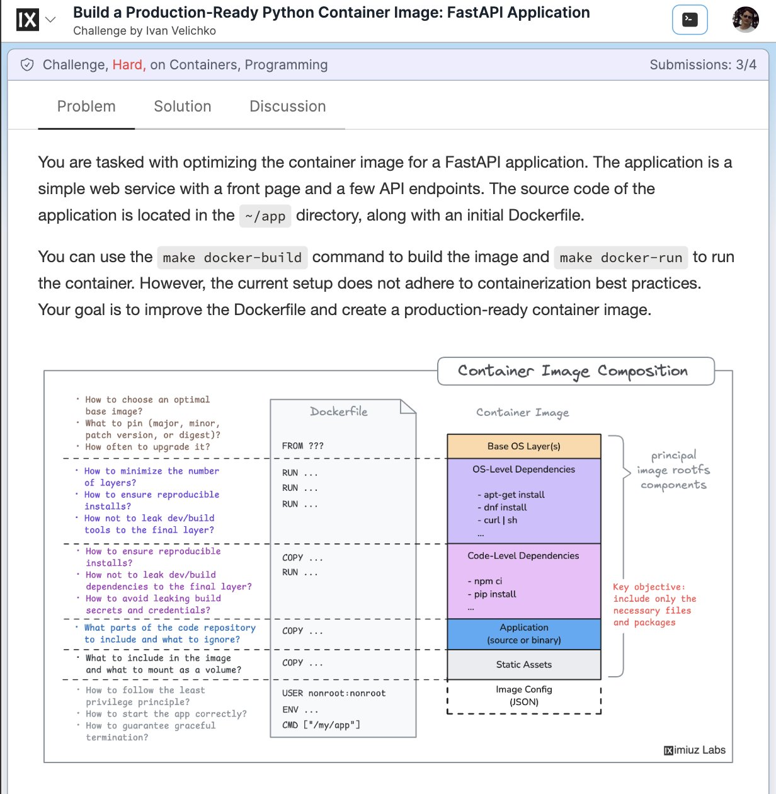

**Source:** [https://twitter.com/i/web/status/1885755816365400433](https://twitter.com/i/web/status/1885755816365400433)
**Original Post Date:** 2025-05-28 04:18:45

# Optimizing Production-Ready Python FastAPI Containers: Best Practices

## Introduction
This article delves into the critical aspects of building optimized Docker containers for Python FastAPI applications in production environments. We'll explore key considerations including layer optimization, security hardening, dependency management, and reproducibility. By following these best practices, you'll learn to create container images that are efficient, secure, and maintainable.

## Dockerfile Structure and Optimization

A well-structured Dockerfile is fundamental to creating production-ready containers. Start with a minimal base image like Alpine Linux for Python applications, which significantly reduces the final image size while maintaining security.

Organize your build process using multi-stage builds, separating development dependencies from the runtime environment.

_Multi-stage build example showing separation of build and runtime environments_

```Dockerfile
FROM python:3.9-slim AS builder
WORKDIR /app
COPY requirements.txt .
RUN pip install --no-cache-dir -r requirements.txt

FROM python:3.9-slim
WORKDIR /app
COPY --from=builder /usr/local/lib/python3.9/site-packages/ ./lib/
COPY . .
ENTRYPOINT ['python', 'main.py']
```

1. Use multi-stage builds to minimize final image size
1. Install system dependencies before Python packages
1. Cache dependency installation for faster rebuilds

> **Note/Tip:** Always pin specific versions of base images and dependencies to ensure reproducibility.

## Container Image Layers and Optimization

Understanding container image layers is crucial for optimization. Each Dockerfile instruction creates a new layer, which can be cached or rebuilt during subsequent builds.

Minimize the number of layers by combining multiple commands using && separators in RUN instructions.

_Combining multiple commands to reduce layer count_

```Dockerfile
RUN apt-get update && \
    apt-get install -y --no-install-recommends python3-pip && \
    rm -rf /var/lib/apt/lists/*
```

## Security Considerations and Best Practices

Security is paramount in production containers. Implement least privilege principles by running the application as a non-root user.

Remove unnecessary system tools and development dependencies from the final image to reduce attack surface.

- Create a dedicated app user with minimal permissions
- Install security updates in base images
- Use non-root users for application execution

> **Note/Tip:** Always perform security scanning of container images before deployment.

## Key Takeaways

- Multi-stage builds reduce final image size while maintaining functionality.
- Minimize layers and optimize cache usage for faster builds.
- Implement least privilege principles for enhanced security.

## Conclusion
Creating production-ready Docker containers requires careful consideration of optimization, security, and reproducibility. By following these best practices, you can build efficient, secure container images that perform reliably in production environments.

## External References

- [Docker Best Practices](https://docs.docker.com/develop/dev-best-practices/)
- [Python Packaging User Guide](https://packaging.python.org/tutorials/packaging-projects/)


## Media

**Image Description:** The image depicts a challenge titled **"Build a Production-Ready Python Container Image: FastAPI Application"** hosted on a platform, likely a coding or technical challenge site. The challenge is categorized as **"Hard"** and focuses on **Containers** and **Programming**. The goal is to optimize a Docker container image for a FastAPI application, ensuring it adheres to best practices for production readiness.

### **Main Subject: Challenge Overview**
The challenge involves:
1. **Optimizing a Dockerfile** for a FastAPI application.
2. Building a production-ready container image.
3. Addressing various technical considerations to ensure the container is efficient, secure, and adheres to best practices.

### **Key Sections in the Image**
1. **Problem Statement:**
   - The task is to optimize the container image for a FastAPI application.
   - The application is a simple web service with a front page and API endpoints.
   - The source code is located in the `~/app` directory, along with an initial Dockerfile.
   - Commands like `make docker-build` and `make docker-run` are provided for building and running the container, but the current setup does not adhere to containerization best practices.

2. **Solution Requirements:**
   - Improve the Dockerfile to create a production-ready container image.
   - Ensure the container image is optimized for size, security, and reproducibility.

3. **Diagram: Container Image Composition**
   - A detailed diagram illustrates the structure of a Docker container image, breaking it down into layers and components. This is the central focus of the image.

### **Diagram Breakdown:**
The diagram is divided into several sections, each highlighting critical aspects of container image composition and optimization:

#### **1. Dockerfile Structure**
   - The Dockerfile is shown as the starting point for building the container image.
   - Key sections of the Dockerfile are highlighted:
     - `FROM`: Specifies the base image.
     - `RUN`: Executes commands to install dependencies.
     - `COPY`: Copies files from the host to the container.
     - `USER`: Sets the user for running the application.
     - `ENV`: Defines environment variables.
     - `CMD`: Specifies the command to run the application.

#### **2. Container Image Layers**
   - The container image is composed of multiple layers, each serving a specific purpose:
     - **Base OS Layer(s):** The foundational operating system layer.
     - **OS-Level Dependencies:** Includes system-level packages installed via package managers like `apt`, `dnf`, etc.
     - **Code-Level Dependencies:** Includes Python packages installed via `pip` or other package managers.
     - **Application:** The actual application code (source or binary).
     - **Static Assets:** Any static files or resources required by the application.

#### **3. Key Considerations for Optimization**
   - **Base Image Selection:**
     - Choosing an optimal base image (e.g., Alpine, Ubuntu, etc.).
     - Pinning the version (major, minor, patch, etc.) to ensure reproducibility.
     - Determining the frequency of base image upgrades.
   - **Layer Minimization:**
     - Reducing the number of layers to minimize image size and improve build time.
     - Combining multiple `RUN` commands into a single command to reduce layers.
   - **Reproducibility:**
     - Ensuring consistent builds by pinning versions of dependencies.
     - Avoiding dynamic or unpredictable commands that could lead to different image outputs.
   - **Security:**
     - Avoiding the inclusion of development tools in the final image.
     - Minimizing the exposure of secrets and credentials.
   - **File Inclusion:**
     - Deciding what parts of the code repository to include in the image.
     - Excluding unnecessary files (e.g., `.git`, `.env`, etc.).
   - **Volume Mounting:**
     - Identifying what should be mounted as a volume (e.g., configuration files, logs).
   - **Privilege Management:**
     - Running the application with the least privilege possible.
   - **Startup and Termination:**
     - Ensuring the application starts correctly and terminates gracefully.

#### **4. Key Objective**
   - The primary objective is to include only the necessary files and packages in the image, ensuring it is minimal, secure, and efficient.

### **Visual Elements**
- **Color Coding:** Different layers in the container image are color-coded for clarity:
  - **Base OS Layer(s):** Orange.
  - **OS-Level Dependencies:** Purple.
  - **Code-Level Dependencies:** Pink.
  - **Application:** Blue.
  - **Static Assets:** Gray.
- **Annotations:** Questions and considerations are listed on the left side, guiding the user through the optimization process.
- **Dockerfile Representation:** A simplified Dockerfile structure is shown in the center, illustrating how commands map to layers.

### **Additional Notes**
- The challenge is part of a series, as indicated by the submission count (`3/4`).
- The challenge is authored by **Ivan Velichko**.
- The platform hosting the challenge is **IX** (as indicated by the logo in the top-left corner).

### **Overall Focus**
The image emphasizes the importance of understanding and optimizing each layer of a Docker container image to ensure it is production-ready. It provides a comprehensive checklist of considerations for building efficient, secure, and reproducible container images. The diagram serves as a visual guide to help users understand the composition of a container image and the best practices for optimizing it.
