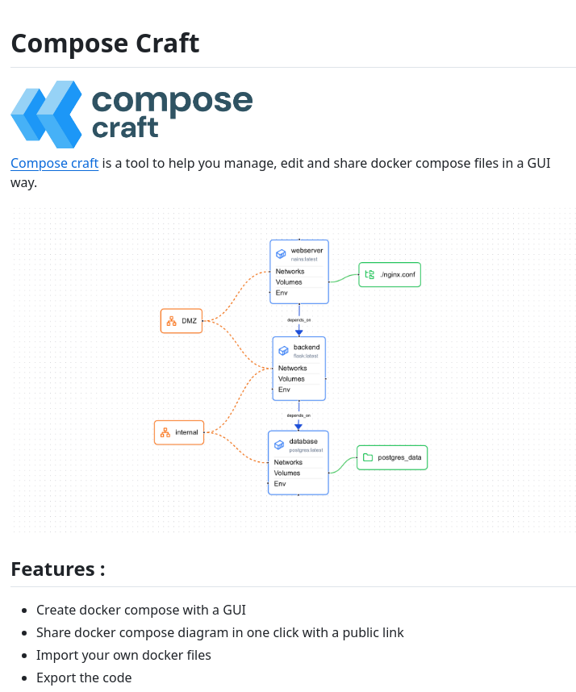

**Source:** [https://twitter.com/i/web/status/1879473911869346092](https://twitter.com/i/web/status/1879473911869346092)
**Original Post Date:** 2025-05-27 22:32:32

# Compose Craft: A Graphical Interface for Managing Docker Compose Files

## Introduction
Docker Compose simplifies the deployment of multi-container applications through YAML configuration. However, working directly with YAML can be challenging, especially for complex setups. Compose Craft addresses this by providing a graphical interface that transforms the creation, management, and sharing of Docker Compose files into an intuitive process.

## Understanding Compose Craft's Architecture

Compose Craft presents a visual representation of Docker environments through a comprehensive diagram. The structure begins with a DMZ layer for public-facing services, connected to web servers that manage HTTP/HTTPS traffic on ports 80 and 443.

The backend service operates on port 8080, handling application logic and depending on the database layer. This dependency chain ensures proper startup sequencing in production environments.

- DMZ Layer: Exposes services to public internet
- Webserver Layer: Manages HTTP/HTTPS traffic
- Backend Layer: Handles application logic
- Database Layer: Stores persistent data

## Key Features and Capabilities

Compose Craft offers a range of features to streamline Docker Compose management. Its intuitive GUI allows users to create complex configurations without dealing with YAML syntax directly.

The tool's sharing capabilities enable team collaboration through public links, while import/export functions integrate smoothly with existing workflows.

1. Create Docker Compose files visually
1. Share configurations via public links
1. Import and export YAML configurations
1. Generate visual diagrams for documentation

> **Note/Tip:** Always validate exported YAML files before production deployment.

> **Note/Tip:** Use the diagram feature to communicate architecture to non-technical stakeholders.

## Technical Implementation Details

The tool handles dependency relationships through explicit 'depends_on' connections, ensuring proper service startup order.

Volume management is simplified with visual representations of mount points like postgres_data for persistent storage.

_Example of a basic Compose Craft-generated YAML configuration showing service dependencies_

```yaml
version: '3.8'
services:
  webserver:
    ports:
      - '80:80'
      - '443:443'
    depends_on:
      - backend
  backend:
    ports:
      - '8080:8080'
    depends_on:
      - database
```

## Key Takeaways

- Compose Craft simplifies complex Docker setups through visual management.
- The tool supports seamless sharing and documentation of container configurations.
- Import/export functionality bridges GUI and traditional YAML workflows effectively.

## Conclusion
For teams working with multi-container Docker applications, Compose Craft offers a significant productivity boost. By abstracting the complexity of YAML configuration into an intuitive visual interface, it enables faster development cycles while maintaining the flexibility of Docker Compose's underlying capabilities.

## External References

- [Docker Compose Documentation](https://docs.docker.com/compose/)
- [Compose Craft Official Documentation](https://composecraft.io/docs)


## Media

**Image Description:** ### Description of the Image

The image is a promotional or informational graphic for a tool called **Compose Craft**, which is designed to help users manage, edit, and share Docker Compose files in a graphical user interface (GUI) environment. Below is a detailed breakdown of the image:

---

#### **Header Section**
- **Title**: The title at the top of the image is **"Compose Craft"**.
- **Logo**: The logo consists of a stylized blue arrow pointing to the left, accompanied by the text **"compose"** in lowercase. Below the logo, the text **"Compose craft"** is repeated in a smaller font.
- **Description**: The description states:
  > "Compose craft is a tool to help you manage, edit, and share Docker Compose files in a GUI way."

This indicates that the tool is focused on simplifying the process of working with Docker Compose files, which are YAML files used to define multi-container Docker applications.

---

#### **Diagram Section**
The central part of the image features a flowchart or diagram that illustrates the structure and relationships of a typical Docker Compose setup. The diagram is organized into several components, each representing different layers or services in a Docker Compose environment. Here's a detailed breakdown:

1. **DMZ (Demilitarized Zone)**:
   - Represented by an orange box labeled **"DMZ"**.
   - This is the outermost layer, typically used for exposing services to the public internet.
   - It is connected to the **webserver** component via a dotted line, indicating a dependency or relationship.

2. **Webserver**:
   - Represented by a blue box labeled **"webserver"**.
   - Contains the following details:
     - **Ports**: 80, 443 (commonly used for HTTP and HTTPS).
     - **Networks**: latest (indicating the latest network configuration).
     - **Volumes**: Mount points for persistent storage.
     - **Env**: Environment variables.
   - The webserver depends on the **backend** service, as indicated by an arrow labeled **"depends_on"**.

3. **Backend**:
   - Represented by a blue box labeled **"backend"**.
   - Contains similar details as the webserver:
     - **Ports**: 8080 (commonly used for internal services).
     - **Networks**: latest.
     - **Volumes**: Mount points.
     - **Env**: Environment variables.
   - The backend depends on the **database** service, as indicated by an arrow labeled **"depends_on"**.

4. **Database**:
   - Represented by a blue box labeled **"database"**.
   - Contains the following details:
     - **Ports**: 5432 (commonly used for PostgreSQL).
     - **Networks**: latest.
     - **Volumes**: Mount points, specifically **postgres_data** (indicating persistent storage for the database).
     - **Env**: Environment variables.
   - The database is the foundational layer and does not depend on any other service.

5. **External Files**:
   - **nginx.conf**: A green box labeled **".nginx.conf"** is connected to the **webserver** via a dotted line, indicating that the webserver uses this configuration file.
   - **postgres_data**: A green box labeled **"postgres_data"** is connected to the **database** via a dotted line, indicating that the database uses this volume for persistent storage.

6. **Internal Network**:
   - Represented by an orange box labeled **"Internal"**.
   - This layer is connected to the **backend** and **database** components via dotted lines, indicating that these services operate within an internal network.

---

#### **Features Section**
The bottom part of the image lists the key features of **Compose Craft**. These features are presented as bullet points:

1. **Create Docker Compose with a GUI**:
   - Allows users to create Docker Compose files using a graphical interface, making it easier for users who are not familiar with YAML syntax.

2. **Share Docker Compose Diagram with a Public Link**:
   - Enables users to share the visual representation of their Docker Compose setup with others via a public link.

3. **Import Your Own Docker Files**:
   - Users can import their existing Docker Compose files into the tool for editing and management.

4. **Export the Code**:
   - Users can export the Docker Compose configuration as code (YAML file) for further use or deployment.

5. **Export the Diagram**:
   - Users can export the visual diagram of their Docker Compose setup for documentation or sharing purposes.

---

### **Technical Details**
- **Docker Compose**: The diagram and features are centered around Docker Compose, a tool for defining and running multi-container Docker applications.
- **YAML Files**: Docker Compose files are written in YAML format, which is a human-readable data serialization language.
- **Dependencies**: The diagram uses arrows labeled **"depends_on"** to show the dependency relationships between services (e.g., webserver depends on backend, backend depends on database).
- **Volumes**: The use of volumes (e.g., **postgres_data**) highlights the importance of persistent storage in Docker setups.
- **Networks**: The use of **latest** for networks indicates that the tool supports the latest Docker network configurations.

---

### **Overall Impression**
The image effectively communicates the purpose and functionality of **Compose Craft** by combining a clear description, a detailed diagram, and a list of features. The diagram visually represents a typical Docker Compose setup, making it easier for users to understand the relationships between different services. The features listed emphasize the tool's utility in managing, sharing, and exporting Docker Compose configurations in a user-friendly manner. 

This tool is particularly beneficial for developers and DevOps engineers who work with Docker Compose and want a more intuitive way to manage their multi-container applications.
