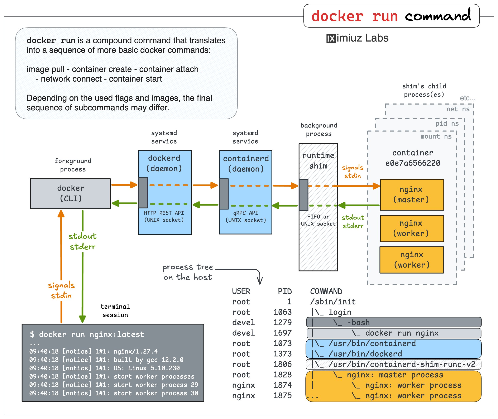

**Source:** [https://twitter.com/i/web/status/1947355173287817472](https://twitter.com/i/web/status/1947355173287817472)
**Original Post Date:** 2025-07-25 15:06:05

# Docker 101: Running Your First Containers

## Introduction
Docker has revolutionized the way we develop, deploy, and run applications by enabling containerization. This article serves as a foundational guide for anyone new to Docker, focusing on three essential tasks: running a 'hello-world' container, setting up a web server, and utilizing an interactive shell within a container. These exercises will provide hands-on experience with Docker's core functionalities.

## Running the Hello-World Container

The 'hello-world' container is a simple yet effective way to verify that Docker is correctly installed and operational on your system. This container outputs a friendly message upon execution, making it an ideal starting point for newcomers.

```bash
docker run hello-world
```

> **Note/Tip:** Ensure Docker is running before executing the command.

> **Note/Tip:** This container does not require port exposure as it only outputs text.

## Setting Up a Web Server Container

Running a web server in a Docker container demonstrates how to utilize containers for hosting applications. Using Nginx, a popular high-performance web server, this section will guide you through the process of setting up and accessing your own web server within a container.

```bash
docker run -d -p 80:80 --name my-nginx nginx
```

> **Note/Tip:** -d runs the container in detached mode.

> **Note/Tip:** -p maps the host's port 80 to the container's port 80.

> **Note/Tip:** Use 'docker ps' to check running containers.

## Using an Interactive Shell Container

An interactive shell within a Docker container allows you to execute commands and explore the container's environment in real-time. This is particularly useful for testing configurations or troubleshooting without affecting your host system.

```bash
docker run -it --rm ubuntu /bin/bash
```

```bash
exit
```

> **Note/Tip:** -i keeps STDIN open even if not attached.

> **Note/Tip:** -t allocates a pseudo-TTY.

> **Note/Tip:** --rm automatically removes the container upon exit.

## Key Takeaways

- Verify Docker installation with 'hello-world'.
- Run web servers by mapping ports and managing containers effectively.
- Utilize interactive shells for temporary, isolated environments.
- Understand basic container lifecycle management.

## Conclusion
Mastering these fundamental Docker operations is crucial for anyone venturing into containerization. By running 'hello-world', setting up a web server, and using an interactive shell, you've gained essential skills that form the basis of more complex Docker tasks. As you progress, consider exploring multi-container setups, orchestration tools like Kubernetes, and advanced networking configurations to enhance your proficiency in containerized application development.


## Media

**Image Description:** Media file
