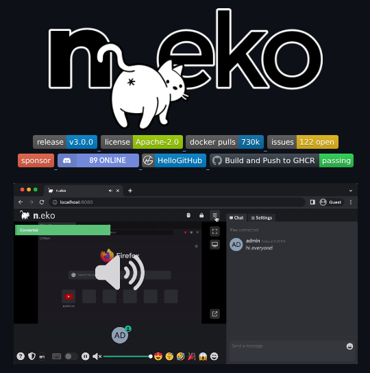

**Source:** [https://twitter.com/i/web/status/1938674618295792014](https://twitter.com/i/web/status/1938674618295792014)
**Original Post Date:** 2025-07-14 20:18:31

# Running Virtual Browsers in Docker Containers: A Comprehensive Guide

## Introduction
Containerization has revolutionized the way we deploy and manage applications, and virtual browsers are no exception. This guide delves into the intricacies of running virtual browsers in Docker containers, with a focus on the n.eko project. We'll explore the setup process, integration with GitHub, and the advantages of using Docker for browser automation tasks.

## Introduction to n.eko Project

The n.eko project is an open-source initiative that leverages Docker containers to provide virtual browser instances. The playful cat logo and the project's name, n.eko, suggest a user-friendly and approachable interface.

Hosted on GitHub, n.eko has gained significant traction with over 730k Docker pulls, indicating its popularity among developers. The project is licensed under Apache-2.0, ensuring open access and collaboration.

- Latest release: v3.0.0
- 122 open issues on GitHub
- 89 sponsors supporting the project
- Featured on HelloGitHub

> **Note/Tip:** The successful build status with GHCR indicates a robust CI/CD pipeline.

## Setting Up n.eko in Docker

To set up n.eko, you'll need to have Docker installed on your system. The project's GitHub repository provides comprehensive documentation and setup instructions.

The chat interface, labeled Connected.eko, suggests real-time communication capabilities integrated with the virtual browser instances.

_This command fetches the latest image of n.eko from Docker Hub, which can then be used to create virtual browser instances._

```bash
docker pull n.eko:latest
# Pull the latest version of n.eko from Docker Hub
```

1. Install Docker on your local machine.
1. Pull the n.eko Docker image using the command provided above.
1. Run the container with appropriate parameters, such as port mappings and environment variables.

> **Note/Tip:** Ensure you have sufficient system resources to run virtual browsers efficiently.

## Integrating n.eko with GitHub

The integration of n.eko with GitHub allows for seamless collaboration and issue tracking. The project's GitHub repository includes detailed documentation, setup instructions, and community support.

The passing build status indicates successful integration with GitHub Container Registry (GHCR), ensuring that the Docker images are up-to-date and reliable.

- Regularly check the GitHub repository for updates and new releases.
- Contribute to the project by reporting issues or submitting pull requests.
- Engage with the community through the chat interface and other communication channels.

> **Note/Tip:** The Apache-2.0 license allows for commercial use, making n.eko a viable option for enterprise applications.

## Advantages of Using Docker for Virtual Browsers

Using Docker to run virtual browsers offers several advantages, including isolation from the host system, portability across different environments, and efficient resource management.

The n.eko project leverages these benefits to provide a scalable and reliable solution for browser automation tasks.

- Isolation: Docker containers run in isolated environments, preventing conflicts with the host system or other containers.
- Portability: Containers can be easily deployed across different systems and environments, ensuring consistency.
- Resource Management: Docker allows for efficient allocation and management of system resources.

> **Note/Tip:** Consider using Docker Compose for managing multi-container applications, which can simplify the setup process for complex browser automation tasks.

## Use Case: Browser Automation with n.eko

The n.eko project is particularly useful for browser automation tasks such as testing, scraping, and monitoring. The integration with GitHub allows for seamless collaboration and issue tracking.

The chat interface provides real-time communication capabilities, enabling teams to collaborate effectively on browser automation projects.

1. Define the scope of your browser automation project.
1. Set up n.eko in Docker according to the provided instructions.
1. Integrate the virtual browsers with your testing or scraping tools.
1. Monitor and manage the browser instances using the chat interface and other communication channels.

> **Note/Tip:** Regularly update the n.eko image to ensure you have access to the latest features and bug fixes.

## Key Takeaways

- The n.eko project leverages Docker containers to provide virtual browser instances with real-time communication capabilities.
- Setting up n.eko involves pulling the Docker image, running the container, and integrating it with GitHub for seamless collaboration.
- Using Docker for virtual browsers offers isolation, portability, and efficient resource management.
- The n.eko project is particularly useful for browser automation tasks such as testing, scraping, and monitoring.

## Conclusion
In conclusion, running virtual browsers in Docker containers using the n.eko project offers a scalable and reliable solution for browser automation tasks. The integration with GitHub allows for seamless collaboration and issue tracking, while the chat interface enables real-time communication among team members.

## External References

- [n.eko GitHub Repository](https://github.com/n.eko)
- [Docker Official Documentation](https://docs.docker.com/)


## Media

**Image Description:** The image depicts a screenshot of a software project interface, specifically for a project named **n.eko**. Below is a detailed breakdown of the image:

### **Main Subject:**
The central focus of the image is the **n.eko** project, which appears to be an open-source software project hosted on GitHub. The project's logo features a playful, stylized white cat with a tail that forms part of the letter "n" in the project name. The cat has a simple, cartoonish design with a star on its forehead, adding a whimsical touch.

### **Technical Details:**
1. **Project Name and Logo:**
   - The project is named **n.eko**, with the logo prominently displayed at the top of the image.
   - The cat logo is integrated into the design of the letter "n" in the project name, creating a unique and memorable visual identity.

2. **GitHub Repository Information:**
   - The top section of the image shows key details about the project's GitHub repository:
     - **Release:** The latest release is **v3.0.0**.
     - **License:** The project is licensed under the **Apache-2.0** license.
     - **Docker Pulls:** The project has been pulled **730k** times, indicating its popularity.
     - **Issues:** There are **122 open issues** in the repository.
     - **Sponsors:** The project has **89 sponsors**.
     - **HelloGitHub:** The project is featured on **HelloGitHub**, a platform that showcases popular GitHub projects.
     - **Build and Push to GHCR:** The build status is shown as **passing**, indicating successful integration with GitHub Container Registry (GHCR).

3. **Chat Interface:**
   - The bottom section of the image shows a chat interface, likely part of the project's communication or collaboration platform.
   - The chat is labeled **Connected.eko**, suggesting it is a real-time communication tool integrated with the project.
   - The chat window shows a user named **admin** who has sent a message: **"hi everyone!"**.
   - The chat interface includes standard messaging features like sending messages, emojis, and other interactive elements.

4. **Browser and Tools:**
   - The image is displayed in a web browser, specifically **Firefox**, as indicated by the browser's logo in the bottom-left corner.
   - The browser tab shows the URL **n.eko**, suggesting the project's website or documentation page.

5. **Additional Visual Elements:**
   - A **sound icon** with a Wi-Fi symbol is overlaid on the image, possibly indicating audio or streaming functionality related to the project.
   - The chat interface includes a sidebar with various icons, likely for navigation or additional features.

### **Overall Impression:**
The image effectively combines visual and technical elements to convey the project's identity, popularity, and collaborative nature. The playful cat logo and chat interface suggest a friendly and community-oriented project, while the GitHub metrics highlight its active development and user base. The integration with tools like Docker and GHCR indicates a modern, containerized approach to software development. The use of Firefox as the browser further emphasizes the project's accessibility and cross-platform compatibility. 

This image is likely designed to attract developers and users interested in the project, showcasing its features, community engagement, and technical robustness.
