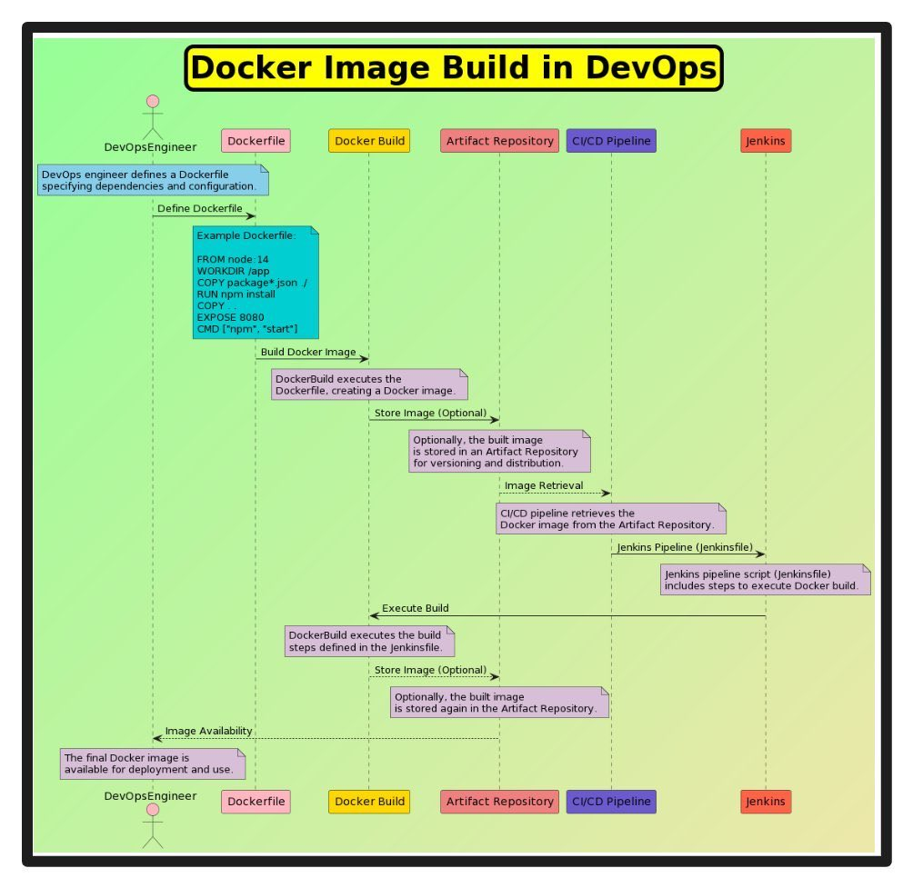

**Source:** [https://twitter.com/i/web/status/1884306371631538367](https://twitter.com/i/web/status/1884306371631538367)
**Original Post Date:** 2025-05-27 17:56:01

# Docker Image Creation Process in DevOps Environments

## Introduction
Understanding the Docker image creation process is fundamental for DevOps engineers. This document outlines a structured workflow from Dockerfile definition through automated builds and deployment using industry-standard tools like Jenkins, while emphasizing best practices for version control and continuous delivery.

## Dockerfile Definition

The Dockerfile serves as the blueprint for container images, containing sequential instructions for environment setup and application configuration. Each instruction creates a new layer in the final image.

Proper structuring of dependencies and multi-stage builds can significantly reduce image size while maintaining security.

```dockerfile
FROM node:14
WORKDIR /app
COPY package.json /app/package.json
RUN npm install
COPY . /app
EXPOSE 8080
CMD ["npm", "start"]
```

- Base image selection impacts performance and security
- Layer optimization reduces build time and image size
- Multi-stage builds help minimize final image footprint

## CI/CD Pipeline Integration

Automated builds using Jenkins ensure consistent, repeatable deployments. The CI/CD pipeline orchestrates Docker image creation, testing, and distribution.

Jenkins pipelines provide centralized management of build workflows through declarative scripts.

```groovy
pipeline {
  agent any
  stages {
    stage('Build') {
      steps {
        sh 'docker build -t myapp .'
      }
    }
  }
}
```

> **Note/Tip:** Implement caching strategies to speed up Docker builds

> **Note/Tip:** Use environment variables for sensitive configuration

## Artifact Repository Management

Storing Docker images in artifact repositories enables version control and distribution across teams. Tools like Harbor or AWS ECR provide centralized management.

Implementing proper tagging strategies ensures traceability and rollback capabilities.

1. Tag images with semantic versions (e.g., v1.0.2)
1. Use unique tags for each build
1. Maintain a single source of truth

## Key Takeaways

- Dockerfile optimization reduces image size and improves deployment performance
- CI/CD automation ensures consistent builds and deployments
- Artifact repositories provide version control and distribution capabilities

## Conclusion
Successful Docker image creation in DevOps environments requires a well-defined workflow from Dockerfile definition to automated deployment. Integration with CI/CD tools like Jenkins, combined with proper artifact repository management, creates a robust pipeline for reliable software delivery.

## External References

- [Docker Official Documentation](https://docs.docker.com/)
- [Jenkins Pipeline Tutorial](https://www.jenkins.io/doc/book/pipeline/)


## Media

**Image Description:** The image is a detailed flowchart illustrating the process of building Docker images in a DevOps environment, with a focus on automation and integration with tools like Jenkins and artifact repositories. Below is a detailed description of the image, highlighting the main subject and technical details:

### **Title**
- The title at the top of the image reads: **"Docker Image Build in DevOps"**. This indicates that the flowchart is centered around the process of building Docker images as part of a DevOps workflow.

### **Main Components**
The flowchart is divided into several key components, each representing a step or tool in the Docker image build process. These components are interconnected with arrows to show the flow of the process.

#### 1. **DevOps Engineer**
   - **Role**: The process begins with a **DevOps Engineer**, who is responsible for defining the Dockerfile.
   - **Action**: The engineer defines a Dockerfile, specifying dependencies, configuration, and the build process.

#### 2. **Dockerfile**
   - **Definition**: The Dockerfile is a text file that contains instructions for building a Docker image.
   - **Example Content**:
     ```
     FROM node:14
     WORKDIR /app
     COPY package.json /app/package.json
     RUN npm install
     COPY . /app
     EXPOSE 8080
     CMD ["npm", "start"]
     ```
     - **FROM**: Specifies the base image (e.g., `node:14`).
     - **WORKDIR**: Sets the working directory inside the container.
     - **COPY**: Copies files from the host to the container.
     - **RUN**: Executes commands inside the container (e.g., `npm install`).
     - **EXPOSE**: Specifies the port that the container will expose.
     - **CMD**: Defines the command to run when the container starts.

#### 3. **Docker Build**
   - **Action**: The Docker build process is triggered, which reads the Dockerfile and creates a Docker image.
   - **Output**: A Docker image is generated based on the instructions in the Dockerfile.

#### 4. **Artifact Repository**
   - **Purpose**: The built Docker image can optionally be stored in an **Artifact Repository**.
   - **Function**: The repository serves as a centralized location for storing and managing Docker images, enabling versioning and distribution.

#### 5. **CI/CD Pipeline**
   - **Integration**: The CI/CD pipeline is integrated into the process to automate the build, test, and deployment of the Docker image.
   - **Action**: The pipeline retrieves the Docker image from the Artifact Repository and executes the build steps.

#### 6. **Jenkins**
   - **Role**: Jenkins is used as the CI/CD tool to orchestrate the build process.
   - **Jenkinsfile**: A Jenkinsfile is a script that defines the pipeline steps. It includes instructions for building the Docker image, storing it, and deploying it.
   - **Action**: Jenkins executes the pipeline, which may include steps like building the Docker image, running tests, and deploying the image.

### **Flow of the Process**
1. **DevOps Engineer Defines Dockerfile**:
   - The engineer creates a Dockerfile specifying the build instructions.

2. **Docker Build**:
   - The Docker build command is executed, reading the Dockerfile and creating a Docker image.

3. **Optional Storage in Artifact Repository**:
   - The built Docker image can be stored in an Artifact Repository for versioning and distribution.

4. **CI/CD Pipeline Integration**:
   - The CI/CD pipeline retrieves the Docker image from the Artifact Repository and executes the build steps.

5. **Jenkins Pipeline Execution**:
   - Jenkins runs the pipeline defined in the Jenkinsfile, automating the build, test, and deployment processes.

6. **Final Docker Image Availability**:
   - The final Docker image is made available for deployment and use.

### **Visual Elements**
- **Color Coding**:
  - Different components are color-coded for clarity:
    - **Blue**: Represents the Dockerfile and its contents.
    - **Yellow**: Represents the Docker Build process.
    - **Pink**: Represents the Artifact Repository.
    - **Purple**: Represents the CI/CD Pipeline.
    - **Red**: Represents Jenkins.
- **Arrows**: Arrows indicate the flow of the process, showing the sequence of actions from the Dockerfile definition to the final image availability.

### **Key Technical Details**
1. **Dockerfile Syntax**:
   - The Dockerfile includes standard instructions like `FROM`, `WORKDIR`, `COPY`, `RUN`, `EXPOSE`, and `CMD`.
2. **Automation with Jenkins**:
   - Jenkins is used to automate the build process, with a Jenkinsfile defining the pipeline steps.
3. **Artifact Repository**:
   - The repository is used for storing Docker images, enabling version control and distribution.
4. **CI/CD Integration**:
   - The CI/CD pipeline automates the retrieval, build, and deployment of Docker images.

### **Summary**
The flowchart provides a comprehensive view of the Docker image build process in a DevOps environment. It highlights the roles of the DevOps engineer, Dockerfile, Docker build, Artifact Repository, CI/CD pipeline, and Jenkins in creating, storing, and deploying Docker images. The process is designed to be automated and integrated, ensuring efficiency and consistency in software delivery.
