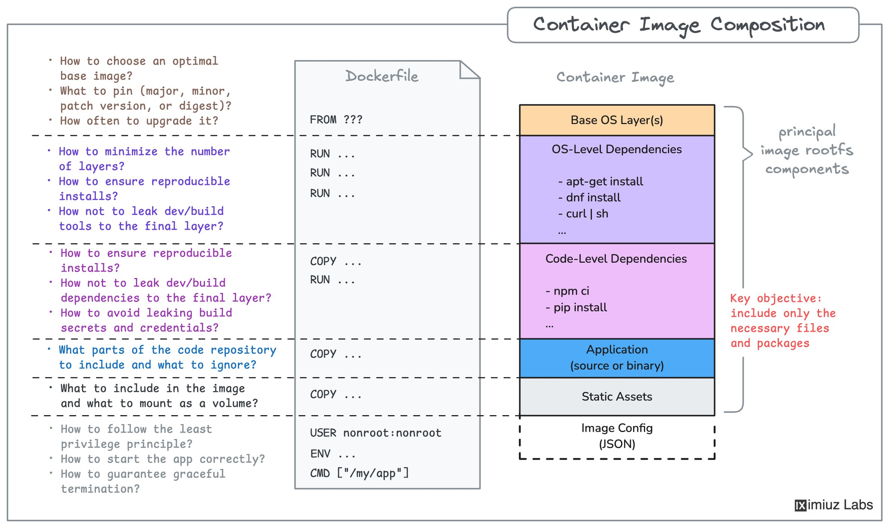

**Source:** [https://twitter.com/i/web/status/1883535445583438263](https://twitter.com/i/web/status/1883535445583438263)
**Original Post Date:** 2025-06-17 10:59:44

# Building Efficient Container Images: Best Practices and Deep Dive into Dockerfile Structure

## Introduction
Containerization has become a cornerstone of modern DevOps workflows. Creating efficient container images is crucial for optimizing application deployment and runtime performance. This article provides an in-depth exploration of Dockerfile structure and container image composition, along with expert-level optimization strategies that ensure security, reliability, and minimal resource usage.

## Dockerfile Structure and Optimization

A well-structured Dockerfile is fundamental to creating efficient container images. The sequence of instructions directly impacts the final image's size and optimization potential.

```dockerfile
FROM alpine:3.18
RUN apk add --no-cache python3
COPY . /app
WORKDIR /app
CMD ["python", "main.py"]
```

1. Always start with a minimal base image
1. Combine RUN commands to reduce layer count
1. Use .dockerignore to exclude unnecessary files
1. Copy only required application code

> **Note/Tip:** Multi-stage builds can significantly reduce final image size by separating build and runtime environments.

## Container Image Layers and Management

Understanding container layer composition is crucial for optimization. Each Dockerfile instruction creates a new layer, which affects storage efficiency and deployment time.

Proper ordering of instructions can lead to better cache utilization during builds.

- Base OS Layer: Use official minimal images (e.g., alpine)
- OS Dependencies: Group package installations in single RUN commands
- Application Code: Place after all dependencies are installed

> **Note/Tip:** Consider using scratch image as base for static applications to minimize attack surface.

## Security and Best Practices

Securing container images requires careful consideration of user privileges, network policies, and runtime configurations.

Implementing least-privilege principles is essential for production deployments.

```dockerfile
USER appuser
RUN chmod +x /app/main.py
EXPOSE 8080
```

## Key Takeaways

- Always optimize layer count by combining commands and using multi-stage builds.
- Implement proper security practices including non-root users and minimal base images.
- Use .dockerignore to exclude unnecessary files and reduce image size.

## Conclusion
Building efficient container images requires careful attention to Dockerfile structure, layer optimization, and security best practices. Following these guidelines ensures that your containers are secure, lightweight, and deployable in production environments.

## External References

- [Docker Official Documentation](https://docs.docker.com/develop/)
- [Best Practices for Container Images](https://kubernetes.io/docs/concepts/configuration/overview/)


## Media

**Image Description:** ### Image Description

The image is a detailed diagram titled **"Container Image Composition"**, which provides an overview of the structure and considerations involved in creating and managing container images, particularly using Docker. The diagram is divided into two main sections: **Dockerfile** and **Container Image**, with additional annotations highlighting best practices, considerations, and key objectives.

---

### **Main Components**

#### **1. Dockerfile**
The left side of the diagram shows the structure of a Dockerfile, which is the configuration file used to build Docker container images. The Dockerfile is depicted as a vertical list of commands, each representing a step in the image-building process. The commands shown are:

- **FROM ???**: Specifies the base image to use as the starting point for the container image.
- **RUN ...**: Executes commands to install dependencies, configure the environment, or perform other setup tasks.
- **COPY ...**: Copies files or directories from the host machine into the container image.
- **USER nonroot:nonroot**: Sets the user for subsequent commands and processes within the container to a non-root user for security.
- **ENV ...**: Sets environment variables within the container.
- **CMD ["my/app"]**: Specifies the default command to run when the container starts.

#### **2. Container Image**
The right side of the diagram illustrates the resulting container image, which is composed of multiple layers. Each layer represents a specific component or dependency added during the image-building process. The layers are stacked vertically, showing the hierarchical nature of the image composition. The layers are:

- **Base OS Layer(s)**: The foundational operating system layer, which provides the core system utilities and libraries.
- **OS-Level Dependencies**: Includes packages installed via package managers like `apt-get`, `dnf`, or other OS-specific tools.
- **Code-Level Dependencies**: Includes dependencies installed at the application level, such as those managed by `npm`, `pip`, or other language-specific package managers.
- **Application**: The actual application code or binary, which can be either source code or a pre-compiled binary.
- **Static Assets**: Includes static files or resources required by the application, such as configuration files, media, or libraries.
- **Image Config (JSON)**: The metadata and configuration of the image, stored in JSON format.

---

### **Annotations and Considerations**

The diagram includes several annotations that highlight best practices and considerations for container image composition. These are organized into categories and are linked to specific parts of the Dockerfile or Container Image:

#### **A. Choosing an Optimal Base Image**
- **How to choose an optimal base image?**
- **What to pin (major, minor, patch version, or digest)?**
- **How often to upgrade it?**

#### **B. Minimizing Layers**
- **How to minimize the number of layers?**
- **How to ensure reproducible installs?**
- **How not to leak dev/build tools to the final layer?**

#### **C. Ensuring Reproducibility**
- **How to ensure reproducible installs?**
- **How not to leak dev/build dependencies to the final layer?**
- **How to avoid leaking build credentials?**

#### **D. Managing Code Repository**
- **What parts of the code repository to include and what to ignore?**
- **What to include in the image and what to mount as a volume?**

#### **E. Security and Privileges**
- **How to follow the least privilege principle?**
- **How to start the app correctly?**
- **How to guarantee graceful termination?**

#### **F. Key Objective**
- **Include only the necessary files and packages.**

---

### **Visual Layout and Design**

- The diagram uses a clean, structured layout with clear separation between the Dockerfile and the resulting Container Image.
- Layers in the Container Image are color-coded to distinguish different types of components:
  - **Base OS Layer(s)**: Orange
  - **OS-Level Dependencies**: Purple
  - **Code-Level Dependencies**: Pink
  - **Application**: Blue
  - **Static Assets**: Light Gray
- Annotations are linked to specific parts of the diagram using dashed lines, making it easy to connect the considerations with the relevant sections.

---

### **Key Takeaways**

1. **Dockerfile Structure**: The Dockerfile is the blueprint for building the container image, with commands like `FROM`, `RUN`, `COPY`, `USER`, `ENV`, and `CMD` used to define the image's contents and behavior.
2. **Layered Architecture**: The container image is built in layers, allowing for efficient storage and reuse of common components.
3. **Best Practices**: The annotations emphasize the importance of reproducibility, security, and minimizing unnecessary components in the image.
4. **Key Objective**: The primary goal is to create a minimal, secure, and efficient container image that includes only the necessary files and dependencies.

---

### **Conclusion**

This diagram serves as a comprehensive guide for understanding the composition of Docker container images, highlighting both the technical structure and the best practices for building and managing them. It is particularly useful for developers and DevOps engineers working with containerized applications. The visual organization and annotations make it easy to grasp the complexities involved in container image creation.
